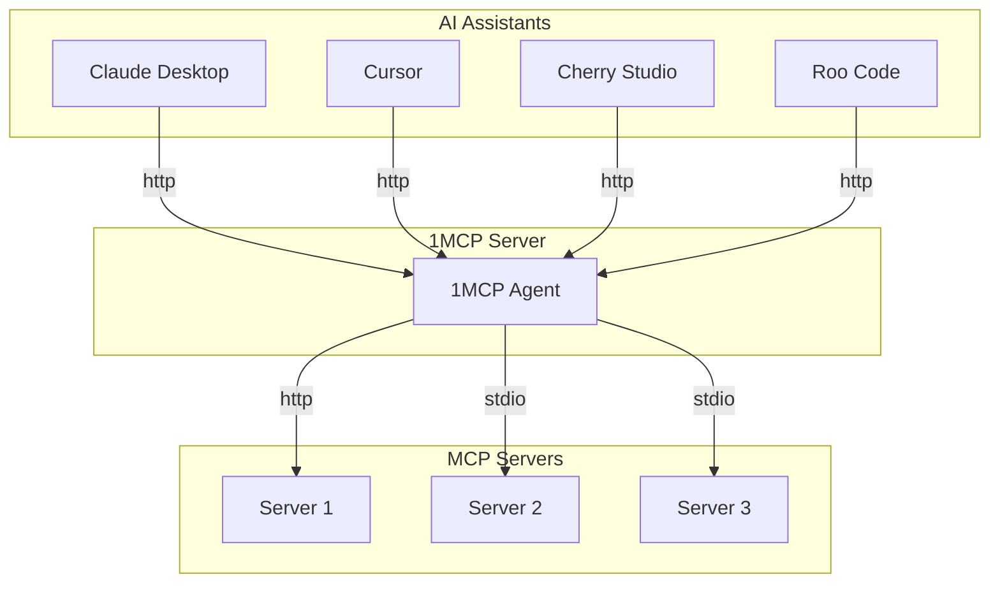
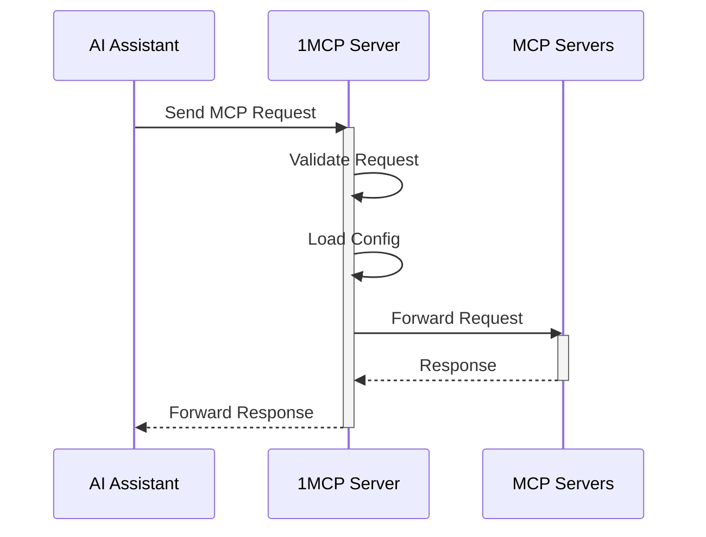

# 1MCP - One MCP Server for All

A unified Model Context Protocol server implementation that aggregates multiple MCP servers into one.

[](https://www.npmjs.com/package/@1mcp/agent)
[](https://www.npmjs.com/package/@1mcp/agent)
[](https://github.com/1mcp-app/agent/actions/workflows/github-code-scanning/codeql)
[](https://github.com/1mcp-app/agent/stargazers)
[](https://docs.1mcp.app)
[](https://deepwiki.com/1mcp-app/agent)
[](https://www.npmjs.com/package/@1mcp/agent)

## Table of Contents

- [Overview](#overview)
- [Features](#features)
- [Quick Start](#quick-start)
- [Commands](#commands)
- [Prerequisites](#prerequisites)
- [Usage](#usage)
- [Docker](#docker)
- [Understanding Tags](#understanding-tags)
- [Configuration](#configuration)
- [Authentication](#authentication)
- [Health Monitoring](#health-monitoring)
- [How It Works](#how-it-works)
- [Development](#development)
- [Contributing](#contributing)
- [License](#license)

## Overview

1MCP (One MCP) is designed to simplify the way you work with AI assistants. Instead of configuring multiple MCP servers for different clients (Claude Desktop, Cherry Studio, Cursor, Roo Code, Claude, etc.), 1MCP provides a single, unified server.

## Features

- **Unified Interface**: Aggregates multiple MCP servers into one.
- **Resource Friendly**: Reduces system resource usage by eliminating redundant server instances.
- **Simplified Configuration**: Simplifies configuration management across different AI assistants.
- **Standardized Interaction**: Provides a standardized way for AI models to interact with external tools and resources.
- **Dynamic Configuration**: Supports dynamic configuration reloading without server restart.
- **Async Loading**: Optional asynchronous server loading with real-time capability updates via listChanged notifications.
- **Graceful Shutdown**: Handles graceful shutdown and resource cleanup.
- **Secure**: Includes comprehensive authentication and security features.
- **Optimized**: Supports advanced filtering, pagination, and request optimization.
- **Health Monitoring**: Built-in health check endpoints for monitoring and observability.

## Quick Start

Get up and running with 1MCP in just a few steps:

### 0. Install 1MCP (Choose One Method)

#### Binary Downloads (Recommended - No Node.js Required)

Download the compressed archive for your platform from the [latest release](https://github.com/1mcp-app/agent/releases/latest):

- **Linux (x64)**: `1mcp-linux-x64`
- **Linux (ARM64)**: `1mcp-linux-arm64`
- **Windows (x64)**: `1mcp-win32-x64.exe`
- **macOS (ARM64)**: `1mcp-darwin-arm64`
- **macOS (Intel)**: `1mcp-darwin-x64`

```bash
# Linux example:
curl -L -o 1mcp-linux-x64.tar.gz https://github.com/1mcp-app/agent/releases/latest/download/1mcp-linux-x64.tar.gz
tar -xzf 1mcp-linux-x64.tar.gz
sudo mv 1mcp /usr/local/bin/
sudo chmod +x /usr/local/bin/1mcp
rm 1mcp-linux-x64.tar.gz
1mcp --version

# macOS example (Apple Silicon):
curl -L -o 1mcp-darwin-arm64.tar.gz https://github.com/1mcp-app/agent/releases/latest/download/1mcp-darwin-arm64.tar.gz
tar -xzf 1mcp-darwin-arm64.tar.gz
sudo mv 1mcp /usr/local/bin/
sudo chmod +x /usr/local/bin/1mcp
rm 1mcp-darwin-arm64.tar.gz
1mcp --version

# Windows example (PowerShell):
Invoke-WebRequest -Uri "https://github.com/1mcp-app/agent/releases/latest/download/1mcp-win32-x64.zip" -OutFile "1mcp-win32-x64.zip"
Expand-Archive -Path "1mcp-win32-x64.zip" -DestinationPath "."
# Move to a directory in your PATH or use directly
.\1mcp.exe --version
Remove-Item "1mcp-win32-x64.zip"
```

More examples: [Installation Guide](https://docs.1mcp.app/guide/installation/)

#### NPM/Node.js Method

If you prefer using Node.js package managers:

```bash
# No installation needed - run directly
npx -y @1mcp/agent --help

# Or install globally
npm install -g @1mcp/agent
```

### 1. Add MCP Servers

Add the MCP servers you want to use. Here are some popular examples:

```bash
# Using binary:
1mcp mcp add context7 -- npx -y @upstash/context7-mcp
1mcp mcp add sequential -- npx -y @modelcontextprotocol/server-sequential-thinking
1mcp mcp add filesystem -- npx -y @modelcontextprotocol/server-filesystem ~/Documents

# Using NPM:
npx -y @1mcp/agent mcp add context7 -- npx -y @upstash/context7-mcp
npx -y @1mcp/agent mcp add sequential -- npx -y @modelcontextprotocol/server-sequential-thinking
npx -y @1mcp/agent mcp add filesystem -- npx -y @modelcontextprotocol/server-filesystem ~/Documents
```

### 2. Start the 1MCP Server

```bash
# Using binary:
1mcp

# Using NPM:
npx -y @1mcp/agent
```

The server will start on `http://127.0.0.1:3050` and show you which MCP servers are active.

### 3. Connect Your AI Assistant

**For Cursor**, add to `~/.cursor/mcp.json` or `<project-root>/.cursor/mcp.json`:

```json
{
  "mcpServers": {
    "1mcp": {
      "url": "http://127.0.0.1:3050/mcp?app=cursor"
    }
  }
}
```

[](cursor://anysphere.cursor-deeplink/mcp/install?name=1mcp&config=eyJ1cmwiOiJodHRwOi8vMTI3LjAuMC4xOjMwNTAvbWNwP2FwcD1jdXJzb3IifQ%3D%3D)

**For VSCode**, add to `settings.json` or `<project-root>/.vscode/mcp.json`:

```json
{
  "servers": {
    "1mcp": {
      "url": "http://127.0.0.1:3050/mcp?app=vscode"
    }
  }
}
```

[Install MCP Server to VSCode](vscode:mcp/install?%7B%22name%22%3A%221mcp%22%2C%22url%22%3A%22http%3A%2F%2F127.0.0.1%3A3050%2Fmcp%3Fapp%3Dvscode%22%7D)

**For Claude Code**, run:

```bash
claude mcp add -t http 1mcp "http://127.0.0.1:3050/mcp?app=claude-code"
```

### 4. Verify Everything Works

Check server status and connected MCP servers:

```bash
# Using binary:
1mcp mcp status

# Using NPM:
npx -y @1mcp/agent mcp status
```

Visit the health endpoint to see system status: `http://127.0.0.1:3050/health`

That's it! All your MCP servers are now available through one unified endpoint. 🎉

## Commands

1MCP provides several commands to manage your MCP server configuration:

### Core Commands

- **`1mcp [serve]`** or **`npx -y @1mcp/agent [serve]`** - Start the 1MCP server (default command)
  - `--transport` - Choose transport type (stdio, http, sse)
  - `--config` - Use specific config file
  - `--port` - Change HTTP port

### MCP Management

- **`1mcp mcp add <name>`** - Add a new MCP server to configuration
- **`1mcp mcp remove <name>`** - Remove an MCP server
- **`1mcp mcp list`** - List all configured MCP servers
- **`1mcp mcp status [name]`** - Show server status and details
- **`1mcp mcp enable/disable <name>`** - Enable or disable servers
- **`1mcp mcp update <name>`** - Update server configuration

### App Integration

- **`1mcp app consolidate`** - Consolidate configurations from other MCP apps
- **`1mcp app discover`** - Discover MCP servers from installed applications
- **`1mcp app list`** - List discovered applications
- **`1mcp app status`** - Show consolidation status

For detailed command usage, run: `1mcp <command> --help` or `npx -y @1mcp/agent <command> --help`

Full documentation: [Commands Reference](https://docs.1mcp.app/commands/)

## Prerequisites

**For Binary Installation (Recommended):**

- None! The binary is self-contained and requires no dependencies.

**For NPM/Node.js Installation:**

- [Node.js](https://nodejs.org/) (version 21 or higher)
- [pnpm](https://pnpm.io/) or npm

## Usage

You can run the server using the binary or NPM:

```bash
# Binary usage examples:
# Basic usage (starts server with HTTP transport)
1mcp

# Use existing Claude Desktop config
1mcp --config ~/Library/Application\ Support/Claude/claude_desktop_config.json

# Use stdio transport instead of HTTP
1mcp --transport stdio

# Use external URL for reverse proxy setup (nginx, etc.)
1mcp --external-url https://example.com

# Configure trust proxy for reverse proxy setup
1mcp --trust-proxy=192.168.1.1

# Show all available options
1mcp --help

# NPM usage (if you prefer Node.js):
# Basic usage (starts server with HTTP transport)
npx -y @1mcp/agent

# All other options work the same way:
npx -y @1mcp/agent --config ~/Library/Application\ Support/Claude/claude_desktop_config.json
npx -y @1mcp/agent --transport stdio
npx -y @1mcp/agent --help
```

For a complete list of all command-line options, environment variables, and configuration details, see:

- **[Configuration Deep Dive](https://docs.1mcp.app/guide/essentials/configuration)** - CLI flags and environment variables
- **[Serve Command Reference](https://docs.1mcp.app/commands/serve)** - Command usage examples

## Docker

You can also run 1MCP using Docker. We provide two image variants:

### Image Variants

- **`latest`**: Full-featured image with extra tools (uv, bun) - default
- **`lite`**: Lightweight image with basic Node.js package managers only (npm, pnpm, yarn)

### Basic Usage

```bash
# Pull the latest full-featured image (default)
docker pull ghcr.io/1mcp-app/agent:latest

# Or pull the lightweight version
docker pull ghcr.io/1mcp-app/agent:lite

# Run with HTTP transport (default) - IMPORTANT: Set host to 0.0.0.0 for Docker networking
docker run -p 3050:3050 \
  -e ONE_MCP_HOST=0.0.0.0 \
  ghcr.io/1mcp-app/agent

# Run the lite version with proper networking
docker run -p 3050:3050 \
  -e ONE_MCP_HOST=0.0.0.0 \
  ghcr.io/1mcp-app/agent:lite

# Run with a custom config file
docker run -p 3050:3050 \
  -e ONE_MCP_HOST=0.0.0.0 \
  -v /path/to/config.json:/config.json \
  ghcr.io/1mcp-app/agent --config /config.json

# Run with stdio transport
docker run -i ghcr.io/1mcp-app/agent --transport stdio
```

### Available Image Tags

#### Full-Featured Images (with uv, bun)

- `latest`: Latest stable release with extra tools
- `vX.Y.Z`: Specific version (e.g. `v1.0.0`)
- `vX.Y`: Major.minor version (e.g. `v1.0`)
- `vX`: Major version (e.g. `v1`)

#### Lightweight Images (npm, pnpm, yarn only)

- `lite`: Latest stable lite release
- `vX.Y.Z-lite`: Specific version lite (e.g. `v1.0.0-lite`)
- `vX.Y-lite`: Major.minor version lite (e.g. `v1.0-lite`)
- `vX-lite`: Major version lite (e.g. `v1-lite`)

For detailed Docker configuration examples with environment variables, see the **[Configuration Deep Dive](https://docs.1mcp.app/guide/essentials/configuration)** documentation.

### Image Details

**Full Image (`latest`):**

- Node.js (version from `.node-version`)
- npm, pnpm, yarn
- uv (Python package manager)
- bun (JavaScript runtime)
- curl, python3, bash

**Lite Image (`lite`):**

- Node.js (version from `.node-version`)
- npm, pnpm, yarn only
- Smaller size, faster downloads

## Understanding Tags

Tags help you control which MCP servers are available to different clients. Think of tags as labels that describe what each server can do.

### How to Use Tags

1. **In your server config**: Add tags to each server to describe its capabilities

```json
{
  "mcpServers": {
    "web-server": {
      "command": "uvx",
      "args": ["mcp-server-fetch"],
      "tags": ["network", "web"],
      "disabled": false
    },
    "file-server": {
      "command": "npx",
      "args": ["-y", "@modelcontextprotocol/server-filesystem", "~/Downloads"],
      "tags": ["filesystem"],
      "disabled": false
    }
  }
}
```

2. **When starting 1MCP in stdio mode**: You can filter servers by tags

**Simple Tag Filtering (OR logic) - ⚠️ Deprecated:**

```bash
# Binary usage:
1mcp --transport stdio --tags "network"
1mcp --transport stdio --tags "network,filesystem"

# NPM usage:
npx -y @1mcp/agent --transport stdio --tags "network"
npx -y @1mcp/agent --transport stdio --tags "network,filesystem"
```

> **Note:** The `--tags` parameter is deprecated and will be removed in a future version. Use `--tag-filter` instead for both simple and advanced filtering.

**Advanced Tag Filtering (Boolean expressions):**

```bash
# Binary usage:
1mcp --transport stdio --tag-filter "network+api"
1mcp --transport stdio --tag-filter "network,filesystem"
1mcp --transport stdio --tag-filter "(web,api)+production-test"
1mcp --transport stdio --tag-filter "web and api and not test"

# NPM usage:
npx -y @1mcp/agent --transport stdio --tag-filter "network+api"
npx -y @1mcp/agent --transport stdio --tag-filter "network,filesystem"
npx -y @1mcp/agent --transport stdio --tag-filter "(web,api)+production-test"
npx -y @1mcp/agent --transport stdio --tag-filter "web and api and not test"
```

3. **When using HTTP/SSE transport**: Clients can request servers with specific tags

**Simple tag filtering:**

```json
{
  "mcpServers": {
    "1mcp": {
      "type": "http",
      "url": "http://localhost:3050/sse?tags=network" // Only connect to network-capable servers
    }
  }
}
```

**Advanced tag filtering:**

```json
{
  "mcpServers": {
    "1mcp": {
      "type": "http",
      "url": "http://localhost:3050/sse?tag-filter=network%2Bapi" // network AND api (URL-encoded)
    }
  }
}
```

Example tags:

- `network`: For servers that make web requests
- `filesystem`: For servers that handle file operations
- `memory`: For servers that provide memory/storage
- `shell`: For servers that run shell commands
- `db`: For servers that handle database operations

## Configuration

1MCP supports comprehensive configuration through JSON files, command-line options, and environment variables.

For complete configuration documentation, see:

- **[MCP Servers Reference](https://docs.1mcp.app/reference/mcp-servers)** - Backend server configuration
- **[Configuration Deep Dive](https://docs.1mcp.app/guide/essentials/configuration)** - CLI flags and environment variables

## Authentication

1MCP supports OAuth 2.1 for secure authentication. To enable it, use the `--enable-auth` flag. The `--auth` flag is deprecated and will be removed in a future version.

When authentication is enabled, 1MCP acts as an OAuth 2.1 provider, allowing client applications to securely connect. This ensures that only authorized clients can access the MCP servers.

## Health Monitoring

1MCP provides comprehensive health check endpoints for monitoring and observability:

### Health Check Endpoints

- **`GET /health`** - Complete health status including system metrics, server status, and configuration
- **`GET /health/live`** - Simple liveness probe (always returns 200 if server is running)
- **`GET /health/ready`** - Readiness probe (returns 200 if configuration is loaded and ready)

### Health Status Levels

- **`healthy`** - All systems operational (HTTP 200)
- **`degraded`** - Some issues but still functional (HTTP 200)
- **`unhealthy`** - Critical issues affecting functionality (HTTP 503)

### Monitoring Integration

Use these endpoints with:

- Load balancers (health checks)
- Container orchestration (Kubernetes health probes)
- CI/CD pipelines (deployment validation)

## How It Works

1MCP acts as a proxy, managing and aggregating multiple MCP servers. It starts and stops these servers as subprocesses and forwards requests from AI assistants to the appropriate server. This architecture allows for a single point of entry for all MCP traffic, simplifying management and reducing overhead.

### System Architecture



### Request Flow



## Development

Install dependencies:

```bash
pnpm install
```

Build the server:

```bash
pnpm build
```

For development with auto-rebuild:

```bash
pnpm watch
```

Run the server:

```bash
# Copy the example environment file first
cp .env.example .env

# Then run the development server
pnpm dev
```

### Debugging

Using the [MCP Inspector](https://github.com/modelcontextprotocol/inspector), which is available as a package script:

```bash
pnpm inspector
```

The Inspector will provide a URL to access debugging tools in your browser.

### Debugging & Source Maps

This project uses [source-map-support](https://www.npmjs.com/package/source-map-support) to enhance stack traces. When you run the server, stack traces will reference the original TypeScript source files instead of the compiled JavaScript. This makes debugging much easier, as error locations and line numbers will match your source code.

No extra setup is required—this is enabled by default. If you see a stack trace, it will point to `.ts` files and the correct line numbers. 🗺️

## Contributing

Contributions are welcome! Please read our [CONTRIBUTING.md](CONTRIBUTING.md) for details on our code of conduct, and the process for submitting pull requests to us.

## License

This project is licensed under the Apache License 2.0. See the [LICENSE](LICENSE) file for details.
