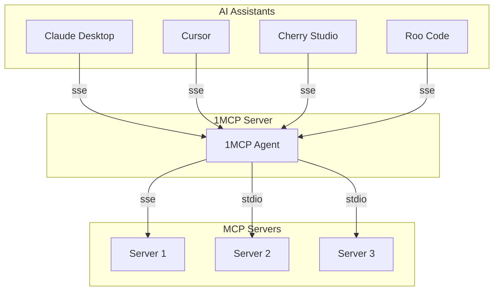
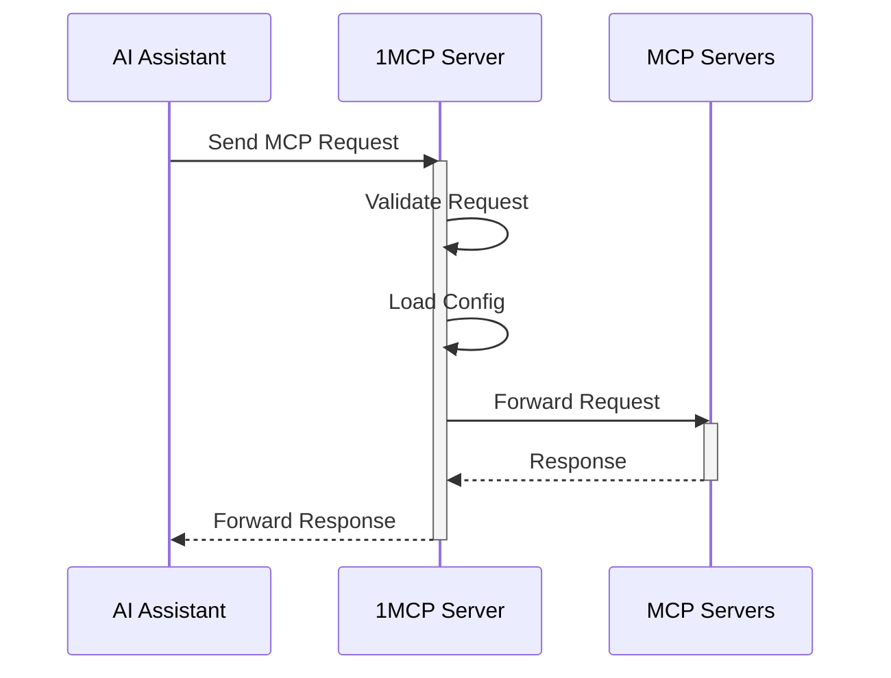

# 1MCP - One MCP Server for All

A unified Model Context Protocol server implementation that aggregates multiple MCP servers into one.

## Overview

1MCP (One MCP) is designed to simplify the way you work with AI assistants. Instead of configuring multiple MCP servers for different clients (Claude Desktop, Cherry Studio, Cursor, Roo Code, Claude, etc.), 1MCP provides a single, unified server that:

- Aggregates multiple MCP servers into one unified interface
- Reduces system resource usage by eliminating redundant server instances
- Simplifies configuration management across different AI assistants
- Provides a standardized way for AI models to interact with external tools and resources
- Supports dynamic configuration reloading without server restart
- Handles graceful shutdown and resource cleanup

## Quick Start

To enable Cursor to use existing MCP servers already configured in Claude Desktop, follow these steps:

1. Run the 1MCP server with the Claude Desktop config file:
```bash
npx -y @1mcp/agent --config ~/Library/Application\ Support/Claude/claude_desktop_config.json
```

2. Add the 1MCP server to your Cursor config file (`~/.cursor/mcp.json`):
```json
{
    "mcpServers": {
        "1mcp": {
            "type": "http",
            "url": "http://localhost:3050/sse"
        }
    }
}
```

3. Enjoy it!

## Usage

You can run the server directly using `npx`:

```bash
# Basic usage (starts server with SSE transport)
npx -y @1mcp/agent

# Use existing Claude Desktop config
npx -y @1mcp/agent --config ~/Library/Application\ Support/Claude/claude_desktop_config.json

# Use stdio transport instead of SSE
npx -y @1mcp/agent --transport stdio

# Show all available options
npx -y @1mcp/agent --help
```

Available options:
- `--transport, -t`: Choose transport type ("stdio" or "sse", default: "sse")
- `--config, -c`: Use a specific config file
- `--port, -P`: Change SSE port (default: 3050)
- `--host, -H`: Change SSE host (default: localhost)
- `--tags, -g`: Filter servers by tags (see Tags section below)
- `--help, -h`: Show help

### Understanding Tags

Tags help you control which MCP servers are available to different clients. Think of tags as labels that describe what each server can do.

#### How to Use Tags

1. **In your server config**: Add tags to each server to describe its capabilities
```json
{
  "mcpServers": {
    "web-server": {
      "command": "uvx",
      "args": ["mcp-server-fetch"],
      "tags": ["network", "web"],
      "disabled": false
    },
    "file-server": {
      "command": "npx",
      "args": ["-y", "@modelcontextprotocol/server-filesystem", "~/Downloads"],
      "tags": ["filesystem"],
      "disabled": false
    }
  }
}
```

2. **When starting 1MCP in stdio mode**: You can filter servers by tags
```bash
# Only start servers with the "network" tag
npx -y @1mcp/agent --transport stdio --tags "network"

# Start servers with either "network" or "filesystem" tags
npx -y @1mcp/agent --transport stdio --tags "network,filesystem"
```

3. **When using SSE transport**: Clients can request servers with specific tags
```json
{
    "mcpServers": {
        "1mcp": {
            "type": "http",
            "url": "http://localhost:3050/sse?tags=network"  // Only connect to network-capable servers
        }
    }
}
```

Example tags:
- `network`: For servers that make web requests
- `filesystem`: For servers that handle file operations
- `memory`: For servers that provide memory/storage
- `shell`: For servers that run shell commands
- `db`: For servers that handle database operations

## Configuration

### Global Configuration

The server automatically manages configuration in a global location:

- macOS/Linux: `~/.config/1mcp/mcp.json`
- Windows: `%APPDATA%/1mcp/mcp.json`

### Configuration File Format

```json
{
  "mcpServers": {
    "mcp-server-fetch": {
      "command": "uvx",
      "args": [
        "mcp-server-fetch"
      ],
      "disabled": false
    },
    "server-memory": {
      "command": "npx",
      "args": [
        "-y",
        "@modelcontextprotocol/server-memory"
      ],
      "disabled": false
    }
  }
}
```

## How It Works

### System Architecture



### Request Flow



## Development

Install dependencies:
```bash
pnpm install
```

Build the server:
```bash
pnpm build
```

For development with auto-rebuild:
```bash
pnpm watch
```

Run the server:
```bash
pnpm dev
```

### Debugging

Since MCP servers communicate over stdio, debugging can be challenging. We recommend using the [MCP Inspector](https://github.com/modelcontextprotocol/inspector), which is available as a package script:

```bash
pnpm run inspector
```

The Inspector will provide a URL to access debugging tools in your browser.
