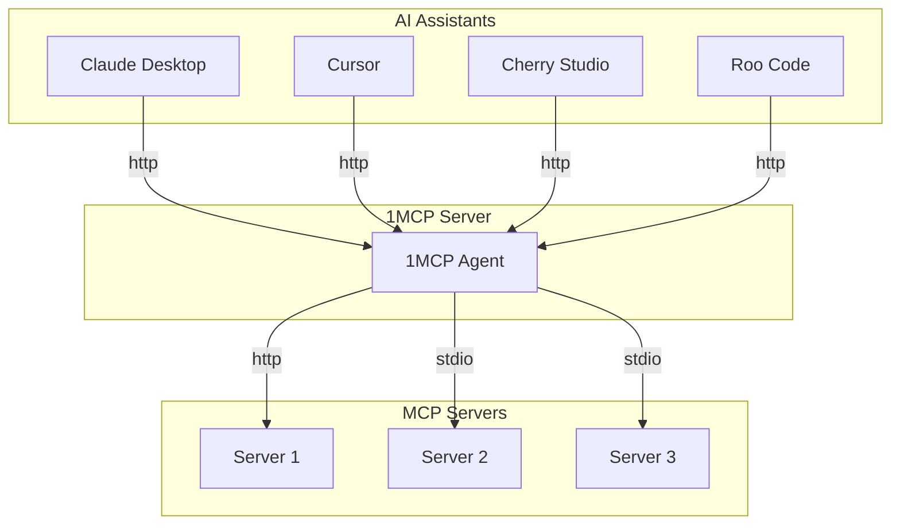
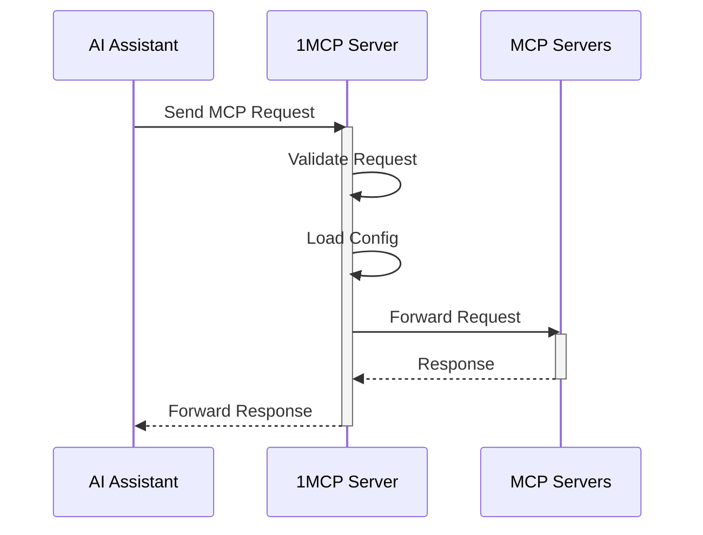

# 1MCP - One MCP Server for All

A unified Model Context Protocol server implementation that aggregates multiple MCP servers into one.

[](https://www.npmjs.com/package/@1mcp/agent)
[](https://www.npmjs.com/package/@1mcp/agent)
[](https://github.com/1mcp-app/agent/actions/workflows/github-code-scanning/codeql)
[](https://github.com/1mcp-app/agent/stargazers)
[](https://docs.1mcp.app)
[](https://deepwiki.com/1mcp-app/agent)
[](https://www.npmjs.com/package/@1mcp/agent)
[](https://archestra.ai/mcp-catalog/1mcp-app__agent)

## Table of Contents

- [Overview](#overview)
- [Features](#features)
- [Quick Start](#quick-start)
- [Commands](#commands)
- [Prerequisites](#prerequisites)
- [Usage](#usage)
- [Docker](#docker)
- [Trust Proxy Configuration](#trust-proxy-configuration)
- [Understanding Tags](#understanding-tags)
- [Configuration](#configuration)
- [Authentication](#authentication)
- [Health Monitoring](#health-monitoring)
- [How It Works](#how-it-works)
- [Development](#development)
- [Contributing](#contributing)
- [License](#license)

## Overview

1MCP (One MCP) is designed to simplify the way you work with AI assistants. Instead of configuring multiple MCP servers for different clients (Claude Desktop, Cherry Studio, Cursor, Roo Code, Claude, etc.), 1MCP provides a single, unified server.

## Features

- **Unified Interface**: Aggregates multiple MCP servers into one.
- **Resource Friendly**: Reduces system resource usage by eliminating redundant server instances.
- **Simplified Configuration**: Simplifies configuration management across different AI assistants.
- **Standardized Interaction**: Provides a standardized way for AI models to interact with external tools and resources.
- **Dynamic Configuration**: Supports dynamic configuration reloading without server restart.
- **Async Loading**: Optional asynchronous server loading with real-time capability updates via listChanged notifications.
- **Graceful Shutdown**: Handles graceful shutdown and resource cleanup.
- **Secure**: Includes comprehensive authentication and security features.
- **Optimized**: Supports advanced filtering, pagination, and request optimization.
- **Health Monitoring**: Built-in health check endpoints for monitoring and observability.

## Quick Start

Get up and running with 1MCP in just a few steps:

### 1. Add MCP Servers

Add the MCP servers you want to use. Here are some popular examples:

```bash
# Add Context7 for documentation and code examples
npx -y @1mcp/agent mcp add context7 -- npx -y @upstash/context7-mcp

# Add Sequential Thinking for complex analysis
npx -y @1mcp/agent mcp add sequential -- npx -y @modelcontextprotocol/server-sequential-thinking

# Add Filesystem for file operations
npx -y @1mcp/agent mcp add filesystem -- npx -y @modelcontextprotocol/server-filesystem ~/Documents
```

### 2. Start the 1MCP Server

```bash
npx -y @1mcp/agent
```

The server will start on `http://127.0.0.1:3050` and show you which MCP servers are active.

### 3. Connect Your AI Assistant

**For Cursor**, add to `~/.cursor/mcp.json` or `<project-root>/.cursor/mcp.json`:

```json
{
  "mcpServers": {
    "1mcp": {
      "url": "http://127.0.0.1:3050/mcp?app=cursor"
    }
  }
}
```

[](cursor://anysphere.cursor-deeplink/mcp/install?name=1mcp&config=eyJ1cmwiOiJodHRwOi8vMTI3LjAuMC4xOjMwNTAvbWNwP2FwcD1jdXJzb3IifQ%3D%3D)

**For VSCode**, add to `settings.json` or `<project-root>/.vscode/mcp.json`:

```json
{
  "servers": {
    "1mcp": {
      "url": "http://127.0.0.1:3050/mcp?app=vscode"
    }
  }
}
```

[Install MCP Server to VSCode](vscode:mcp/install?%7B%22name%22%3A%221mcp%22%2C%22url%22%3A%22http%3A%2F%2F127.0.0.1%3A3050%2Fmcp%3Fapp%3Dvscode%22%7D)

**For Claude Code**, run:

```bash
claude mcp add -t http 1mcp "http://127.0.0.1:3050/mcp?app=claude-code"
```

### 4. Verify Everything Works

Check server status and connected MCP servers:

```bash
npx -y @1mcp/agent mcp status
```

Visit the health endpoint to see system status: `http://127.0.0.1:3050/health`

That's it! All your MCP servers are now available through one unified endpoint. 🎉

## Commands

1MCP provides several commands to manage your MCP server configuration:

### Core Commands

- **`npx -y @1mcp/agent [serve]`** - Start the 1MCP server (default command)
  - `--transport` - Choose transport type (stdio, http, sse)
  - `--config` - Use specific config file
  - `--port` - Change HTTP port

### MCP Management

- **`npx -y @1mcp/agent mcp add <name>`** - Add a new MCP server to configuration
- **`npx -y @1mcp/agent mcp remove <name>`** - Remove an MCP server
- **`npx -y @1mcp/agent mcp list`** - List all configured MCP servers
- **`npx -y @1mcp/agent mcp status [name]`** - Show server status and details
- **`npx -y @1mcp/agent mcp enable/disable <name>`** - Enable or disable servers
- **`npx -y @1mcp/agent mcp update <name>`** - Update server configuration

### App Integration

- **`npx -y @1mcp/agent app consolidate`** - Consolidate configurations from other MCP apps
- **`npx -y @1mcp/agent app discover`** - Discover MCP servers from installed applications
- **`npx -y @1mcp/agent app list`** - List discovered applications
- **`npx -y @1mcp/agent app status`** - Show consolidation status

For detailed command usage, run: `1mcp <command> --help`

Full documentation: [Commands Reference](https://docs.1mcp.app/commands/)

## Prerequisites

- [Node.js](https://nodejs.org/) (version 21 or higher)
- [pnpm](https://pnpm.io/)

## Usage

You can run the server directly using `npx`:

```bash
# Basic usage (starts server with SSE transport)
npx -y @1mcp/agent

# Use existing Claude Desktop config
npx -y @1mcp/agent --config ~/Library/Application\ Support/Claude/claude_desktop_config.json

# Use stdio transport instead of SSE
npx -y @1mcp/agent --transport stdio

# Use external URL for reverse proxy setup (nginx, etc.)
npx -y @1mcp/agent --external-url https://example.com

# Configure trust proxy for reverse proxy setup
npx -y @1mcp/agent --trust-proxy=192.168.1.1

# Show all available options
npx -y @1mcp/agent --help
```

Available options:

| Option (CLI)                 | Environment Variable               | Description                                                                                     |  Default   |
| :--------------------------- | :--------------------------------- | :---------------------------------------------------------------------------------------------- | :--------: |
| `--transport`, `-t`          | `ONE_MCP_TRANSPORT`                | Choose transport type ("stdio", "http", or "sse")                                               |   "http"   |
| `--config`, `-c`             | `ONE_MCP_CONFIG`                   | Use a specific config file                                                                      |            |
| `--port`, `-P`               | `ONE_MCP_PORT`                     | Change HTTP port                                                                                |    3050    |
| `--host`, `-H`               | `ONE_MCP_HOST`                     | Change HTTP host                                                                                | localhost  |
| `--external-url`, `-u`       | `ONE_MCP_EXTERNAL_URL`             | External URL for OAuth callbacks and public URLs (e.g., https://example.com)                    |            |
| `--trust-proxy`              | `ONE_MCP_TRUST_PROXY`              | Trust proxy configuration for client IP detection (boolean, IP, CIDR, preset)                   | "loopback" |
| `--tags`, `-g`               | `ONE_MCP_TAGS`                     | Filter servers by tags (comma-separated, OR logic) ⚠️ **Deprecated - use --tag-filter**         |            |
| `--tag-filter`, `-f`         | `ONE_MCP_TAG_FILTER`               | Advanced tag filter expression (and/or/not logic)                                               |            |
| `--pagination`, `-p`         | `ONE_MCP_PAGINATION`               | Enable pagination for client/server lists (boolean)                                             |   false    |
| `--enable-auth`              | `ONE_MCP_ENABLE_AUTH`              | Enable authentication (OAuth 2.1)                                                               |   false    |
| `--enable-scope-validation`  | `ONE_MCP_ENABLE_SCOPE_VALIDATION`  | Enable tag-based scope validation (boolean)                                                     |    true    |
| `--enable-enhanced-security` | `ONE_MCP_ENABLE_ENHANCED_SECURITY` | Enable enhanced security middleware (boolean)                                                   |   false    |
| `--session-ttl`              | `ONE_MCP_SESSION_TTL`              | Session expiry time in minutes (number)                                                         |    1440    |
| `--session-storage-path`     | `ONE_MCP_SESSION_STORAGE_PATH`     | Custom session storage directory path (string)                                                  |            |
| `--rate-limit-window`        | `ONE_MCP_RATE_LIMIT_WINDOW`        | OAuth rate limit window in minutes (number)                                                     |     15     |
| `--rate-limit-max`           | `ONE_MCP_RATE_LIMIT_MAX`           | Maximum requests per OAuth rate limit window (number)                                           |    100     |
| `--enable-async-loading`     | `ONE_MCP_ENABLE_ASYNC_LOADING`     | Enable asynchronous MCP server loading(boolean)                                                 |   false    |
| `--health-info-level`        | `ONE_MCP_HEALTH_INFO_LEVEL`        | Health endpoint information detail level ("full", "basic", "minimal")                           | "minimal"  |
| `--log-level`                | `ONE_MCP_LOG_LEVEL`                | Set the log level ("debug", "info", "warn", "error")                                            |   "info"   |
| `--log-file`                 | `ONE_MCP_LOG_FILE`                 | Write logs to a file in addition to console (disables console logging only for stdio transport) |            |
| `--help`, `-h`               |                                    | Show help                                                                                       |            |

## Docker

You can also run 1MCP using Docker:

```bash
# Pull the latest image
docker pull ghcr.io/1mcp-app/agent:latest

# Run with HTTP transport (default)
docker run -p 3050:3050 ghcr.io/1mcp-app/agent

# Run with a custom config file
docker run -p 3050:3050 -v /path/to/config.json:/config.json ghcr.io/1mcp-app/agent --config /config.json

# Run with stdio transport
docker run -i ghcr.io/1mcp-app/agent --transport stdio
```

Available image tags:

- `latest`: Latest stable release
- `vX.Y.Z`: Specific version (e.g. `v1.0.0`)
- `sha-<commit>`: Specific commit

Examples:

```bash
# Custom port, tags, and logging
docker run -p 3051:3051 \
  -e ONE_MCP_PORT=3051 \
  -e ONE_MCP_TAGS=network,filesystem \
  -e ONE_MCP_LOG_LEVEL=debug \
  ghcr.io/1mcp-app/agent

# With external URL for reverse proxy
docker run -p 3050:3050 \
  -e ONE_MCP_EXTERNAL_URL=https://mcp.example.com \
  -e ONE_MCP_TRUST_PROXY=true \
  ghcr.io/1mcp-app/agent
```

## Trust Proxy Configuration

When running 1MCP behind a reverse proxy, configure trust proxy settings for proper client IP detection:

```bash
# Default (safe for local development)
npx -y @1mcp/agent --trust-proxy=loopback

# Behind reverse proxy
npx -y @1mcp/agent --trust-proxy=192.168.1.1

# Behind CDN/Cloudflare
npx -y @1mcp/agent --trust-proxy=true
```

See [docs/TRUST_PROXY.md](docs/TRUST_PROXY.md) for detailed configuration options, security considerations, and reverse proxy setup examples.

## Understanding Tags

Tags help you control which MCP servers are available to different clients. Think of tags as labels that describe what each server can do.

### How to Use Tags

1. **In your server config**: Add tags to each server to describe its capabilities

```json
{
  "mcpServers": {
    "web-server": {
      "command": "uvx",
      "args": ["mcp-server-fetch"],
      "tags": ["network", "web"],
      "disabled": false
    },
    "file-server": {
      "command": "npx",
      "args": ["-y", "@modelcontextprotocol/server-filesystem", "~/Downloads"],
      "tags": ["filesystem"],
      "disabled": false
    }
  }
}
```

2. **When starting 1MCP in stdio mode**: You can filter servers by tags

**Simple Tag Filtering (OR logic) - ⚠️ Deprecated:**

```bash
# Only start servers with the "network" tag
npx -y @1mcp/agent --transport stdio --tags "network"

# Start servers with either "network" or "filesystem" tags
npx -y @1mcp/agent --transport stdio --tags "network,filesystem"
```

> **Note:** The `--tags` parameter is deprecated and will be removed in a future version. Use `--tag-filter` instead for both simple and advanced filtering.

**Advanced Tag Filtering (Boolean expressions):**

```bash
# Servers with both "network" AND "api" tags
npx -y @1mcp/agent --transport stdio --tag-filter "network+api"

# Servers with "network" OR "filesystem" tags
npx -y @1mcp/agent --transport stdio --tag-filter "network,filesystem"

# Complex expression: (web OR api) AND production, but NOT test
npx -y @1mcp/agent --transport stdio --tag-filter "(web,api)+production-test"

# Natural language syntax also supported
npx -y @1mcp/agent --transport stdio --tag-filter "web and api and not test"
```

3. **When using HTTP/SSE transport**: Clients can request servers with specific tags

**Simple tag filtering:**

```json
{
  "mcpServers": {
    "1mcp": {
      "type": "http",
      "url": "http://localhost:3050/sse?tags=network" // Only connect to network-capable servers
    }
  }
}
```

**Advanced tag filtering:**

```json
{
  "mcpServers": {
    "1mcp": {
      "type": "http",
      "url": "http://localhost:3050/sse?tag-filter=network%2Bapi" // network AND api (URL-encoded)
    }
  }
}
```

Example tags:

- `network`: For servers that make web requests
- `filesystem`: For servers that handle file operations
- `memory`: For servers that provide memory/storage
- `shell`: For servers that run shell commands
- `db`: For servers that handle database operations

## Configuration

### Global Configuration

The server automatically manages configuration in a global location:

- macOS/Linux: `~/.config/1mcp/mcp.json`
- Windows: `%APPDATA%/1mcp/mcp.json`

### Configuration File Format

```json
{
  "mcpServers": {
    "mcp-server-fetch": {
      "command": "uvx",
      "args": ["mcp-server-fetch"],
      "disabled": false
    },
    "server-memory": {
      "command": "npx",
      "args": ["-y", "@modelcontextprotocol/server-memory"],
      "disabled": false
    }
  }
}
```

## Authentication

1MCP supports OAuth 2.1 for secure authentication. To enable it, use the `--enable-auth` flag. The `--auth` flag is deprecated and will be removed in a future version.

When authentication is enabled, 1MCP acts as an OAuth 2.1 provider, allowing client applications to securely connect. This ensures that only authorized clients can access the MCP servers.

## Health Monitoring

1MCP provides comprehensive health check endpoints for monitoring and observability:

### Health Check Endpoints

- **`GET /health`** - Complete health status including system metrics, server status, and configuration
- **`GET /health/live`** - Simple liveness probe (always returns 200 if server is running)
- **`GET /health/ready`** - Readiness probe (returns 200 if configuration is loaded and ready)

### Health Status Levels

- **`healthy`** - All systems operational (HTTP 200)
- **`degraded`** - Some issues but still functional (HTTP 200)
- **`unhealthy`** - Critical issues affecting functionality (HTTP 503)

### Monitoring Integration

Use these endpoints with:

- Load balancers (health checks)
- Container orchestration (Kubernetes health probes)
- CI/CD pipelines (deployment validation)

## How It Works

1MCP acts as a proxy, managing and aggregating multiple MCP servers. It starts and stops these servers as subprocesses and forwards requests from AI assistants to the appropriate server. This architecture allows for a single point of entry for all MCP traffic, simplifying management and reducing overhead.

### System Architecture



### Request Flow



## Development

Install dependencies:

```bash
pnpm install
```

Build the server:

```bash
pnpm build
```

For development with auto-rebuild:

```bash
pnpm watch
```

Run the server:

```bash
# Copy the example environment file first
cp .env.example .env

# Then run the development server
pnpm dev
```

### Debugging

Using the [MCP Inspector](https://github.com/modelcontextprotocol/inspector), which is available as a package script:

```bash
pnpm inspector
```

The Inspector will provide a URL to access debugging tools in your browser.

### Debugging & Source Maps

This project uses [source-map-support](https://www.npmjs.com/package/source-map-support) to enhance stack traces. When you run the server, stack traces will reference the original TypeScript source files instead of the compiled JavaScript. This makes debugging much easier, as error locations and line numbers will match your source code.

No extra setup is required—this is enabled by default. If you see a stack trace, it will point to `.ts` files and the correct line numbers. 🗺️

## Contributing

Contributions are welcome! Please read our [CONTRIBUTING.md](CONTRIBUTING.md) for details on our code of conduct, and the process for submitting pull requests to us.

## License

This project is licensed under the Apache License 2.0. See the [LICENSE](LICENSE) file for details.
