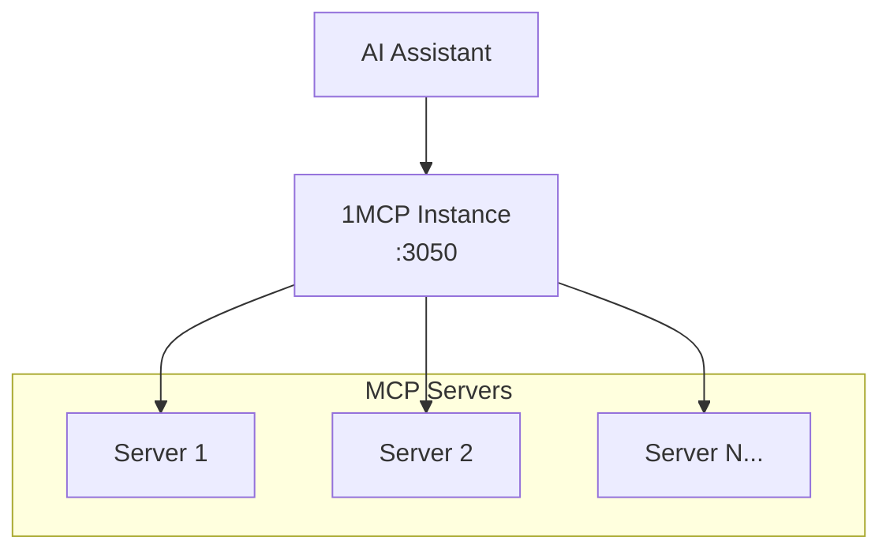
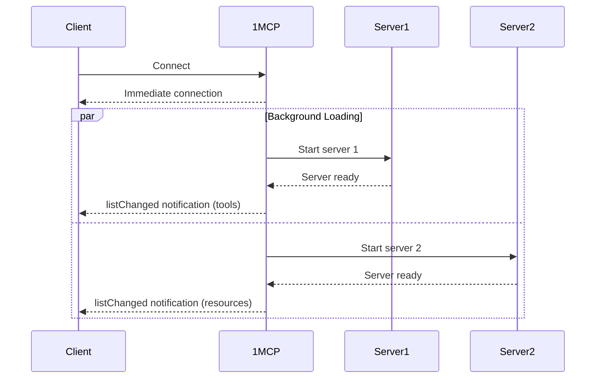

# Enterprise & Operations

> **🏢 Production-Ready**: Enterprise-scale deployment, monitoring, and operational features for mission-critical environments

## 🔧 Single-Instance Deployment

**What it does**: Runs as a single process managing multiple MCP server connections
**Why you need it**: Simple, reliable deployment with minimal resource overhead
**How it helps**: Easy deployment, process management, unified configuration

**Deployment Architecture**:



**⏱️ Setup Time**: 5 minutes
**🎯 Perfect For**: Individual use, small teams, simple deployments
**✅ You Get**: Simple deployment, easy management, reliable operation

---

## ⚡ Async Loading & Real-Time Updates

**What it does**: Loads MCP servers asynchronously with real-time capability notifications
**Why you need it**: Get immediate access to the server while other MCP servers start up in background
**How it helps**: Faster startup times, progressive capability discovery, listChanged notifications

**Loading Strategy**:



**Configuration Example**:

```bash
# Enable async loading with CLI flag
npx -y @1mcp/agent --config mcp.json --enable-async-loading

# Or via environment variable
export ONE_MCP_ENABLE_ASYNC_LOADING=true
npx -y @1mcp/agent --config mcp.json
```

**Real-World Impact**:

- **Startup Time**: Immediate connection vs. waiting for all servers
- **Progressive Loading**: Capabilities appear as servers come online
- **Better UX**: No blocking on slow-starting servers
- **Batched Notifications**: Prevents client spam during initialization

**⏱️ Setup Time**: Single CLI flag
**🎯 Perfect For**: Fast startup times, better user experience, large server configurations
**✅ You Get**: Immediate connection, progressive capabilities, real-time updates, batched notifications

---

## 📋 Security Operation Logging

**What it does**: Logs security-related operations including authentication and scope validation
**Why you need it**: Track OAuth operations and security events for monitoring
**How it helps**: Structured logging of scope operations, authentication events, access control

**Security Log Examples**:

```bash
# Scope validation events
INFO: Scope operation: scope_validation_success {
  "operation": "scope_validation_success",
  "clientId": "app-client",
  "requestedScopes": ["tag:filesystem"],
  "grantedScopes": ["tag:filesystem", "tag:memory"],
  "success": true
}

# Authorization events
INFO: Scope operation: authorization_granted {
  "operation": "authorization_granted",
  "clientId": "app-client",
  "requestedScopes": ["tag:web"],
  "success": true
}
```

**⏱️ Setup Time**: Built-in security logging
**🎯 Perfect For**: Security monitoring, access tracking, OAuth debugging
**✅ You Get**: Security event logs, scope operation tracking, authentication monitoring

---

## 💊 Health Monitoring & Observability

**What it does**: Comprehensive health check endpoints with system metrics and server status
**Why you need it**: Monitor production deployments, enable automated health checks, and debugging
**How it helps**: Real-time system status, automated alerts, load balancer integration

**Health Check Endpoints**:

```bash
# Complete health status
GET /health

# Liveness probe (Kubernetes ready)
GET /health/live

# Readiness probe (configuration loaded)
GET /health/ready
```

**Health Response Example**:

```json
{
  "status": "healthy",
  "timestamp": "2025-01-30T12:00:00.000Z",
  "version": "0.15.0",
  "system": {
    "uptime": 3600,
    "memory": {
      "used": 50.5,
      "total": 100.0,
      "percentage": 50.5
    }
  },
  "servers": {
    "total": 3,
    "healthy": 2,
    "unhealthy": 1,
    "details": [
      {
        "name": "filesystem-server",
        "status": "connected",
        "healthy": true,
        "lastConnected": "2025-01-30T11:30:00.000Z",
        "tags": ["filesystem"]
      },
      {
        "name": "web-server",
        "status": "error",
        "healthy": false,
        "lastError": "Connection timeout",
        "tags": ["network", "web"]
      }
    ]
  },
  "configuration": {
    "loaded": true,
    "serverCount": 3,
    "enabledCount": 2,
    "disabledCount": 1,
    "authEnabled": true,
    "transport": "http"
  }
}
```

**Health Status Levels**:

- **`healthy`** (200) - All systems operational
- **`degraded`** (200) - Some issues but functional
- **`unhealthy`** (503) - Critical issues affecting service

**Integration Examples**:

```yaml
# Kubernetes deployment
livenessProbe:
  httpGet:
    path: /health/live
    port: 3050
  initialDelaySeconds: 30
  periodSeconds: 10

readinessProbe:
  httpGet:
    path: /health/ready
    port: 3050
  initialDelaySeconds: 5
  periodSeconds: 5

# Docker Compose healthcheck
healthcheck:
  test: ['CMD', 'curl', '-f', 'http://localhost:3050/health']
  interval: 30s
  timeout: 10s
  retries: 3
```

**⏱️ Setup Time**: Available immediately (built-in)
**🎯 Perfect For**: Production monitoring, DevOps automation, debugging server issues
**✅ You Get**: System metrics, server status, Kubernetes probes, load balancer health checks

---

## 🔧 Advanced Configuration Management

**What it does**: Environment-specific configs, secret management, feature flags
**Why you need it**: Manage complex deployments across development, staging, production
**How it helps**: Configuration templating, secret injection, environment isolation

**Configuration Hierarchy**:

```
1. Environment Variables (highest priority)
2. CLI Arguments
3. Configuration Files
4. Default Values (lowest priority)
```

**Secret Management Example**:

```json
{
  "mcpServers": {
    "database": {
      "command": ["mcp-postgres"],
      "env": {
        "DATABASE_URL": "${DATABASE_URL}", // From environment
        "API_KEY": "${SECRET:api-key}" // From secret store
      }
    }
  }
}
```

**⏱️ Setup Time**: 30 minutes for advanced configuration
**🎯 Perfect For**: Multi-environment deployments, secret management, configuration as code
**✅ You Get**: Environment separation, secret security, configuration templating

---

## Enterprise Deployment Patterns

### Kubernetes Deployment

- **Health Probes**: Built-in liveness and readiness endpoints
- **ConfigMaps**: External configuration management
- **Secrets**: Secure credential injection
- **Service Discovery**: Automatic server detection

### Docker Compose

- **Multi-Environment**: Development, staging, production configs
- **Volume Mounting**: Configuration and log persistence
- **Service Dependencies**: Proper startup ordering

### Load Balancer Integration

- **Health Check**: `/health` endpoint for load balancer monitoring
- **Session Affinity**: OAuth session management across instances
- **Graceful Shutdown**: Clean connection termination

### Monitoring and Alerting

- **Log Aggregation**: Structured logging for centralized collection
- **Metrics Export**: Health data for monitoring systems
- **Alert Integration**: Webhook notifications for critical events

### Next Steps

- **Core Features** → [Core Features](/guide/essentials/core-features)
- **Security Setup** → [Security Features](/guide/advanced/security)
- **Development** → [Developer Features](/guide/integrations/developer-tools)

---

> **🏢 Enterprise Note**: These features are designed for production deployments. Start with basic deployment, then add monitoring and advanced configuration as your infrastructure needs grow.
