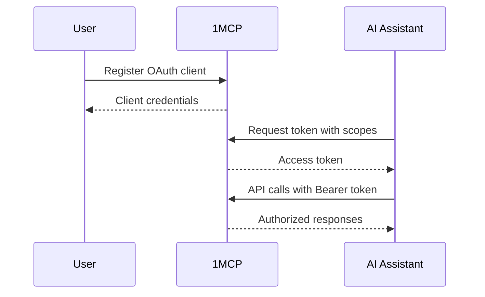

# Security & Access Control

> **🛡️ Enterprise-Grade Security**: Protect your MCP servers with industry-standard authentication and granular access control

## 🛡️ OAuth 2.1 Authentication

**What it does**: Industry-standard authentication with secure token management
**Why you need it**: Control who can access your MCP servers with enterprise-grade security
**How it helps**: User sessions, token refresh, audit trails, scope-based permissions

**Authentication Flow**:



**⏱️ Setup Time**: 15 minutes
**🎯 Perfect For**: Teams, shared environments, security compliance
**✅ You Get**: Secure authentication, session management, token refresh, audit logs

---

## 🏷️ Tag-Based Access Control

**What it does**: Granular permissions using server tags and OAuth scopes
**Why you need it**: Give users access to only the MCP servers they need
**How it helps**: Tag servers by sensitivity/function, grant access by role

**Permission Examples**:

```yaml
# Server Configuration
filesystem: { tags: ['files', 'sensitive'] }
database: { tags: ['database', 'sensitive'] }
web-search: { tags: ['web', 'safe'] }
memory: { tags: ['memory', 'safe'] }

# User Roles
Developer: 'tag:files tag:database tag:web tag:memory' # Full access
Analyst: 'tag:database tag:web' # Data access only
Demo: 'tag:web' # Public APIs only
```

**⏱️ Setup Time**: 5 minutes per role
**🎯 Perfect For**: Multi-user environments, principle of least privilege
**✅ You Get**: Role-based access, fine-grained permissions, security compliance

---

## 🚫 Rate Limiting & DDoS Protection

**What it does**: Prevents abuse with configurable request limits per client
**Why you need it**: Protect your MCP servers from overload and malicious usage
**How it helps**: Per-client limits, burst handling, automatic throttling

**Rate Limit Configuration**:

```bash
# Configure via CLI flags
npx -y @1mcp/agent --config mcp.json --enable-auth \
  --rate-limit-window 15 \     # 15 minute window
  --rate-limit-max 100         # 100 requests per window

# Or via environment variables
export ONE_MCP_RATE_LIMIT_WINDOW=15
export ONE_MCP_RATE_LIMIT_MAX=100
npx -y @1mcp/agent --config mcp.json --enable-auth
```

**⏱️ Setup Time**: Built-in with sensible defaults
**🎯 Perfect For**: Public APIs, high-traffic environments, abuse prevention
**✅ You Get**: Automatic protection, configurable limits, fair usage enforcement

---

## Getting Started with Security

### Security Setup Path

1. **[15 minutes]** OAuth 2.1 authentication → [Authentication Guide](/guide/advanced/authentication)
2. **[10 minutes]** Tag-based access control → [Configuration Guide](/guide/essentials/configuration)
3. **[5 minutes]** Rate limiting setup → Built-in protection

### Security Best Practices

- **Principle of Least Privilege**: Grant minimal necessary access
- **Regular Auditing**: Review access logs and permissions
- **Token Management**: Implement proper token refresh cycles
- **Monitoring**: Track authentication events and failures

### Advanced Security

- **Custom Scopes**: Define application-specific permissions
- **Audit Logging**: Track all security events
- **Integration**: Connect with enterprise identity providers

### Next Steps

- **Core Features** → [Core Features](/guide/essentials/core-features)
- **Performance** → [Performance Features](/guide/advanced/performance)
- **Production Setup** → [Enterprise Features](/guide/advanced/enterprise)

---

> **🔒 Security Note**: All security features are designed to work together. Enable OAuth 2.1 first, then layer on tag-based access control and rate limiting for comprehensive protection.
