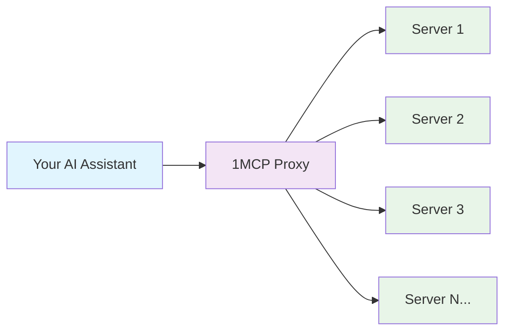

# Core Features

> **🎯 What Everyone Gets**: Essential features that work out of the box for every user

## 🔗 Universal MCP Aggregation

**What it does**: Connects to all your MCP servers through one endpoint
**Why you need it**: Stop managing dozens of individual server connections
**How it helps**: One configuration file, one health check, one connection to manage



**⏱️ Setup Time**: 5 minutes
**🎯 Perfect For**: Anyone using 2+ MCP servers
**✅ You Get**: Unified interface, automatic health monitoring, connection pooling

---

## 🔄 Hot Configuration Reload

**What it does**: Updates server configuration without restarting or losing connections
**Why you need it**: Add/remove MCP servers instantly with zero downtime
**How it helps**: Edit config file → Changes applied automatically in <30 seconds

**Real Example**:

```bash
# Edit your config file
vim ~/.config/1mcp/mcp.json

# Add a new server:
"new-server": {
  "command": "npx",
  "args": ["-y", "@modelcontextprotocol/server-web"],
  "tags": ["web", "search"]
}

# Save file → Server automatically detected and connected
# No restart needed, existing connections preserved
```

**⏱️ Setup Time**: Built-in (no setup required)
**🎯 Perfect For**: Development, production environments, frequent config changes
**✅ You Get**: Zero-downtime updates, instant server addition/removal, preserved sessions

---

## 📊 Basic Status Monitoring

**What it does**: Provides logging and basic status information for MCP servers
**Why you need it**: Track server connections and troubleshoot issues
**How it helps**: Structured logging, connection status, error tracking

**Status Information**:

- Server status available through structured logs.
- Connection information via MCP protocol responses.
- A health endpoint is available to check system status.
- Monitor through application logs and see [Enterprise Features](/guide/advanced/enterprise) for advanced health monitoring.

**⏱️ Setup Time**: Automatic
**🎯 Perfect For**: Production monitoring, troubleshooting, system reliability
**✅ You Get**: Structured logging, error tracking, connection monitoring

---

## Getting Started with Core Features

### Quick Setup Path

1. **[5 minutes]** Basic MCP aggregation → [Getting Started](/guide/getting-started#🌟-level-1-basic-proxy-5-minutes)
2. **Configuration** → [Configuration Guide](/guide/essentials/configuration)
3. **Troubleshooting** → Check logs and status information

### Next Steps

- **Add Security** → [Security Features](/guide/advanced/security)
- **Scale Performance** → [Performance Features](/guide/advanced/performance)
- **Production Ready** → [Enterprise Features](/guide/advanced/enterprise)

---

> **💡 Pro Tip**: These core features work out of the box with zero configuration. Start here, then add advanced features as your needs grow.
