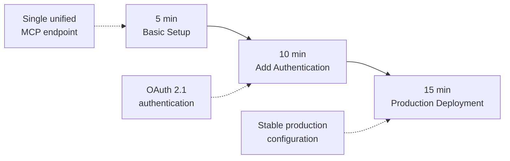

# Getting Started with 1MCP

> **🎯 Goal**: Get you from individual MCP server connections to a unified proxy in simple, practical steps.

## 🗺️ Your Journey Overview



**Choose Your Starting Point**:

- 👋 **New to MCP?** → Start with Level 1
- 🔒 **Need authentication?** → Jump to Level 2
- 🏢 **Production deployment?** → Go to Level 3

---

## 📋 Prerequisites

### **System Requirements**

- **OS**: Linux, macOS, or Windows
- **Memory**: 512MB RAM minimum, 2GB recommended
- **Node.js**: Version 18+ (for MCP servers)
- **Network**: HTTP/HTTPS outbound access

### **What You'll Need**

- [ ] Existing MCP servers or intention to install them
- [ ] Text editor for configuration files
- [ ] Terminal/command line access
- [ ] Basic understanding of JSON configuration

### **5-Minute Environment Check**

```bash
# Check Node.js version
node --version  # Should be 18+

# Verify you can create files in your home directory
touch ~/.test-file && rm ~/.test-file && echo "✅ File permissions OK"

# Check if you have existing MCP servers
ls ~/.config/*/mcp.json 2>/dev/null || echo "ℹ️ No existing MCP config found"
```

---

## 🌟 Level 1: Basic Proxy (5 minutes)

**🎯 Goal**: Replace individual MCP connections with single proxy
**👤 Perfect for**: First-time users, simple setups, proof of concept

### **What You'll Achieve**

- ✅ Single configuration file instead of multiple connections
- ✅ Unified health monitoring for all MCP servers
- ✅ Automatic connection management and retry logic
- ✅ One endpoint for your AI assistant to connect to

### **Step 1: Get 1MCP** (1 minute)

**Option A: Binary Download (Fastest - No Node.js Required)**

```bash
# Linux:
curl -L -o 1mcp https://github.com/1mcp-app/agent/releases/latest/download/1mcp-linux-x64
sudo mv 1mcp /usr/local/bin/ && sudo chmod +x /usr/local/bin/1mcp
1mcp --help

# macOS:
curl -L -o 1mcp https://github.com/1mcp-app/agent/releases/latest/download/1mcp-darwin-arm64
sudo mv 1mcp /usr/local/bin/ && sudo chmod +x /usr/local/bin/1mcp
1mcp --help

# Windows (PowerShell):
Invoke-WebRequest -Uri "https://github.com/1mcp-app/agent/releases/latest/download/1mcp-win32-x64.exe" -OutFile "1mcp.exe"
.\1mcp.exe --help
```

**Option B: NPM (No Installation Needed)**

```bash
# 1MCP runs via npx - no global installation required
# Verify it works:
npx -y @1mcp/agent --help
```

### **Step 2: Create Basic Configuration** (2 minutes)

```bash
# Create config directory
mkdir -p ~/.config/1mcp

# Create basic configuration file
cat > ~/.config/1mcp/mcp.json << 'EOF'
{
  "mcpServers": {
    "filesystem": {
      "command": "npx",
      "args": ["-y", "@modelcontextprotocol/server-filesystem", "/tmp"],
      "tags": ["local", "files"]
    },
    "memory": {
      "command": "npx",
      "args": ["-y", "@modelcontextprotocol/server-memory"],
      "tags": ["memory", "notes"]
    }
  }
}
EOF
```

### **Step 3: Start 1MCP** (1 minute)

```bash
# Binary option:
1mcp --config ~/.config/1mcp/mcp.json --port 3050

# NPM option:
npx -y @1mcp/agent --config ~/.config/1mcp/mcp.json --port 3050

# You should see:
# ✅ Server is running on port 3050 with HTTP/SSE transport
# ✅ Connected to filesystem, memory servers
# 📋 OAuth Management Dashboard: http://localhost:3050/oauth
```

### **Step 4: Test Your Setup** (< 1 minute)

```bash
# Use MCP Inspector for testing and debugging (recommended)
npx @modelcontextprotocol/inspector

# This opens a powerful UI at http://localhost:5173 that lets you:
# - Connect to your 1MCP proxy at http://localhost:3050
# - Test all available tools and resources
# - Debug authentication flows
# - Monitor real-time MCP protocol messages

# Alternative: Check the health via curl
curl http://localhost:3050/health
# Or visit http://localhost:3050/health in your browser
```

### **✅ Level 1 Complete!**

**🎉 Success Indicators**:

- [ ] 1MCP server running on port 3050
- [ ] MCP Inspector connects successfully at http://localhost:5173
- [ ] Health endpoint shows servers connected at http://localhost:3050/health
- [ ] Can test filesystem and memory tools via Inspector UI

**🔧 Common Issues**:

- **Port 3050 in use?** → Use `--port 3051`
- **MCP servers fail to start?** → Check Node.js version is 21+
- **Permission errors?** → Ensure ~/.config/1mcp directory is writable
- **Config not found?** → Use absolute path: `--config $(pwd)/.config/1mcp/mcp.json`

**➡️ Next Level**: [Add authentication and access control](#-level-2-secure-access-15-minutes)

---

## 🔒 Level 2: Secure Access (15 minutes)

**🎯 Goal**: Add authentication and granular access control
**👤 Perfect for**: Teams, shared environments, security-conscious users

### **What You'll Achieve**

- ✅ OAuth 2.1 authentication with secure token management
- ✅ Scope-based permissions controlling MCP server access
- ✅ User session management with automatic token refresh
- ✅ Audit logging of all access attempts

### **Step 1: Enable Authentication** (1 minute)

```bash
# Stop your existing 1MCP instance (Ctrl+C)

# Start with authentication enabled
# Binary option:
1mcp --config ~/.config/1mcp/mcp.json --port 3050 --enable-auth

# NPM option:
npx -y @1mcp/agent --config ~/.config/1mcp/mcp.json --port 3050 --enable-auth

# New output shows:
# 🔐 Authentication enabled - OAuth 2.1 endpoints available via SDK
# 📋 OAuth Management Dashboard: http://localhost:3050/oauth
```

### **Step 2: Use the OAuth Management Dashboard** (2 minutes)

Instead of a manual registration endpoint, the 1MCP Agent provides an OAuth Management Dashboard to manage the authorization flow with your backend services. When a backend service requires OAuth, you can use this dashboard to initiate and approve the authorization request.

Visit the dashboard in your browser to see the status of your services and authorize any that are awaiting OAuth.

### **Step 3: Configure Scope-Based Access** (2 minutes)

```bash
# Update your configuration with more detailed tagging
cat > ~/.config/1mcp/mcp.json << 'EOF'
{
  "mcpServers": {
    "filesystem": {
      "command": "npx",
      "args": ["-y", "@modelcontextprotocol/server-filesystem", "/tmp"],
      "tags": ["filesystem", "local", "sensitive"]
    },
    "memory": {
      "command": "npx",
      "args": ["-y", "@modelcontextprotocol/server-memory"],
      "tags": ["memory", "notes", "safe"]
    }
  }
}
EOF

# Config will hot-reload automatically - no restart needed!
```

### **Step 4: Test Authentication** (2 minutes)

```bash
# Use MCP Inspector to test OAuth flow (recommended)
npx @modelcontextprotocol/inspector

# In the Inspector UI:
# 1. Connect to http://localhost:3050
# 2. You'll see OAuth authentication prompts
# 3. Use the built-in OAuth flow testing
# 4. Test scope-based access with different tags

# Alternative: Manual OAuth testing via curl
# Try accessing SSE endpoint without authentication
curl http://localhost:3050/sse
# Should require authentication when auth is enabled

# Manual token flow (if needed for debugging)
export CLIENT_ID="your-client-id-from-step-2"
export CLIENT_SECRET="your-client-secret-from-step-2"

curl -X POST http://localhost:3050/token \
  -H "Content-Type: application/x-www-form-urlencoded" \
  -d "grant_type=client_credentials&client_id=$CLIENT_ID&client_secret=$CLIENT_SECRET&scope=tag:safe"
```

### **✅ Level 2 Complete!**

**🎉 Success Indicators**:

- [ ] MCP Inspector successfully handles OAuth flow
- [ ] OAuth client registration works via Inspector UI
- [ ] Scope restrictions properly enforced (tag-based access)
- [ ] Can test different scopes using Inspector interface
- [ ] Management dashboard shows authentication status

**🔧 Common Issues**:

- **MCP Inspector can't connect?** → Verify 1MCP is running on port 3050
- **OAuth flow fails in Inspector?** → Check 1MCP is running with --enable-auth
- **Scope errors?** → Ensure server tags match requested scopes
- **Inspector shows "Unauthorized"?** → Complete OAuth flow in Inspector UI first
- **Dashboard not loading?** → Ensure --enable-auth flag is used

**➡️ Next Level**: [Production-ready deployment](#-level-3-production-ready-45-minutes)

---

## 🏗️ Level 3: Production Ready (15 minutes)

**🎯 Goal**: Stable production deployment with basic security
**👤 Perfect for**: Production environments, teams, shared deployments

### **What You'll Achieve**

- ✅ Systemd service for automatic startup
- ✅ Basic security configuration
- ✅ Log management and rotation
- ✅ Configuration backup
- ✅ Basic monitoring

### **Step 1: Production Configuration** (5 minutes)

```bash
# Create production config directory
sudo mkdir -p /etc/1mcp
sudo chown $USER:$USER /etc/1mcp

# Production configuration
cat > /etc/1mcp/mcp.json << 'EOF'
{
  "mcpServers": {
    "filesystem": {
      "command": "npx",
      "args": ["-y", "@modelcontextprotocol/server-filesystem", "/app/data"],
      "tags": ["filesystem", "data", "sensitive"]
    },
    "memory": {
      "command": "npx",
      "args": ["-y", "@modelcontextprotocol/server-memory"],
      "tags": ["memory", "cache", "safe"]
    }
  }
}
EOF
```

### **Step 2: Create Systemd Service** (5 minutes)

```bash
# First, install the binary system-wide (if not already done)
sudo curl -L -o /usr/local/bin/1mcp https://github.com/1mcp-app/agent/releases/latest/download/1mcp-linux-x64
sudo chmod +x /usr/local/bin/1mcp

# Create systemd service file
sudo tee /etc/systemd/system/1mcp.service << 'EOF'
[Unit]
Description=1MCP - Universal MCP Server Proxy
After=network.target

[Service]
Type=simple
User=$USER
WorkingDirectory=/home/$USER
ExecStart=/usr/local/bin/1mcp --config /etc/1mcp/mcp.json --port 3050 --enable-auth
Restart=always
RestartSec=5
StandardOutput=journal
StandardError=journal

[Install]
WantedBy=multi-user.target
EOF

# Enable and start service
sudo systemctl daemon-reload
sudo systemctl enable 1mcp
sudo systemctl start 1mcp

# Check status
sudo systemctl status 1mcp
```

### **Step 3: Basic Monitoring** (5 minutes)

```bash
# Simple health check script
cat > /usr/local/bin/1mcp-health-check << 'EOF'
#!/bin/bash
HEALTH_URL="http://localhost:3050/health"
RESPONSE=$(curl -s -o /dev/null -w "%{http_code}" "$HEALTH_URL")

if [ "$RESPONSE" = "200" ]; then
    echo "✅ 1MCP healthy ($(date))"
    exit 0
else
    echo "❌ 1MCP unhealthy (HTTP $RESPONSE) ($(date))"
    exit 1
fi
EOF

sudo chmod +x /usr/local/bin/1mcp-health-check

# Add to crontab for regular health checks
(crontab -l 2>/dev/null; echo "*/5 * * * * /usr/local/bin/1mcp-health-check >> /var/log/1mcp-health.log 2>&1") | crontab -

# Check logs
tail -f /var/log/1mcp-health.log
```

### **Step 4: Configure Environment** (Optional)

```bash
# Set environment variables for production
sudo tee -a /etc/environment << 'EOF'
ONE_MCP_ENABLE_AUTH=true
ONE_MCP_ENABLE_ENHANCED_SECURITY=true
ONE_MCP_RATE_LIMIT_WINDOW=15
ONE_MCP_RATE_LIMIT_MAX=100
EOF

# Restart service to pick up environment changes
sudo systemctl restart 1mcp
```

### **Step 5: Backup Configuration** (Optional)

```bash
# Simple backup script
cat > ~/1mcp-backup.sh << 'EOF'
#!/bin/bash
TIMESTAMP=$(date +%Y%m%d-%H%M%S)
cp /etc/1mcp/mcp.json ~/"1mcp-config-backup-$TIMESTAMP.json"
echo "✅ Configuration backed up to ~/1mcp-config-backup-$TIMESTAMP.json"
EOF

chmod +x ~/1mcp-backup.sh

# Run backup
~/1mcp-backup.sh
```

### **✅ Level 3 Complete!**

**🎉 Success Indicators**:

- [ ] 1MCP running as systemd service
- [ ] Service starts automatically on boot
- [ ] Health check script working
- [ ] Configuration backed up
- [ ] Health endpoint accessible at http://localhost:3050/health

**🔧 Production Checklist**:

- [ ] SSL/TLS certificate configured (use reverse proxy like nginx)
- [ ] Firewall rules configured (allow only port 3050)
- [ ] OAuth clients registered for your applications
- [ ] Server tags configured appropriately
- [ ] Configuration backed up regularly

**➡️ Next Level**: [Advanced optimization](#-level-4-advanced-optimization-2-hours)

---

## 🔧 Beyond Basic Setup

**Additional configuration options available:**

### **Transport Configuration**

- Use `--transport sse` for Server-Sent Events
- Use `--transport stdio` for standard input/output
- Use `--transport http` for streamable HTTP (default)

### **Tag Filtering**

- Filter servers by tags: `--tags "network,filesystem"`
- Configure tag-based OAuth scopes

### **Reverse Proxy Setup**

- Configure `--trust-proxy` for proxy environments
- Use `--external-url` for public-facing deployments

### **Simple Reverse Proxy Setup** (Optional)

```bash
# Basic nginx configuration for SSL termination
sudo tee /etc/nginx/sites-available/1mcp << 'EOF'
server {
    listen 80;
    server_name your-domain.com;
    return 301 https://$server_name$request_uri;
}

server {
    listen 443 ssl;
    server_name your-domain.com;

    ssl_certificate /path/to/your/cert.pem;
    ssl_certificate_key /path/to/your/key.pem;

    location / {
        proxy_pass http://localhost:3050;
        proxy_set_header Host $host;
        proxy_set_header X-Real-IP $remote_addr;
        proxy_set_header X-Forwarded-For $proxy_add_x_forwarded_for;
        proxy_set_header X-Forwarded-Proto $scheme;
    }
}
EOF
```

### **Using Different Configurations**

```bash
# Create environment-specific configs
cp /etc/1mcp/mcp.json /etc/1mcp/mcp-dev.json
cp /etc/1mcp/mcp.json /etc/1mcp/mcp-staging.json

# Start with different configs
npx -y @1mcp/agent --config /etc/1mcp/mcp-dev.json --port 3051
npx -y @1mcp/agent --config /etc/1mcp/mcp-staging.json --port 3052
```

### **Basic Log Monitoring**

```bash
# Monitor 1MCP logs
sudo journalctl -u 1mcp -f

# Check for errors
sudo journalctl -u 1mcp --since "1 hour ago" | grep -i error

# Simple log analysis script
cat > ~/1mcp-log-summary.sh << 'EOF'
#!/bin/bash
echo "=== 1MCP Service Status ==="
sudo systemctl status 1mcp --no-pager
echo
echo "=== Recent Errors ==="
sudo journalctl -u 1mcp --since "1 hour ago" | grep -i error | tail -10
EOF

chmod +x ~/1mcp-log-summary.sh
```

### **Environment Variables Reference**

```bash
# Authentication settings
ONE_MCP_ENABLE_AUTH=true
ONE_MCP_ENABLE_SCOPE_VALIDATION=true

# Rate limiting
ONE_MCP_RATE_LIMIT_WINDOW=15  # 15 minutes
ONE_MCP_RATE_LIMIT_MAX=100

# Security
ONE_MCP_ENABLE_ENHANCED_SECURITY=true
ONE_MCP_TRUST_PROXY=loopback

# Session management
ONE_MCP_SESSION_TTL=1440  # 24 hours
ONE_MCP_SESSION_STORAGE_PATH=/var/lib/1mcp/sessions
```

### **✅ Setup Complete!**

You now have 1MCP running as a stable service with basic authentication and monitoring.

---

## 🆘 Troubleshooting Guide

### **Common Issues & Solutions**

#### **🔌 Connection Issues**

```bash
# Problem: "Connection refused"
# Solution: Check if 1MCP is running
systemctl status 1mcp
# Check application logs for server status

# Problem: "MCP server not responding"
# Solution: Check individual server health (debug mode)
# Binary:
ONE_MCP_LOG_LEVEL=debug 1mcp --config ~/.config/1mcp/mcp.json
# NPM:
ONE_MCP_LOG_LEVEL=debug npx -y @1mcp/agent --config ~/.config/1mcp/mcp.json
```

#### **🔐 Authentication Issues**

```bash
# Problem: "Invalid token"
# Solution: Check token expiration and scopes
# Check token validity through OAuth endpoints (when auth enabled)

# Problem: "Insufficient scope"
# Solution: Verify server tags match token scopes
cat ~/.config/1mcp/mcp.json | jq '.mcpServers[].tags'
```

#### **⚡ Performance Issues**

```bash
# Problem: Slow response times
# Solution: Check server status and logs
# Check application logs for server status
# Check logs for connection issues
htop # Check CPU/memory usage

# Problem: High error rates
# Solution: Check server logs for patterns
journalctl -u 1mcp -f --lines=100
```

### **Getting Help**

- 📖 **Documentation**: [Documentation Home](/)
- 🐛 **Issues**: [GitHub Issues](https://github.com/1mcp-app/agent/issues)
- 💬 **Community**: [Discussions](https://github.com/1mcp-app/agent/discussions)

---

## 🎯 Next Steps

- [Explore security features](/reference/security)
- [Advanced architecture](/reference/architecture)

---

> **🎉 Congratulations!** You've successfully set up 1MCP from basic proxy to enterprise-grade infrastructure. Your AI assistants now have reliable, secure, and scalable access to all their MCP capabilities through a single, unified interface.
