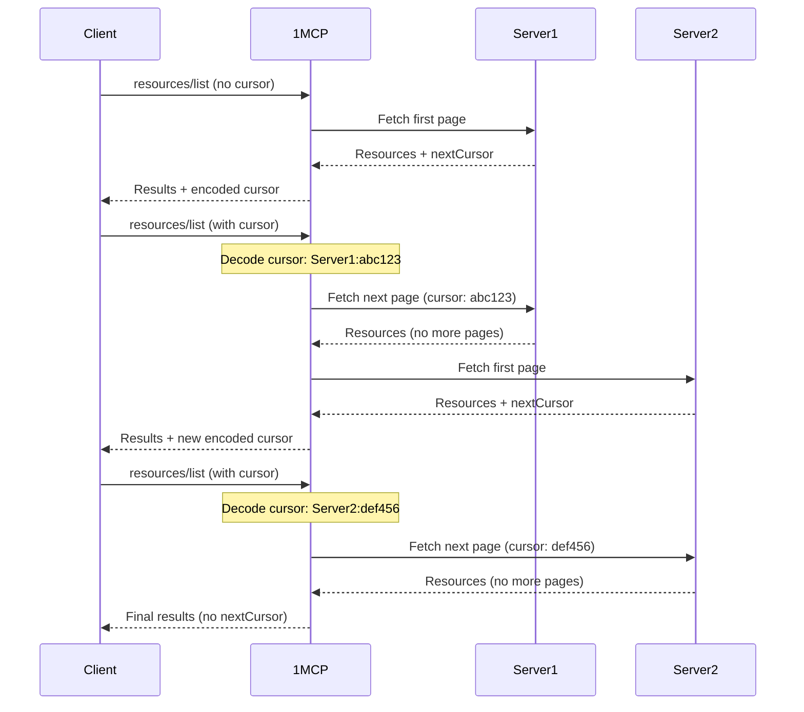

# Pagination Support

1MCP Agent supports pagination for MCP protocol responses to improve performance when dealing with large result sets from multiple servers. This feature helps manage resources efficiently when aggregating data from many MCP servers.

## Overview

**What it does**: Enables paginated responses for MCP protocol methods (resources, tools, prompts, resource templates)

**Why it's disabled by default**: Not all MCP clients support pagination, so it's opt-in to ensure compatibility

**How it works**: Uses cursor-based pagination to fetch results from multiple servers in chunks

## ⚠️ Important: Default Behavior

**Pagination is disabled by default** because not all MCP clients support pagination. When disabled:

- All results from all connected MCP servers are fetched and returned at once
- This ensures maximum compatibility with existing clients
- May consume more memory and time with many servers

## Enabling Pagination

### 1. Command Line Flag

Enable pagination with the `--pagination` or `-p` flag:

```bash
# Enable pagination for HTTP transport
npx -y @1mcp/agent --config mcp.json --pagination

# With short flag
npx -y @1mcp/agent --config mcp.json -p
```

### 2. Environment Variable

Set the `ONE_MCP_PAGINATION` environment variable:

```bash
export ONE_MCP_PAGINATION=true
npx -y @1mcp/agent --config mcp.json
```

### 3. HTTP Query Parameter

For HTTP transport, enable pagination per-request:

```bash
# Test pagination with MCP Inspector
pnpm inspector

# Then in the inspector interface:
# 1. Navigate to the tools tab
# 2. Enable pagination in settings
# 3. Click "List Tools" to see paginated results
# 4. Use the "List More Tools" button to navigate through results
```

## How Pagination Works

### Cursor Format

1MCP uses **base64-encoded cursors** that contain:

- Client name (which MCP server to continue from)
- Server-specific cursor (for continuing within that server)

```
Cursor format: base64(clientName:serverCursor)
```

### Pagination Flow



### Supported MCP Methods

Pagination works with these MCP protocol methods:

- `resources/list` - List available resources
- `resources/templates/list` - List resource templates
- `tools/list` - List available tools
- `prompts/list` - List available prompts

## Performance Benefits

### With Pagination Enabled

**Memory Usage**: Lower - only current page in memory
**Response Time**: Faster initial response - immediate first page
**Network**: Reduced - smaller response payloads
**Scalability**: Better - handles many servers efficiently

```bash
# Example: 10 servers with 100 resources each
# Without pagination: 1000 resources in single response (slow)
# With pagination: 50-100 resources per response (fast)
```

### Without Pagination (Default)

**Memory Usage**: Higher - all results loaded at once
**Response Time**: Slower - waits for all servers
**Network**: Larger - complete result sets
**Compatibility**: Maximum - works with all clients

## Client Implementation

### Making Paginated Requests

```json
{
  "jsonrpc": "2.0",
  "id": 1,
  "method": "resources/list",
  "params": {
    "_meta": {
      "progressToken": "optional-progress-token"
    }
  }
}
```

### Handling Paginated Responses

```json
{
  "jsonrpc": "2.0",
  "id": 1,
  "result": {
    "resources": [
      {
        "uri": "file:///example.txt",
        "name": "Example File",
        "mimeType": "text/plain"
      }
    ],
    "nextCursor": "aGVsbG86d29ybGQ="
  }
}
```

### Fetching Next Page

```json
{
  "jsonrpc": "2.0",
  "id": 2,
  "method": "resources/list",
  "params": {
    "cursor": "aGVsbG86d29ybGQ=",
    "_meta": {
      "progressToken": "optional-progress-token"
    }
  }
}
```

## Error Handling

### Invalid Cursor

If a cursor becomes invalid (server removed, corrupted data):

```json
{
  "jsonrpc": "2.0",
  "id": 1,
  "result": {
    "resources": [],
    "nextCursor": "bmV3LWN1cnNvcg=="
  }
}
```

1MCP automatically:

- Falls back to the first available server
- Logs a warning about the invalid cursor
- Continues pagination from a valid starting point

### Server Unavailable

When a server in the pagination sequence becomes unavailable:

- 1MCP skips the unavailable server
- Continues with the next available server
- Logs the server status for monitoring

## Configuration Examples

### Development Setup

```bash
# Quick development with pagination
npx -y @1mcp/agent --config dev.json --pagination --log-level debug
```

### Production Setup

```bash
# Production with environment variables
export ONE_MCP_PAGINATION=true
npx -y @1mcp/agent --config production.json
```

### Docker Environment

```yaml
# docker-compose.yml
services:
  1mcp:
    image: ghcr.io/1mcp-app/agent:latest
    environment:
      - ONE_MCP_PAGINATION=true
      - ONE_MCP_CONFIG_PATH=/config/mcp.json
    volumes:
      - ./config:/config
    ports:
      - '3050:3050'
```

## When to Enable Pagination

### ✅ Enable When

- You have **5+ MCP servers** with large result sets
- Client **supports pagination** (can handle `nextCursor`)
- **Performance** is more important than simplicity
- Working with **resource-intensive** operations

### ❌ Keep Disabled When

- You have **few MCP servers** (≤3) with small result sets
- Client **doesn't support pagination** (ignores `nextCursor`)
- **Compatibility** is more important than performance
- **Simple setup** is preferred

## Troubleshooting

### Check If Pagination Is Working

```bash
# Test with MCP Inspector
pnpm inspector

# In the inspector:
# 1. Enable pagination in settings
# 2. Navigate to any list view (resources, tools, prompts)
# 3. Look for "List More" button and page indicators
# 4. Check the response JSON for "nextCursor" field
```

### Debug Pagination Issues

```bash
# Enable debug logging to see pagination flow
npx -y @1mcp/agent --config mcp.json --pagination --log-level debug
```

Look for log messages like:

- `Fetching all items for client X` (when pagination disabled)
- `Fetching next page for client X with cursor Y` (when pagination enabled)

### Common Issues

**Empty Results with Pagination**:

- Check if servers support pagination
- Verify cursor format is valid base64

**Performance Not Improved**:

- Ensure client is making paginated requests
- Check if servers return appropriate page sizes

**Cursor Errors**:

- Enable debug logging to see cursor parsing
- Verify server names haven't changed in configuration

## Related Documentation

- [Configuration Guide](/guide/essentials/configuration) - Full configuration options
- [Feature Overview](/guide/features) - All 1MCP features
- [Server Management](/guide/essentials/server-management) - Managing MCP servers
- [Health Check API](/reference/health-check) - Monitoring server status
