# Fast Startup: Async Server Loading

Get your 1MCP agent running instantly, even when some servers take time to connect.

## What's This About?

When you start 1MCP, it needs to connect to all your configured MCP servers. Previously, if even one server was slow or unreachable, your entire 1MCP instance would be stuck waiting. Now, 1MCP starts immediately and connects to servers in the background.

## The Problem We Solved

**Before**:

- 1MCP waits for ALL servers before starting
- One slow server = entire system stuck
- Network issues block your workflow

**Now**:

- 1MCP starts in under 1 second
- Servers connect in the background
- You can work immediately with available servers

## How It Works

```mermaid
graph TD
    A[Start 1MCP] --> B[HTTP Server Ready <1s]
    B --> C[Background: Connect to MCP Servers]
    C --> D[Server 1: Ready ✅]
    C --> E[Server 2: Loading ⏳]
    C --> F[Server 3: Failed ❌]
    D --> G[Full Functionality Available]
    E --> G
    F --> H[Retry in Background]
    H --> G
```



## Server States

| State              | Icon | What It Means                   | What You Can Do              |
| ------------------ | ---- | ------------------------------- | ---------------------------- |
| **Ready**          | ✅   | Server connected successfully   | Full functionality available |
| **Loading**        | ⏳   | Server connecting in background | Wait or use other servers    |
| **Failed**         | ❌   | Connection failed, will retry   | Check server config/network  |
| **Awaiting OAuth** | 🔐   | Needs authorization             | Complete OAuth flow          |

## Monitor Your Servers

### Quick Health Check

```bash
curl http://localhost:3000/health/mcp
```

### Individual Server Status

```bash
curl http://localhost:3000/health/mcp/context7
```

## Benefits for You

### ⚡ Instant Startup

- 1MCP ready in <1 second regardless of server count
- No more waiting for slow connections
- Start working immediately

### 🛡️ Resilient Operation

- One failed server doesn't break everything
- Automatic retries with smart backoff
- Graceful handling of network issues

### 📊 Full Visibility

- Real-time status of all servers
- Detailed error messages when things fail
- Progress tracking for long connections

## Configuration Options

You can customize how 1MCP handles server connections through your configuration file.

### Timeout Settings

```json5
{
  loading: {
    // How long to wait for each server (default: 30 seconds)
    serverTimeoutMs: 30000,

    // How many times to retry failed connections (default: 3)
    maxRetries: 3,

    // Initial delay between retries (default: 2 seconds)
    retryDelayMs: 2000,
  },
}
```

### Performance Tuning

```json5
{
  loading: {
    // How many servers to connect simultaneously (default: 5)
    maxConcurrentLoads: 5,

    // Continue if some servers fail (recommended: true)
    continueOnFailure: true,

    // Keep retrying failed servers (recommended: true)
    enableBackgroundRetry: true,

    // How often to retry failed servers (default: 1 minute)
    backgroundRetryIntervalMs: 60000,
  },
}
```

## Health Check API

Check the status of your MCP servers through simple HTTP endpoints.

### Overall Status: `/health/mcp`

Get a complete overview of all your servers:

```bash
curl http://localhost:3000/health/mcp
```

**Example Response:**

```json
{
  "loading": {
    "isComplete": false, // Still connecting to some servers
    "successRate": 66.7, // 2 out of 3 servers connected
    "averageLoadTime": 2500 // Average connection time in ms
  },
  "summary": {
    "total": 3, // Total configured servers
    "ready": 2, // Servers ready to use
    "loading": 1, // Servers still connecting
    "failed": 0 // Servers that failed
  },
  "servers": {
    "ready": ["context7", "magic"], // Working servers
    "loading": ["sequential"] // Still connecting
  }
}
```

### Individual Server: `/health/mcp/:serverName`

Check a specific server:

```bash
curl http://localhost:3000/health/mcp/context7
```

**Example Response:**

```json
{
  "name": "context7",
  "state": "ready", // Current status
  "duration": 2300, // Time to connect (ms)
  "retryCount": 1, // Number of connection attempts
  "message": "Successfully connected"
}
```

## Common Scenarios

### Network Timeout

When a server takes too long to connect:

```
Server "context7" → Loading → Timeout (30s) → Failed → Retry in background (60s)
```

### OAuth Authorization

Some servers need you to authorize first:

```
Server "github" → Loading → Awaiting OAuth → Visit auth URL → Ready
```

### Partial Availability

When some servers work and others don't:

```
3 servers configured:
✅ context7 (ready)
✅ magic (ready)
❌ sequential (failed)

Result: 1MCP works with 2/3 servers, keeps retrying the failed one
```

## What You'll Notice

### Faster Startup ⚡

- 1MCP starts in under 1 second
- No more waiting for slow connections
- You can start working immediately

### Better Reliability 🛡️

- Individual server failures don't break everything
- Failed servers retry automatically in the background
- Clear visibility into what's working and what's not

### Monitoring Made Easy 📊

- Check `/health/mcp` anytime to see status
- Get detailed info about individual servers
- Real-time progress as servers connect

## Troubleshooting

### "Some servers are still loading"

**Normal behavior.** 1MCP starts fast and connects servers in background. Check `/health/mcp` to see progress.

### "Server keeps failing to connect"

1. Check your network connection
2. Verify server configuration in your `mcp.json`
3. Check if the server requires OAuth authorization
4. Look at `/health/mcp/servername` for detailed error messages

### "Everything seems slow"

1. Check how many servers you're loading simultaneously (`maxConcurrentLoads`)
2. Consider increasing timeout values for slow networks
3. Some servers might be rate-limiting your connections

### "1MCP won't start at all"

This usually means a configuration problem, not a server connection issue:

1. Check your `mcp.json` file syntax
2. Verify file permissions
3. Check the 1MCP logs for specific errors

::: tip
The async loading only affects MCP server connections. If 1MCP itself won't start, it's likely a configuration or permission issue.
:::
