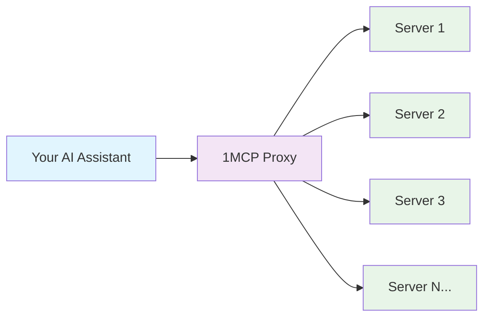
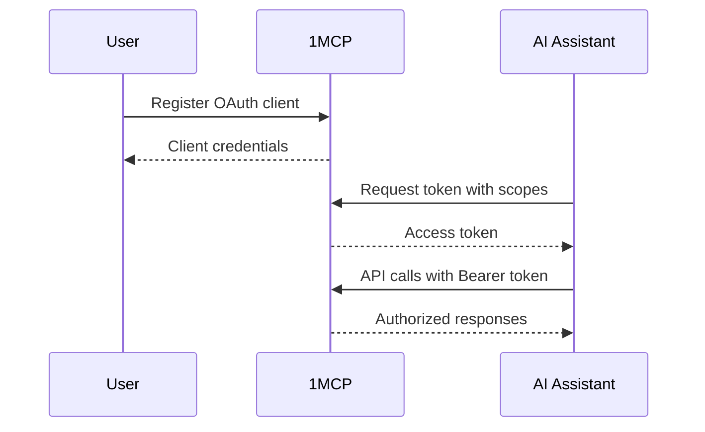
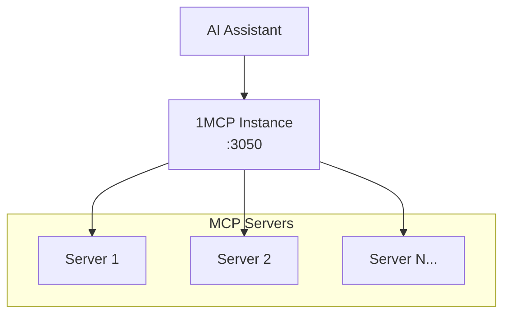

# 1MCP Features: What Can You Do?

> **🎯 Philosophy**: Every feature exists to solve a real user problem. We built capabilities you actually need, not just features that sound impressive.

## 🚀 Quick Discovery (Choose Your Path)

**👋 I'm new to 1MCP** → [Core Features](#-core-features-what-everyone-gets)
**🔒 I need security** → [Security Features](#-security--access-control)
**⚡ I want performance** → [Performance Features](#-performance--reliability)
**🏢 I run production systems** → [Enterprise Features](#-enterprise--operations)
**🔧 I'm a developer** → [Developer Features](#-developer--integration)

---

## 🌟 Core Features (What Everyone Gets)

### **🔗 Universal MCP Aggregation**

**What it does**: Connects to all your MCP servers through one endpoint
**Why you need it**: Stop managing dozens of individual server connections
**How it helps**: One configuration file, one health check, one connection to manage



**⏱️ Setup Time**: 5 minutes
**🎯 Perfect For**: Anyone using 2+ MCP servers
**✅ You Get**: Unified interface, automatic health monitoring, connection pooling

---

### **🔄 Hot Configuration Reload**

**What it does**: Updates server configuration without restarting or losing connections
**Why you need it**: Add/remove MCP servers instantly with zero downtime
**How it helps**: Edit config file → Changes applied automatically in <30 seconds

**Real Example**:

```bash
# Edit your config file
vim ~/.config/1mcp/mcp.json

# Add a new server:
"new-server": {
  "command": ["npx", "-y", "@modelcontextprotocol/server-web"],
  "tags": ["web", "search"]
}

# Save file → Server automatically detected and connected
# No restart needed, existing connections preserved
```

**⏱️ Setup Time**: Built-in (no setup required)
**🎯 Perfect For**: Development, production environments, frequent config changes
**✅ You Get**: Zero-downtime updates, instant server addition/removal, preserved sessions

---

### **📊 Basic Status Monitoring**

**What it does**: Provides logging and basic status information for MCP servers
**Why you need it**: Track server connections and troubleshoot issues
**How it helps**: Structured logging, connection status, error tracking

**Status Information**:

- Server status available through logs
- Connection information via MCP protocol responses
- No dedicated health endpoint
- Monitor through application logs and server behavior

**⏱️ Setup Time**: Automatic
**🎯 Perfect For**: Production monitoring, troubleshooting, system reliability
**✅ You Get**: Structured logging, error tracking, connection monitoring

---

## 🔒 Security & Access Control

### **🛡️ OAuth 2.1 Authentication**

**What it does**: Industry-standard authentication with secure token management
**Why you need it**: Control who can access your MCP servers with enterprise-grade security
**How it helps**: User sessions, token refresh, audit trails, scope-based permissions

**Authentication Flow**:



**⏱️ Setup Time**: 15 minutes
**🎯 Perfect For**: Teams, shared environments, security compliance
**✅ You Get**: Secure authentication, session management, token refresh, audit logs

---

### **🏷️ Tag-Based Access Control**

**What it does**: Granular permissions using server tags and OAuth scopes
**Why you need it**: Give users access to only the MCP servers they need
**How it helps**: Tag servers by sensitivity/function, grant access by role

**Permission Examples**:

```yaml
# Server Configuration
filesystem: { tags: ['files', 'sensitive'] }
database: { tags: ['database', 'sensitive'] }
web-search: { tags: ['web', 'safe'] }
memory: { tags: ['memory', 'safe'] }

# User Roles
Developer: 'tag:files tag:database tag:web tag:memory' # Full access
Analyst: 'tag:database tag:web' # Data access only
Demo: 'tag:web' # Public APIs only
```

**⏱️ Setup Time**: 5 minutes per role
**🎯 Perfect For**: Multi-user environments, principle of least privilege
**✅ You Get**: Role-based access, fine-grained permissions, security compliance

---

### **🚫 Rate Limiting & DDoS Protection**

**What it does**: Prevents abuse with configurable request limits per client
**Why you need it**: Protect your MCP servers from overload and malicious usage
**How it helps**: Per-client limits, burst handling, automatic throttling

**Rate Limit Configuration**:

```bash
# Configure via CLI flags
npx -y @1mcp/agent --config mcp.json --enable-auth \
  --rate-limit-window 15 \     # 15 minute window
  --rate-limit-max 100         # 100 requests per window

# Or via environment variables
export ONE_MCP_RATE_LIMIT_WINDOW=15
export ONE_MCP_RATE_LIMIT_MAX=100
npx -y @1mcp/agent --config mcp.json --enable-auth
```

**⏱️ Setup Time**: Built-in with sensible defaults
**🎯 Perfect For**: Public APIs, high-traffic environments, abuse prevention
**✅ You Get**: Automatic protection, configurable limits, fair usage enforcement

---

## ⚡ Performance & Reliability

### **🔄 Efficient Request Handling**

**What it does**: Direct request forwarding to backend MCP servers with proper error handling
**Why you need it**: Reliable communication between AI assistants and MCP servers
**How it helps**: Consistent request processing, error recovery, connection management

**⏱️ Setup Time**: Built-in functionality
**🎯 Perfect For**: Reliable MCP server communication, error handling
**✅ You Get**: Stable connections, proper error handling, request forwarding

---

### **🔄 Automatic Retry & Recovery**

**What it does**: Intelligent retry logic with exponential backoff for failed connections
**Why you need it**: Handle temporary server failures gracefully without manual intervention
**How it helps**: Automatic recovery, circuit breaker pattern, minimal service disruption

**Recovery Strategy**:

```
Connection Failure → Wait 1s → Retry
Still Failing → Wait 2s → Retry
Still Failing → Wait 4s → Retry
Still Failing → Wait 8s → Mark server unavailable
Server Recovers → Immediate reconnection
```

**Reliability Impact**:

- **Individual Server Uptime**: 95% typical
- **Effective System Uptime**: 99.9% with retry logic
- **Recovery Time**: Seconds instead of manual intervention

**⏱️ Setup Time**: Built-in resilience
**🎯 Perfect For**: Production systems, unreliable networks, critical workflows
**✅ You Get**: Automatic recovery, improved uptime, reduced maintenance

---

### **📊 Basic Monitoring & Logging**

**What it does**: Structured logging and basic monitoring for system status
**Why you need it**: Track system status and troubleshoot issues
**How it helps**: Winston-based logging, request/error tracking, connection monitoring

**Available Monitoring**:

```bash
# Main MCP endpoint
POST /mcp

# OAuth management dashboard
GET /oauth

# Application logs for monitoring
# Request/response logging
# Error tracking with stack traces
```

**⏱️ Setup Time**: Built-in logging
**🎯 Perfect For**: Basic monitoring, troubleshooting, system status
**✅ You Get**: Structured logs, error tracking, request monitoring

---

## 🏢 Enterprise & Operations

### **🔧 Single-Instance Deployment**

**What it does**: Runs as a single process managing multiple MCP server connections
**Why you need it**: Simple, reliable deployment with minimal resource overhead
**How it helps**: Easy deployment, process management, unified configuration

**Deployment Architecture**:



**⏱️ Setup Time**: 5 minutes
**🎯 Perfect For**: Individual use, small teams, simple deployments
**✅ You Get**: Simple deployment, easy management, reliable operation

---

### **📋 Security Operation Logging**

**What it does**: Logs security-related operations including authentication and scope validation
**Why you need it**: Track OAuth operations and security events for monitoring
**How it helps**: Structured logging of scope operations, authentication events, access control

**Security Log Examples**:

```bash
# Scope validation events
INFO: Scope operation: scope_validation_success {
  "operation": "scope_validation_success",
  "clientId": "app-client",
  "requestedScopes": ["tag:filesystem"],
  "grantedScopes": ["tag:filesystem", "tag:memory"],
  "success": true
}

# Authorization events
INFO: Scope operation: authorization_granted {
  "operation": "authorization_granted",
  "clientId": "app-client",
  "requestedScopes": ["tag:web"],
  "success": true
}
```

**⏱️ Setup Time**: Built-in security logging
**🎯 Perfect For**: Security monitoring, access tracking, OAuth debugging
**✅ You Get**: Security event logs, scope operation tracking, authentication monitoring

---

### **🔧 Advanced Configuration Management**

**What it does**: Environment-specific configs, secret management, feature flags
**Why you need it**: Manage complex deployments across development, staging, production
**How it helps**: Configuration templating, secret injection, environment isolation

**Configuration Hierarchy**:

```
1. Environment Variables (highest priority)
2. CLI Arguments
3. Configuration Files
4. Default Values (lowest priority)
```

**Secret Management Example**:

```json
{
  "mcpServers": {
    "database": {
      "command": ["mcp-postgres"],
      "env": {
        "DATABASE_URL": "${DATABASE_URL}", // From environment
        "API_KEY": "${SECRET:api-key}" // From secret store
      }
    }
  }
}
```

**⏱️ Setup Time**: 30 minutes for advanced configuration
**🎯 Perfect For**: Multi-environment deployments, secret management, configuration as code
**✅ You Get**: Environment separation, secret security, configuration templating

---

## 🔧 Developer & Integration

### **🔌 RESTful API & Standards Compliance**

**What it does**: Clean REST API with full MCP protocol compatibility
**Why you need it**: Easy integration with any client, maintain MCP standard compliance
**How it helps**: Well-documented endpoints, standard HTTP methods, consistent responses

**API Examples**:

```bash
# MCP protocol endpoint
POST /mcp
Content-Type: application/json
Authorization: Bearer {token}

# OAuth management dashboard
GET /oauth

# OAuth endpoints (when auth enabled)
POST /oauth/token
GET /oauth/callback/:serverName
```

**⏱️ Setup Time**: Ready to use immediately
**🎯 Perfect For**: Custom integrations, API clients, third-party tools
**✅ You Get**: Standard REST API, MCP compliance, comprehensive documentation

---

### **📡 HTTP Transport with MCP Protocol**

**What it does**: Reliable HTTP-based communication using the MCP protocol standard
**Why you need it**: Standards-compliant communication between AI clients and MCP servers
**How it helps**: Request/response patterns, proper error handling, protocol compliance

**HTTP MCP Example**:

```bash
# MCP protocol over HTTP
POST /mcp
Content-Type: application/json
Authorization: Bearer {token}

{
  "jsonrpc": "2.0",
  "id": 1,
  "method": "tools/list",
  "params": {}
}
```

**⏱️ Setup Time**: Built-in, default transport
**🎯 Perfect For**: Standard MCP client integration, reliable communication
**✅ You Get**: MCP protocol compliance, reliable transport, standard HTTP methods

**Note**: SSE transport is deprecated - use HTTP transport instead

---

### **🧪 Development & Integration Support**

**What it does**: Provides development-friendly features for testing and integration
**Why you need it**: Easier development, debugging, and integration testing
**How it helps**: Hot-reload configuration, structured logging, MCP Inspector support

**Development Features**:

```bash
# Hot-reload configuration changes
npx -y @1mcp/agent --config dev.json
# Edit dev.json → changes applied automatically

# Use MCP Inspector for testing
npx @modelcontextprotocol/inspector
# Connect to http://localhost:3050 for interactive testing

# Environment-specific logging
LOG_LEVEL=debug npx -y @1mcp/agent --config dev.json

# Multiple environment configs
npx -y @1mcp/agent --config dev.json --port 3051
npx -y @1mcp/agent --config staging.json --port 3052
```

**⏱️ Setup Time**: Built-in development features
**🎯 Perfect For**: Development workflows, testing, debugging integration issues
**✅ You Get**: Hot-reload configs, MCP Inspector integration, structured logging, multi-environment support

---

## 🚀 Feature Matrix by User Type

| Feature               | End User       | Developer       | Admin         | DevOps         | Enterprise      |
| --------------------- | -------------- | --------------- | ------------- | -------------- | --------------- |
| **MCP Aggregation**   | ✅ Essential   | ✅ Essential    | ✅ Essential  | ✅ Essential   | ✅ Essential    |
| **Hot Reload**        | 🔄 Automatic   | 🔧 Debug Tool   | ⚡ Critical   | ⚡ Critical    | ⚡ Critical     |
| **Health Monitoring** | 👁️ Basic       | 🔧 Debug Data   | 📊 API Access | 📊 Logging     | 📊 Custom       |
| **OAuth 2.1**         | 🔒 Transparent | 🔌 Integration  | 🛡️ Required   | 🛡️ Required    | 🛡️ Custom       |
| **Tag-Based Access**  | 🚫 Hidden      | 🔧 Configurable | ✅ Management | ✅ Policies    | ✅ Custom       |
| **Rate Limiting**     | 🚫 Transparent | 🔧 Configurable | 🛡️ Protection | 📊 Monitoring  | 📊 Custom       |
| **Request Handling**  | ⚡ Automatic   | ⚡ Reliable     | ⚡ Stable     | ⚡ Monitored   | ⚡ Scalable     |
| **Single-Instance**   | ✅ Simple      | ✅ Easy Deploy  | ✅ Manageable | ✅ Reliable    | 🔧 Custom Setup |
| **Basic Logging**     | 🚫 Hidden      | 🔍 Debug        | 📋 Monitoring | 📋 Analysis    | 📋 Custom       |
| **HTTP Transport**    | ⚡ Automatic   | 🔌 API Feature  | 📊 Monitoring | 📊 Integration | 📊 Custom       |

**Legend**:

- ✅ Primary benefit
- ⚡ Performance feature
- 🔒 Security feature
- 🔧 Technical capability
- 🛡️ Protection feature
- 📊 Monitoring/analytics
- 🚫 Not relevant for user type

---

## 🎯 Getting Started with Features

### **Quick Start Path**

1. **[5 minutes]** Basic MCP aggregation → [Level 1 Setup](/guide/getting-started#🌟-level-1-basic-proxy-5-minutes)
2. **[15 minutes]** Add authentication → [Level 2 Setup](/guide/getting-started#🔒-level-2-secure-access-15-minutes)
3. **[45 minutes]** Production features → [Level 3 Setup](/guide/getting-started#🏗️-level-3-production-ready-15-minutes)

### **Feature-Specific Guides**

- **Security Setup** → [Security Documentation](/reference/security)
- **Configuration Guide** → [Configuration Reference](/guide/configuration)
- **Authentication Guide** → [Authentication Setup](/guide/authentication)
- **Architecture Overview** → [System Architecture](/reference/architecture)

### **Real-World Examples**

- **Comparison Guide** → [Feature Comparison](/reference/feature-comparison)

---

> **💡 Pro Tip**: Start with the features you need most, then add advanced capabilities as your requirements grow. Every feature is designed to work independently and can be enabled incrementally without breaking existing functionality.
