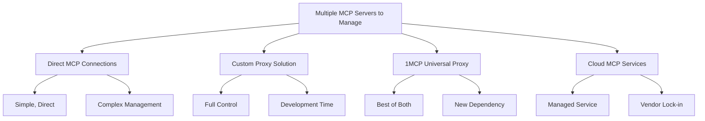
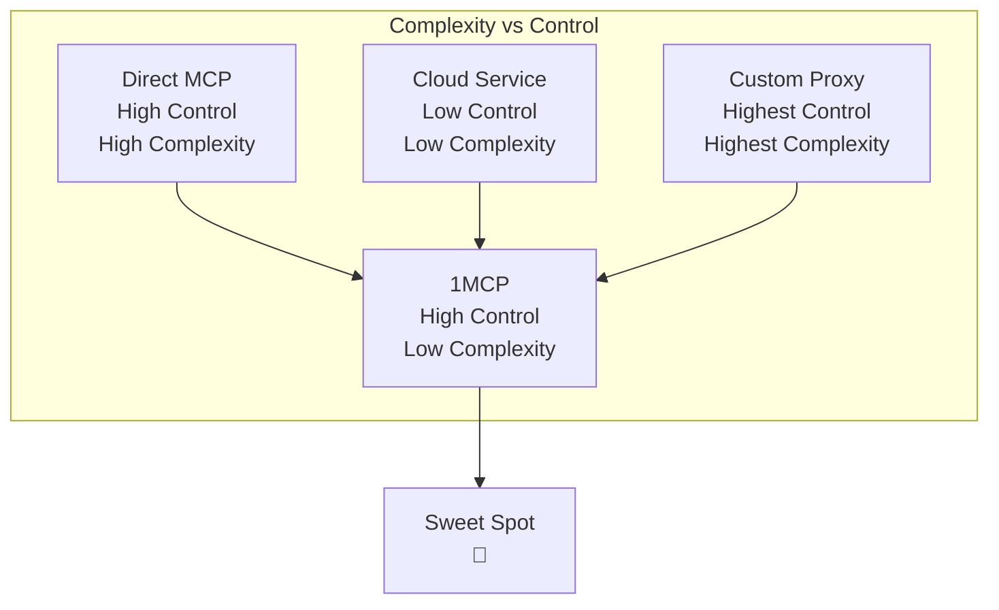

# 1MCP vs Alternatives: Why Choose 1MCP?

> **🎯 Objective Comparison**: We believe in making informed decisions. Here's how 1MCP compares to other approaches for managing multiple MCP servers, with honest pros and cons for each option.

## 🗺️ Your Options Landscape



---

## 🔗 Option 1: Direct MCP Connections

### **What It Is**

Connect your AI assistant directly to each MCP server individually, managing each connection separately.

### **When It Makes Sense**

- **1-2 MCP servers only** - Simple setup, minimal overhead
- **Proof of concept** - Testing MCP capabilities before scaling
- **Single developer** - Personal use with full control
- **Learning MCP protocol** - Understanding the fundamentals

### **Detailed Comparison**

| Aspect                    | Direct MCP                | 1MCP Proxy              | Winner        |
| ------------------------- | ------------------------- | ----------------------- | ------------- |
| **Initial Setup**         | Simple (1-2 servers)      | Moderate                | Direct MCP 📊 |
| **Scaling Complexity**    | Exponential growth        | Linear growth           | 1MCP 🚀       |
| **Connection Management** | Manual per server         | Centralized handling    | 1MCP ⚡       |
| **Health Monitoring**     | Per-server checking       | Unified dashboard       | 1MCP 📊       |
| **Authentication**        | Per-server credentials    | Centralized OAuth       | 1MCP 🔒       |
| **Configuration Changes** | Restart each server       | Hot reload              | 1MCP 🔄       |
| **Failure Recovery**      | Manual intervention       | Automatic retry         | 1MCP 🛡️       |
| **Resource Usage**        | High (multiple processes) | Moderate (single proxy) | 1MCP ⚡       |

### **Real-World Scenario: 10 MCP Servers**

**Direct MCP Setup**:

```bash
# Claude Desktop configuration
{
  "mcpServers": {
    "filesystem": {
      "command": ["mcp-filesystem"],
      "args": ["/data"]
    },
    "database": {
      "command": ["python", "/path/to/db-server.py"]
    },
    "web-scraper": {
      "command": ["node", "/path/to/web.js"]
    }
    // ... repeat for 7 more servers
  }
}

# Daily maintenance:
# 1. Check if all 10 servers are running
ps aux | grep mcp | wc -l  # Should be 10, often 7-9

# 2. Restart failed servers individually
pkill -f "mcp-filesystem" && mcp-filesystem /data &
pkill -f "db-server.py" && python /path/to/db-server.py &

# 3. Update Claude Desktop config for any changes
# 4. Restart Claude Desktop to pick up changes
```

**Time Investment**:

- **Daily monitoring**: 10 servers × 2 minutes = 20 minutes
- **Weekly troubleshooting**: 10 servers × 15 minutes = 2.5 hours
- **Monthly updates**: 10 servers × 30 minutes = 5 hours
- **Total**: 15+ hours/month of maintenance

**1MCP Equivalent**:

```bash
# Single configuration file
{
  "mcpServers": {
    "filesystem": { "command": ["mcp-filesystem", "/data"] },
    "database": { "command": ["python", "/path/to/db-server.py"] },
    "web-scraper": { "command": ["node", "/path/to/web.js"] }
    // ... 7 more servers
  }
}

# Daily maintenance:
# Check logs and server status through application monitoring

# Total maintenance: 5 minutes/month
```

### **Pros of Direct MCP**

✅ **Simplicity**: No additional components to manage
✅ **Direct Control**: Full control over each server individually
✅ **No Dependencies**: No proxy layer to potentially fail
✅ **Learning**: Better understanding of MCP protocol
✅ **Debugging**: Direct access to server logs and diagnostics

### **Cons of Direct MCP**

❌ **Exponential Complexity**: Each new server adds significant overhead
❌ **No Health Monitoring**: Must check each server individually
❌ **Connection Overhead**: New connections for every request
❌ **No Authentication**: Security managed per-server or not at all
❌ **Manual Recovery**: Server failures require manual intervention
❌ **Configuration Fragmentation**: Updates require multiple file changes

### **Bottom Line**

**Choose Direct MCP if**: You have 1-2 servers, are learning MCP, or need maximum control with minimal dependencies.

**Switch to 1MCP when**: You have 3+ servers, want reliability, or need team access.

---

## 🔧 Option 2: Custom Proxy Solution

### **What It Is**

Build your own proxy/aggregation layer using frameworks like Express.js, FastAPI, or Go to manage multiple MCP servers.

### **When It Makes Sense**

- **Unique Requirements**: Very specific business logic or protocol needs
- **Existing Infrastructure**: Already have proxy frameworks and expertise
- **Full Control**: Need complete control over every aspect of the proxy
- **Learning Exercise**: Building MCP expertise and custom solutions

### **Development Reality Check**

**Minimum Viable Custom Proxy** (3-6 months):

```typescript
// Basic proxy server (simplified)
class CustomMCPProxy {
  private servers: Map<string, MCPConnection> = new Map();

  async initialize() {
    // 1. Connection management (2-3 weeks)
    // 2. Request routing (1-2 weeks)
    // 3. Error handling (2-3 weeks)
    // 4. Basic health checks (1 week)
    // 5. Configuration management (1-2 weeks)
  }

  async handleRequest(request: MCPRequest) {
    // Route to appropriate server
    // Handle failures and retries
    // Aggregate responses if needed
    // Return formatted response
  }
}

// Missing enterprise features:
// - Authentication (OAuth 2.1): +4-6 weeks
// - Request handling optimization: +2-3 weeks
// - Hot reload: +1-2 weeks
// - Monitoring/metrics: +3-4 weeks
// - Multi-instance deployment: +4-6 weeks
// - Comprehensive testing: +4-8 weeks
```

### **Detailed Comparison**

| Aspect                   | Custom Proxy                | 1MCP                    | Winner          |
| ------------------------ | --------------------------- | ----------------------- | --------------- |
| **Development Time**     | 3-12 months                 | 5 minutes               | 1MCP ⚡         |
| **Initial Cost**         | $50K-$200K+                 | $0                      | 1MCP 💰         |
| **Ongoing Maintenance**  | High (your team)            | None (community)        | 1MCP 🔧         |
| **Feature Completeness** | Depends on time/budget      | Production-ready        | 1MCP ✅         |
| **MCP Compliance**       | Risk of protocol violations | Guaranteed compliance   | 1MCP 📋         |
| **Security Features**    | DIY implementation          | Battle-tested OAuth 2.1 | 1MCP 🔒         |
| **Performance**          | Depends on expertise        | Standard                | Tie ⚖️          |
| **Customization**        | Unlimited                   | Configurable            | Custom Proxy 🎨 |
| **Control**              | Complete                    | High                    | Custom Proxy 🎛️ |
| **Support**              | Internal team only          | Community + docs        | 1MCP 🆘         |

### **Real Development Timeline**

**Phase 1: Basic Proxy (Month 1-2)**

```
Week 1-2: Project setup, basic routing
Week 3-4: MCP protocol implementation
Week 5-6: Error handling, basic retry logic
Week 7-8: Configuration management, testing
```

**Phase 2: Production Features (Month 3-6)**

```
Week 9-12: Authentication system (OAuth)
Week 13-16: Request handling and error recovery
Week 17-20: Health monitoring and metrics
Week 21-24: High availability and deployment
```

**Phase 3: Enterprise Features (Month 7-12)**

```
Week 25-32: Advanced security, audit logging
Week 33-40: Multi-instance deployment
Week 41-48: Comprehensive monitoring, alerting
Week 49-52: Documentation, team training
```

**Total Investment**: $150K-$300K (depending on team size and feature scope)

### **Hidden Costs of Custom Development**

```
Development Costs:
├── Senior Developer (12 months): $150K
├── DevOps Engineer (6 months): $75K
├── Security Review: $25K
├── Testing & QA: $30K
├── Documentation: $15K
└── Total: $295K first year

Ongoing Costs:
├── Maintenance (20% dev time): $30K/year
├── Security updates: $15K/year
├── Feature additions: $40K/year
├── Support & documentation: $10K/year
└── Total: $95K/year ongoing
```

### **What You Get vs 1MCP**

**Custom Proxy Advantages**:

```typescript
// You CAN build exactly what you need:
class MyCustomProxy {
  // Unlimited customization
  async handleSpecialBusinessLogic() {
    // Your unique requirements here
  }

  // Custom protocols
  async handleLegacyProtocol() {
    // Support for non-standard systems
  }

  // Proprietary integrations
  async integrateWithInternalSystems() {
    // Company-specific integrations
  }
}
```

**1MCP Equivalent** (5 minutes setup):

```json
{
  "mcpServers": {
    "your-servers": "standard MCP configuration"
  }
}
```

### **Pros of Custom Proxy**

✅ **Unlimited Customization**: Build exactly what you need
✅ **Full Control**: Complete ownership of codebase and decisions
✅ **Internal Expertise**: Team learns MCP protocol deeply
✅ **Integration Flexibility**: Can integrate with any internal system
✅ **No External Dependencies**: Complete self-reliance

### **Cons of Custom Proxy**

❌ **High Development Cost**: $150K-$300K initial investment
❌ **Long Time to Market**: 3-12 months to production-ready
❌ **Ongoing Maintenance**: Permanent team responsibility
❌ **Security Risk**: DIY security vs battle-tested solutions
❌ **Feature Gap**: Missing enterprise features for months/years
❌ **Opportunity Cost**: Resources not spent on core business features

### **Bottom Line**

**Choose Custom Proxy if**: You have unique requirements that no existing solution can meet, have 6+ months for development, and budget $200K+ for the project.

**Choose 1MCP if**: You want to solve MCP aggregation quickly and focus resources on your core business features.

---

## ☁️ Option 3: Cloud MCP Services

### **What It Is**

Managed MCP proxy services offered by cloud providers or specialized vendors (hypothetical, as this market is emerging).

### **When It Makes Sense**

- **Zero Maintenance**: Want completely managed infrastructure
- **Enterprise SLAs**: Need vendor-backed uptime guarantees
- **Unlimited Scale**: Handling massive enterprise deployments
- **Compliance Requirements**: Need vendor certifications (SOC 2, GDPR, etc.)

### **Theoretical Comparison**

| Aspect              | Cloud MCP Service           | 1MCP                 | Winner           |
| ------------------- | --------------------------- | -------------------- | ---------------- |
| **Setup Time**      | 5-15 minutes                | 5 minutes            | Tie ⚖️           |
| **Maintenance**     | Zero                        | Minimal              | Cloud Service 🔧 |
| **Cost**            | $500-$5000/month            | $0                   | 1MCP 💰          |
| **Customization**   | Limited to service features | High configurability | 1MCP 🎨          |
| **Data Control**    | Third-party servers         | Your infrastructure  | 1MCP 🔒          |
| **Vendor Lock-in**  | High risk                   | None                 | 1MCP 🔓          |
| **SLA Guarantees**  | 99.9%+ with credits         | Self-managed         | Cloud Service 📋 |
| **Compliance**      | Vendor certifications       | Self-certification   | Cloud Service ✅ |
| **Global Scale**    | Automatic                   | Manual setup         | Cloud Service 🌍 |
| **Feature Updates** | Automatic                   | Manual upgrade       | Cloud Service 🔄 |

### **Cost Analysis Example**

**Cloud MCP Service** (estimated pricing):

```
Pricing Tiers:
├── Starter: $99/month (10 servers, 1M requests)
├── Professional: $499/month (50 servers, 10M requests)
├── Enterprise: $2,499/month (unlimited servers, 100M requests)
└── Custom: $5,000+/month (dedicated infrastructure)

Annual Cost: $1,200 - $60,000+
```

**1MCP Self-Hosted**:

```
Infrastructure Costs:
├── Small deployment: $50-100/month (cloud VM)
├── Medium deployment: $200-500/month (HA setup)
├── Large deployment: $1,000-2,000/month (multi-region)
└── Maintenance: Your team or consultant

Total Annual Cost: $600 - $24,000 (infrastructure only)
```

**Cost Comparison** (5 years):

```
                Year 1    Year 3    Year 5    Total
Cloud Service   $30K      $32K      $35K      $161K
1MCP Hosted     $6K       $8K       $10K      $39K
Savings         $24K      $24K      $25K      $122K
```

### **Pros of Cloud MCP Services**

✅ **Zero Maintenance**: Completely managed infrastructure
✅ **Enterprise SLAs**: Vendor-backed uptime guarantees
✅ **Automatic Scaling**: Handle traffic spikes automatically
✅ **Compliance**: Vendor certifications and audit support
✅ **Global Infrastructure**: Multi-region deployment included
✅ **24/7 Support**: Professional support teams

### **Cons of Cloud MCP Services**

❌ **High Cost**: $1,200-$60,000+ annually vs $0 for 1MCP
❌ **Vendor Lock-in**: Difficult to migrate away from service
❌ **Data Privacy**: Your MCP traffic flows through third-party servers
❌ **Limited Customization**: Restricted to vendor's feature set
❌ **Service Risk**: Vendor could discontinue service or change terms
❌ **Network Latency**: Additional hop through vendor infrastructure

### **Bottom Line**

**Choose Cloud MCP if**: Cost is not a concern, you need zero maintenance, and vendor SLAs are required for compliance.

**Choose 1MCP if**: You want control over your infrastructure, need customization, or want to minimize costs.

---

## 🏆 1MCP: The Best of All Worlds

### **Why 1MCP Exists**

We built 1MCP because each alternative has significant drawbacks:

- **Direct MCP**: Doesn't scale beyond 2-3 servers
- **Custom Proxy**: Takes 6+ months and $200K+ to build properly
- **Cloud Services**: Expensive, vendor lock-in, limited control

1MCP provides enterprise-grade features immediately, at zero cost, with full control.

### **1MCP's Unique Position**



### **Feature Completeness Comparison**

| Feature                  | Direct MCP          | Custom Proxy | Cloud Service | 1MCP         |
| ------------------------ | ------------------- | ------------ | ------------- | ------------ |
| **MCP Aggregation**      | ❌ Manual           | ✅ Custom    | ✅ Managed    | ✅ Built-in  |
| **Health Monitoring**    | ❌ None             | 🔧 DIY       | ✅ Included   | ✅ Built-in  |
| **Authentication**       | ❌ Per-server       | 🔧 DIY       | ✅ Included   | ✅ OAuth 2.1 |
| **Hot Reload**           | ❌ Restart required | 🔧 DIY       | ✅ Included   | ✅ Built-in  |
| **Connection Pooling**   | ❌ None             | 🔧 DIY       | ✅ Included   | ✅ Built-in  |
| **Rate Limiting**        | ❌ None             | 🔧 DIY       | ✅ Included   | ✅ Built-in  |
| **Multi-Instance**       | ❌ None             | 🔧 DIY       | ✅ Included   | ✅ Built-in  |
| **Audit Logging**        | ❌ None             | 🔧 DIY       | ✅ Included   | ✅ Built-in  |
| **Basic Monitoring**     | ❌ None             | 🔧 DIY       | ✅ Included   | ✅ Built-in  |
| **Custom Configuration** | ✅ Full             | ✅ Unlimited | ❌ Limited    | ✅ Extensive |
| **Data Control**         | ✅ Full             | ✅ Full      | ❌ Vendor     | ✅ Full      |
| **Cost**                 | $0                  | $200K+       | $30K+/year    | $0           |
| **Time to Production**   | Immediate           | 6+ months    | 1 week        | 5 minutes    |

**Legend**: ✅ Included | 🔧 Build yourself | ❌ Not available

---

## 🎯 Decision Framework

### **Choose Direct MCP if**:

- [ ] You have 1-2 MCP servers maximum
- [ ] You're learning MCP protocol
- [ ] You're doing proof-of-concept work
- [ ] You need maximum control and minimal dependencies
- [ ] Setup simplicity is more important than scaling

### **Choose Custom Proxy if**:

- [ ] You have very unique business requirements no existing solution meets
- [ ] You have $200K+ budget and 6+ months timeline
- [ ] You have experienced development team for ongoing maintenance
- [ ] You need unlimited customization capabilities
- [ ] Control is more important than time/cost

### **Choose Cloud MCP if**:

- [ ] Budget is not a constraint ($30K+/year is acceptable)
- [ ] You need zero maintenance and vendor SLAs
- [ ] Compliance requires vendor certifications
- [ ] You're handling massive enterprise scale (1000+ developers)
- [ ] Data privacy concerns are minimal

### **Choose 1MCP if**:

- [ ] You have 3+ MCP servers to manage
- [ ] You want production-ready features immediately
- [ ] You need enterprise capabilities at zero cost
- [ ] You want control over your infrastructure
- [ ] You need to be productive quickly (5-minute setup)
- [ ] You want to avoid vendor lock-in
- [ ] Your focus should be on your core business, not MCP infrastructure

---

## 🚀 Migration Paths

### **From Direct MCP to 1MCP**

```bash
# 1. Export your existing MCP server configurations
# 2. Convert to 1MCP format (5 minutes)
# 3. Test with 1MCP in parallel
# 4. Switch your AI client to 1MCP endpoint
# 5. Decommission individual servers

# Migration time: 30 minutes
# Risk: Low (parallel testing)
# Rollback: Immediate (switch back to direct)
```

### **From Custom Proxy to 1MCP**

```bash
# 1. Document your custom features and requirements
# 2. Configure 1MCP with equivalent settings
# 3. Run 1MCP in parallel with custom proxy
# 4. Migrate clients gradually to 1MCP
# 5. Decommission custom proxy once validated

# Migration time: 1-2 weeks (validation and testing)
# Risk: Medium (feature parity verification)
# Benefit: Eliminate maintenance burden, gain new features
```

### **From Cloud Service to 1MCP**

```bash
# 1. Export configuration from cloud service
# 2. Set up 1MCP on your infrastructure
# 3. Test feature parity and functionality
# 4. Migrate during maintenance window
# 5. Cancel cloud service subscription

# Migration time: 1 week (infrastructure setup)
# Risk: Low (similar feature set)
# Benefit: Eliminate ongoing costs, gain control
```

---

## 🎯 The Bottom Line

### **For Most Users, 1MCP is the Clear Choice Because**:

1. **⚡ Immediate Value**: Production-ready in 5 minutes vs months of development
2. **💰 Zero Cost**: No licensing, subscription, or development costs
3. **🛡️ Enterprise Features**: OAuth, audit logging, multi-instance deployment included
4. **🔧 Full Control**: Deploy on your infrastructure, customize as needed
5. **🚫 No Lock-in**: Open source, migrate away anytime
6. **📈 Proven Scale**: From single developer to Fortune 500 enterprise
7. **🔒 Security First**: Battle-tested authentication and security features
8. **📊 Production Ready**: Health checks, logging, and reliable operation

### **When You Might Choose Alternatives**:

- **Direct MCP**: You have 1-2 servers and extreme simplicity needs
- **Custom Proxy**: You have unique requirements and $200K+ budget
- **Cloud Service**: You have unlimited budget and zero maintenance requirements

### **Most Common Decision Path**:

```
Start → Direct MCP (1-2 servers) → 1MCP (3+ servers) → Stay with 1MCP (scales to enterprise)
```

---

> **🎯 Ready to Make the Switch?**
>
> **Try 1MCP risk-free**: [5-minute setup guide](/guide/getting-started)
>
> Still unsure? [Join our community](https://github.com/1mcp-app/agent/discussions) to discuss your specific requirements with other users who've made the switch.
