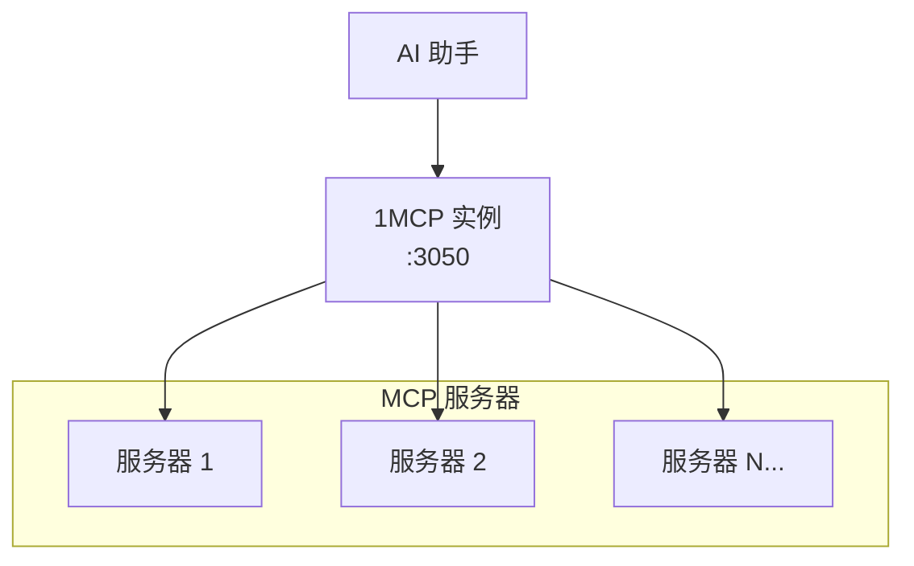
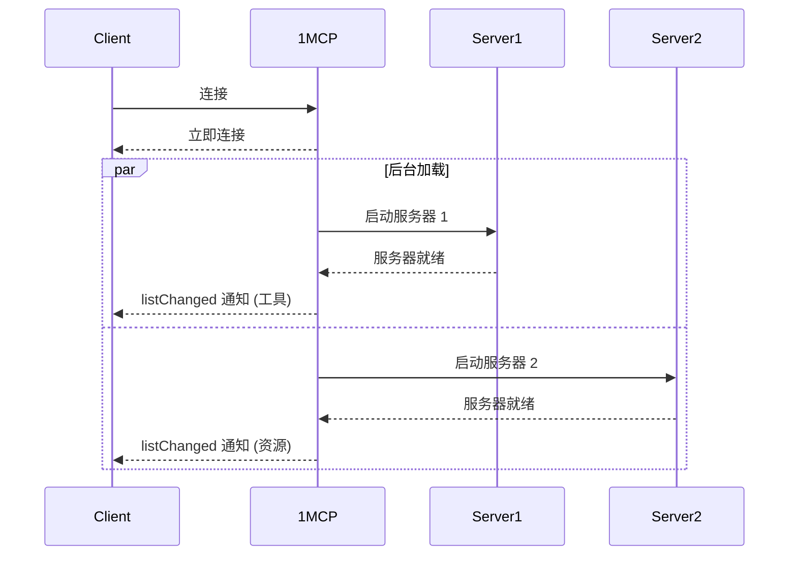

# 企业版与运维

> **🏢 生产就绪**：适用于关键任务环境的企业级部署、监控和运营功能

## 🔧 单实例部署

**功能描述**：作为单个进程运行，管理多个 MCP 服务器连接
**适用场景**：简单、可靠的部署，资源开销最小
**优势特点**：部署简单、进程管理便捷、配置统一

**部署架构**：



**⏱️ 设置时间**：5 分钟
**🎯 适用场景**：个人使用、小团队、简单部署
**✅ 获得收益**：简单部署、易于管理、可靠运行

---

## ⚡ 异步加载与实时更新

**功能描述**：异步加载 MCP 服务器，实时发送功能通知
**适用场景**：立即访问服务器，其他 MCP 服务器在后台启动
**优势特点**：启动更快、渐进式功能发现、listChanged 通知

**加载策略**：



**配置示例**：

```bash
# 通过 CLI 标志启用异步加载
npx -y @1mcp/agent --config mcp.json --enable-async-loading

# 或通过环境变量
export ONE_MCP_ENABLE_ASYNC_LOADING=true
npx -y @1mcp/agent --config mcp.json
```

**实际效果**：

- **启动时间**：立即连接 vs. 等待所有服务器
- **渐进式加载**：服务器上线时功能逐步显示
- **更好的用户体验**：不会被启动缓慢的服务器阻塞
- **批量通知**：防止初始化期间对客户端的垃圾信息

**⏱️ 设置时间**：单个 CLI 标志
**🎯ЗИ适用场景**：快速启动、更好的用户体验、大型服务器配置
**✅ 获得收益**：立即连接、渐进式功能、实时更新、批量通知

---

## 📋 安全操作日志

**功能描述**：记录安全相关操作，包括身份验证和范围验证
**适用场景**：跟踪 OAuth 操作和安全事件以进行监控
**优势特点**：范围操作的结构化日志、身份验证事件、访问控制

**安全日志示例**：

```bash
# 范围验证事件
INFO: Scope operation: scope_validation_success {
  "operation": "scope_validation_success",
  "clientId": "app-client",
  "requestedScopes": ["tag:filesystem"],
  "grantedScopes": ["tag:filesystem", "tag:memory"],
  "success": true
}

# 授权事件
INFO: Scope operation: authorization_granted {
  "operation": "authorization_granted",
  "clientId": "app-client",
  "requestedScopes": ["tag:web"],
  "success": true
}
```

**⏱️ 设置时间**：内置安全日志
**🎯 适用场景**：安全监控、访问追踪、OAuth 调试
**✅ 获得收益**：安全事件日志、范围操作追踪、身份验证监控

---

## 💊 健康监控与可观测性

**功能描述**：全面的健康检查端点，包含系统指标和服务器状态
**适用场景**：监控生产部署、启用自动健康检查和调试
**优势特点**：实时系统状态、自动告警、负载均衡器集成

**健康检查端点**：

```bash
# 完整健康状态
GET /health

# 存活探针（Kubernetes 就绪）
GET /health/live

# 就绪探针（配置已加载）
GET /health/ready
```

**健康响应示例**：

```json
{
  "status": "healthy",
  "timestamp": "2025-01-30T12:00:00.000Z",
  "version": "0.15.0",
  "system": {
    "uptime": 3600,
    "memory": {
      "used": 50.5,
      "total": 100.0,
      "percentage": 50.5
    }
  },
  "servers": {
    "total": 3,
    "healthy": 2,
    "unhealthy": 1,
    "details": [
      {
        "name": "filesystem-server",
        "status": "connected",
        "healthy": true,
        "lastConnected": "2025-01-30T11:30:00.000Z",
        "tags": ["filesystem"]
      },
      {
        "name": "web-server",
        "status": "error",
        "healthy": false,
        "lastError": "Connection timeout",
        "tags": ["network", "web"]
      }
    ]
  },
  "configuration": {
    "loaded": true,
    "serverCount": 3,
    "enabledCount": 2,
    "disabledCount": 1,
    "authEnabled": true,
    "transport": "http"
  }
}
```

**健康状态级别**：

- **`healthy`** (200) - 所有系统正常运行
- **`degraded`** (200) - 存在一些问题但功能正常
- **`unhealthy`** (503) - 影响服务的严重问题

**集成示例**：

```yaml
# Kubernetes 部署
livenessProbe:
  httpGet:
    path: /health/live
    port: 3050
  initialDelaySeconds: 30
  periodSeconds: 10

readinessProbe:
  httpGet:
    path: /health/ready
    port: 3050
  initialDelaySeconds: 5
  periodSeconds: 5

# Docker Compose 健康检查
healthcheck:
  test: ['CMD', 'curl', '-f', 'http://localhost:3050/health']
  interval: 30s
  timeout: 10s
  retries: 3
```

**⏱️ 设置时间**：立即可用（内置）
**🎯 适用场景**：生产监控、DevOps 自动化、服务器问题调试
**✅ 获得收益**：系统指标、服务器状态、Kubernetes 探针、负载均衡器健康检查

---

## 🔧 高级配置管理

**功能描述**：环境特定配置、密钥管理、功能开关
**适用场景**：管理跨开发、测试、生产的复杂部署
**优势特点**：配置模板化、密钥注入、环境隔离

**配置层次结构**：

```
1. 环境变量（最高优先级）
2. CLI 参数
3. 配置文件
4. 默认值（最低优先级）
```

**密钥管理示例**：

```json
{
  "mcpServers": {
    "database": {
      "command": ["mcp-postgres"],
      "env": {
        "DATABASE_URL": "${DATABASE_URL}", // 来自环境变量
        "API_KEY": "${SECRET:api-key}" // 来自密钥存储
      }
    }
  }
}
```

**⏱️ 设置时间**：高级配置 30 分钟
**🎯 适用场景**：多环境部署、密钥管理、配置即代码
**✅ 获得收益**：环境分离、密钥安全、配置模板化

---

## 企业部署模式

### Kubernetes 部署

- **健康探针**：内置存活性和就绪性端点
- **ConfigMaps**：外部配置管理
- **Secrets**：安全凭证注入
- **服务发现**：自动服务器检测

### Docker Compose

- **多环境**：开发、测试、生产配置
- **卷挂载**：配置和日志持久化
- **服务依赖**：正确的启动顺序

### 负载均衡器集成

- **健康检查**：`/health` 端点用于负载均衡器监控
- **会话亲和性**：跨实例的 OAuth 会话管理
- **优雅关闭**：干净的连接终止

### 监控和告警

- **日志聚合**：用于集中收集的结构化日志
- **指标导出**：用于监控系统的健康数据
- **告警集成**：关键事件的 Webhook 通知

### 下一步

- **核心功能** → [核心功能](/guide/features/core)
- **安全设置** → [安全功能](/guide/features/security)
- **开发** → [开发者功能](/guide/features/developer)

---

> **🏢 企业提示**：这些功能专为生产部署而设计。从基本部署开始，然后随着基础设施需求的增长添加监控和高级配置。
