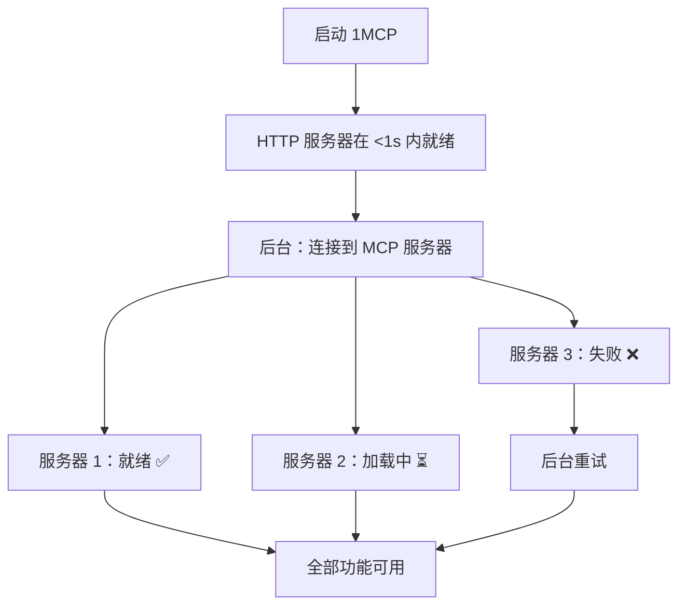
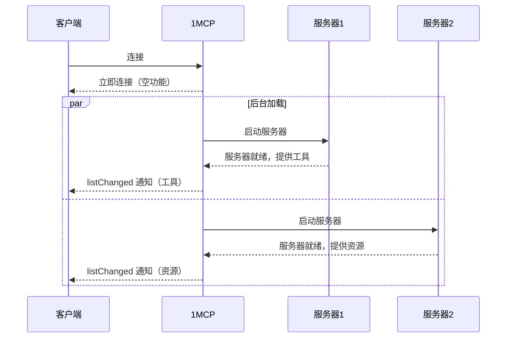

# 快速启动：异步服务器加载

让您的 1MCP 代理即时运行，并提供实时功能更新，即使某些服务器需要时间连接。

## 这是关于什么的？

当您启动 1MCP 时，它需要连接到所有已配置的 MCP 服务器。以前，如果即使一台服务器速度慢或无法访问，您的整个 1MCP 实例也会被卡住等待。现在，1MCP 会立即启动并在后台连接到服务器，随着功能可用，向客户端发送实时 `listChanged` 通知。

## 我们解决的问题

**之前**：

- 1MCP 在启动前等待所有服务器
- 一台慢速服务器 = 整个系统卡住
- 网络问题会阻塞您的工作流程

**现在**：

- 1MCP 在 1 秒内启动
- 服务器在后台连接
- 随着功能可用，提供实时通知
- 您可以立即使用可用的服务器

## 工作原理



## 服务器状态

| 状态           | 图标 | 含义               | 您可以做什么         |
| -------------- | ---- | ------------------ | -------------------- |
| **就绪**       | ✅   | 服务器已成功连接   | 全部功能可用         |
| **加载中**     | ⏳   | 服务器正在后台连接 | 等待或使用其他服务器 |
| **失败**       | ❌   | 连接失败，将重试   | 检查服务器配置/网络  |
| **等待 OAuth** | 🔐   | 需要授权           | 完成 OAuth 流程      |

## 监控您的服务器

### 快速健康检查

```bash
curl http://localhost:3000/health/mcp
```

### 单个服务器状态

```bash
curl http://localhost:3000/health/mcp/context7
```

## 对您的好处

### ⚡ 即时启动

- 无论服务器数量多少，1MCP 都在 <1 秒内就绪
- 不再等待慢速连接
- 立即开始工作

### 🛡️ 弹性操作

- 一台失败的服务器不会破坏一切
- 使用智能回退自动重试
- 优雅地处理网络问题

### 📊 完全可见性

- 所有服务器的实时状态
- 出现问题时提供详细的错误消息
- 跟踪长连接的进度

## 启用异步加载

异步加载是一项选择性加入的功能，默认情况下禁用以保持向后兼容性。

### CLI 标志

```bash
# 使用 CLI 标志启用异步加载
npx -y @1mcp/agent --config mcp.json --enable-async-loading
```

### 环境变量

```bash
# 通过环境变量启用
export ONE_MCP_ENABLE_ASYNC_LOADING=true
npx -y @1mcp/agent --config mcp.json
```

### 实时通知

启用异步加载后，客户端会在服务器就绪时收到 `listChanged` 通知：



**好处：**

- **渐进式发现**：新功能实时出现
- **批量通知**：将多个更改分组以防止垃圾邮件
- **更好的用户体验**：无需手动刷新或重新连接

## 配置

您可以在 JSON 配置文件的 `loading` 部分自定义异步加载行为，例如超时和重试逻辑。

有关选项的完整列表，请参阅 **[配置深入探讨](/guide/essentials/configuration#loading-section-async-loading)**。

## 健康检查 API

通过简单的 HTTP 端点检查您的 MCP 服务器的状态。

### 整体状态：`/health/mcp`

获取所有服务器的完整概览：

```bash
curl http://localhost:3000/health/mcp
```

**示例响应：**

```json
{
  "loading": {
    "isComplete": false, // 仍在连接某些服务器
    "successRate": 66.7, // 3 台服务器中有 2 台已连接
    "averageLoadTime": 2500 // 平均连接时间（毫秒）
  },
  "summary": {
    "total": 3, // 配置的总服务器数
    "ready": 2, // 可供使用的服务器
    "loading": 1, // 仍在连接的服务器
    "failed": 0 // 失败的服务器
  },
  "servers": {
    "ready": ["context7", "magic"], // 正常工作的服务器
    "loading": ["sequential"] // 仍在连接
  }
}
```

### 单个服务器：`/health/mcp/:serverName`

检查特定服务器：

```bash
curl http://localhost:3000/health/mcp/context7
```

**示例响应：**

```json
{
  "name": "context7",
  "state": "ready", // 当前状态
  "duration": 2300, // 连接时间（毫秒）
  "retryCount": 1, // 连接尝试次数
  "message": "已成功连接"
}
```

## 常见场景

### 网络超时

当服务器连接时间过长时：

```
服务器 "context7" → 加载中 → 超时 (30s) → 失败 → 后台重试 (60s)
```

### OAuth 授权

某些服务器需要您先授权：

```
服务器 "github" → 加载中 → 等待 OAuth → 访问授权 URL → 就绪
```

### 部分可用性

当某些服务器工作而其他服务器不工作时：

```
配置了 3 台服务器：
✅ context7 (就绪)
✅ magic (就绪)
❌ sequential (失败)

结果：1MCP 使用 2/3 的服务器工作，并不断重试失败的服务器
```

## 您会注意到什么

### 更快的启动速度 ⚡

- 1MCP 在 1 秒内启动
- 不再等待慢速连接
- 您可以立即开始工作

### 更好的可靠性 🛡️

- 单个服务器故障不会破坏一切
- 失败的服务器会在后台自动重试
- 清楚地了解哪些工作正常，哪些不正常

### 轻松监控 📊

- 随时检查 `/health/mcp` 以查看状态
- 获取有关单个服务器的详细信息
- 服务器连接时的实时进度

## 故障排除

### “某些服务器仍在加载”

**正常行为。** 1MCP 启动速度快，并在后台连接服务器。检查 `/health/mcp` 以查看进度。

### “服务器不断连接失败”

1. 检查您的网络连接
2. 验证您的 `mcp.json` 中的服务器配置
3. 检查服务器是否需要 OAuth 授权
4. 查看 `/health/mcp/servername` 以获取详细的错误消息

### “一切似乎都很慢”

1. 检查您同时加载的服务器数量 (`maxConcurrentLoads`)
2. 考虑为慢速网络增加超时值
3. 某些服务器可能会限制您的连接

### “1MCP 根本无法启动”

这通常表示配置问题，而不是服务器连接问题：

1. 检查您的 `mcp.json` 文件语法
2. 验证文件权限
3. 检查 1MCP 日志以获取特定错误

::: tip
异步加载仅影响 MCP 服务器连接。如果 1MCP 本身无法启动，则可能是配置或权限问题。
:::
