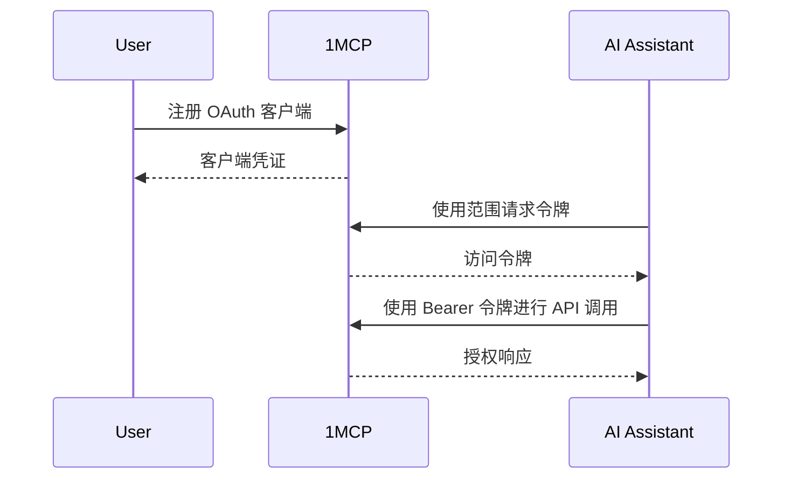

# 安全与访问控制

> **🛡️ 企业级安全**：通过行业标准身份验证和细粒度访问控制保护您的 MCP 服务器

## 🛡️ OAuth 2.1 身份验证

**功能描述**：具有安全令牌管理的行业标准身份验证
**适用场景**：通过企业级安全控制谁可以访问您的 MCP 服务器
**优势特点**：用户会话、令牌刷新、审计跟踪、基于范围的权限

**身份验证流程**：



**⏱️ 设置时间**：15 分钟
**🎯 适用场景**：团队、共享环境、安全合规
**✅ 获得收益**：安全身份验证、会话管理、令牌刷新、审计日志

---

## 🏷️ 基于标签的访问控制

**功能描述**：使用服务器标签和 OAuth 范围的细粒度权限
**适用场景**：仅向用户授予所需 MCP 服务器的访问权限
**优势特点**：按敏感度/功能标记服务器，按角色授予访问权限

**权限示例**：

```yaml
# 服务器配置
filesystem: { tags: ['files', 'sensitive'] }
database: { tags: ['database', 'sensitive'] }
web-search: { tags: ['web', 'safe'] }
memory: { tags: ['memory', 'safe'] }

# 用户角色
Developer: 'tag:files tag:database tag:web tag:memory' # 完全访问
Analyst: 'tag:database tag:web' # 仅数据访问
Demo: 'tag:web' # 仅公共 API
```

**⏱️ 设置时间**：每个角色 5 分钟
**🎯 适用场景**：多用户环境、最小权限原则
**✅ 获得收益**：基于角色的访问、细粒度权限、安全合规

---

## 🚫 速率限制和 DDoS 防护

**功能描述**：通过每客户端可配置请求限制防止滥用
**适用场景**：保护您的 MCP 服务器免受过载和恶意使用
**优势特点**：每客户端限制、突发处理、自动节流

**速率限制配置**：

```bash
# 通过 CLI 标志配置
npx -y @1mcp/agent --config mcp.json --enable-auth \
  --rate-limit-window 15 \     # 15 分钟窗口
  --rate-limit-max 100         # 每个窗口 100 个请求

# 或通过环境变量
export ONE_MCP_RATE_LIMIT_WINDOW=15
export ONE_MCP_RATE_LIMIT_MAX=100
npx -y @1mcp/agent --config mcp.json --enable-auth
```

**⏱️ 设置时间**：具有合理默认值的内置功能
**🎯 适用场景**：公共 API、高流量环境、滥用防护
**✅ 获得收益**：自动保护、可配置限制、公平使用强制执行

---

## 安全入门

### 安全设置路径

1. **[15 分钟]** OAuth 2.1 身份验证 → [身份验证指南](/guide/authentication)
2. **[10 分钟]** 基于标签的访问控制 → [配置指南](/guide/configuration)
3. **[5 分钟]** 速率限制设置 → 内置保护

### 安全最佳实践

- **最小权限原则**：授予最少的必要访问权限
- **定期审计**：审查访问日志和权限
- **令牌管理**：实施适当的令牌刷新周期
- **监控**：跟踪身份验证事件和失败

### 高级安全

- **自定义范围**：定义特定于应用程序的权限
- **审计日志**：跟踪所有安全事件
- **集成**：连接企业身份提供商

### 下一步

- **核心功能** → [核心功能](/guide/features/core)
- **性能** → [性能功能](/guide/features/performance)
- **生产设置** → [企业功能](/guide/features/enterprise)

---

> **🔒 安全提示**：所有安全功能都设计为协同工作。首先启用 OAuth 2.1，然后分层添加基于标签的访问控制和速率限制，以获得全面保护。
