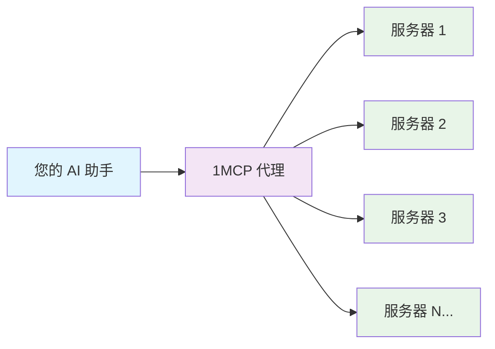
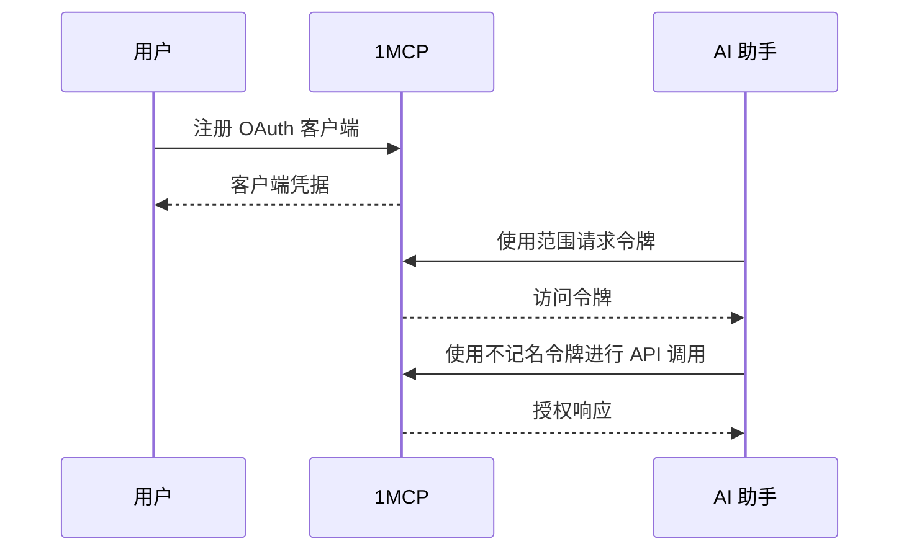
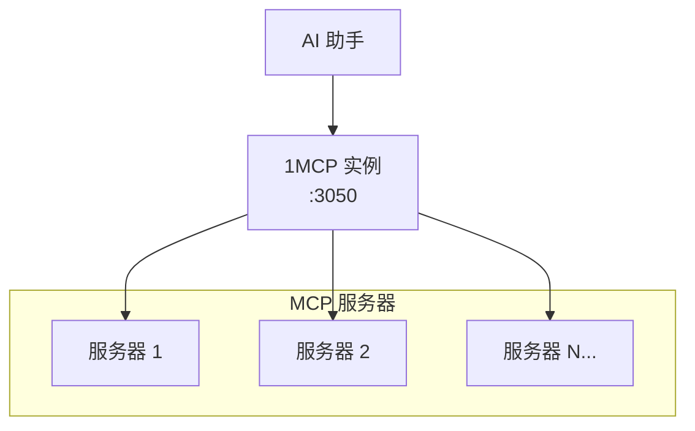
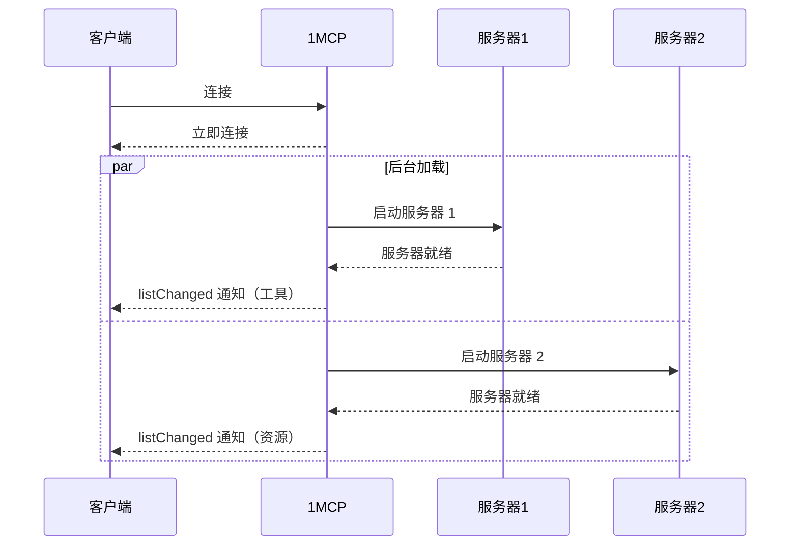

# 1MCP 功能：你能做什么？

> **🎯 理念**：每个功能的存在都是为了解决一个真实的用户问题。我们构建了您实际需要的功能，而不仅仅是听起来令人印象深刻的功能。

## 🚀 快速发现（选择您的路径）

**👋 我是 1MCP 的新手** → [核心功能](#-核心功能-每个人都能获得什么)
**🔒 我需要安全** → [安全功能](#-安全与访问控制)
**⚡ 我想要性能** → [性能功能](#-性能与可靠性)
**🏢 我运行生产系统** → [企业功能](#-企业与运营)
**🔧 我是开发人员** → [开发人员功能](#-开发人员与集成)

---

## 🌟 核心功能（每个人都能获得什么）

### **🔗 通用 MCP 聚合**

**它做什么**：通过一个端点连接到您所有的 MCP 服务器
**为什么您需要它**：停止管理数十个单独的服务器连接
**它如何帮助**：一个配置文件，一个健康检查，一个要管理的连接



**⏱️ 设置时间**：5 分钟
**🎯 非常适合**：任何使用 2 个以上 MCP 服务器的人
**✅ 您将获得**：统一的界面、自动健康监控、连接池

---

### **🔄 热配置重载**

**它做什么**：在不重新启动或丢失连接的情况下更新服务器配置
**为什么您需要它**：立即添加/删除 MCP 服务器，零停机时间
**它如何帮助**：编辑配置文件 → 更改在 <30 秒内自动应用

**真实示例**：

```bash
# 编辑您的配置文件
vim ~/.config/1mcp/mcp.json

# 添加一个新服务器：
"new-server": {
  "command": ["npx", "-y", "@modelcontextprotocol/server-web"],
  "tags": ["web", "search"]
}

# 保存文件 → 服务器自动检测并连接
# 无需重新启动，现有连接得以保留
```

**⏱️ 设置时间**：内置（无需设置）
**🎯 非常适合**：开发、生产环境、频繁的配置更改
**✅ 您将获得**：零停机更新、即时服务器添加/删除、保留的会话

---

### **📊 基本状态监控**

**它做什么**：为 MCP 服务器提供日志记录和基本状态信息
**为什么您需要它**：跟踪服务器连接并解决问题
**它如何帮助**：结构化日志记录、连接状态、错误跟踪

**状态信息**：

- 通过日志可用的服务器状态
- 通过 MCP 协议响应的连接信息
- 没有专门的健康端点
- 通过应用程序日志和服务器行为进行监控

**⏱️ 设置时间**：自动
**🎯 非常适合**：生产监控、故障排除、系统可靠性
**✅ 您将获得**：结构化日志、错误跟踪、连接监控

---

## 🔒 安全与访问控制

### **🛡️ OAuth 2.1 身份验证**

**它做什么**：具有安全令牌管理的行业标准身份验证
**为什么您需要它**：通过企业级安全性控制谁可以访问您的 MCP 服务器
**它如何帮助**：用户会话、令牌刷新、审计跟踪、基于范围的权限

**身份验证流程**：



**⏱️ 设置时间**：15 分钟
**🎯 非常适合**：团队、共享环境、安全合规性
**✅ 您将获得**：安全身份验证、会话管理、令牌刷新、审计日志

---

### **🏷️ 基于标签的访问控制**

**它做什么**：使用服务器标签和 OAuth 范围的精细权限
**为什么您需要它**：仅向用户授予他们需要的 MCP 服务器的访问权限
**它如何帮助**：按敏感度/功能标记服务器，按角色授予访问权限

**权限示例**：

```yaml
# 服务器配置
filesystem: { tags: ['files', 'sensitive'] }
database: { tags: ['database', 'sensitive'] }
web-search: { tags: ['web', 'safe'] }
memory: { tags: ['memory', 'safe'] }

# 用户角色
Developer: 'tag:files tag:database tag:web tag:memory' # 完全访问
Analyst: 'tag:database tag:web' # 仅数据访问
Demo: 'tag:web' # 仅公共 API
```

**⏱️ 设置时间**：每个角色 5 分钟
**🎯 非常适合**：多用户环境、最小权限原则
**✅ 您将获得**：基于角色的访问、精细的权限、安全合规性

---

### **🚫 速率限制和 DDoS 保护**

**它做什么**：通过每个客户端的可配置请求限制来防止滥用
**为什么您需要它**：保护您的 MCP 服务器免受过载和恶意使用的影响
**它如何帮助**：每个客户端的限制、突发处理、自动节流

**速率限制配置**：

```bash
# 通过 CLI 标志进行配置
npx -y @1mcp/agent --config mcp.json --enable-auth \
  --rate-limit-window 15 \
  --rate-limit-max 100

# 或通过环境变量
export ONE_MCP_RATE_LIMIT_WINDOW=15
export ONE_MCP_RATE_LIMIT_MAX=100
npx -y @1mcp/agent --config mcp.json --enable-auth
```

**⏱️ 设置时间**：内置，具有合理的默认值
**🎯 非常适合**：公共 API、高流量环境、防止滥用
**✅ 您将获得**：自动保护、可配置的限制、公平使用强制执行

---

## ⚡ 性能与可靠性

### **🔄 高效的请求处理**

**它做什么**：将请求直接转发到后端 MCP 服务器，并进行适当的错误处理
**为什么您需要它**：AI 助手和 MCP 服务器之间的可靠通信
**它如何帮助**：一致的请求处理、错误恢复、连接管理

**⏱️ 设置时间**：内置功能
**🎯 非常适合**：可靠的 MCP 服务器通信、错误处理
**✅ 您将获得**：稳定的连接、适当的错误处理、请求转发

---

### **🔄 自动重试和恢复**

**它做什么**：具有指数退避的智能重试逻辑，用于处理失败的连接
**为什么您需要它**：优雅地处理临时服务器故障，无需手动干预
**它如何帮助**：自动恢复、断路器模式、最小的服务中断

**恢复策略**：

```
连接失败 → 等待 1 秒 → 重试
仍然失败 → 等待 2 秒 → 重试
仍然失败 → 等待 4 秒 → 重试
仍然失败 → 等待 8 秒 → 将服务器标记为不可用
服务器恢复 → 立即重新连接
```

**可靠性影响**：

- **单个服务器正常运行时间**：通常为 95%
- **有效系统正常运行时间**：使用重试逻辑为 99.9%
- **恢复时间**：秒级，而不是手动干预

**⏱️ 设置时间**：内置弹性
**🎯 非常适合**：生产系统、不可靠的网络、关键工作流程
**✅ 您将获得**：自动恢复、更高的正常运行时间、更少的维护

---

### **📊 基本监控和日志记录**

**它做什么**：用于系统状态的结构化日志记录和基本监控
**为什么您需要它**：跟踪系统状态并解决问题
**它如何帮助**：基于 Winston 的日志记录、请求/错误跟踪、连接监控

**可用的监控**：

```bash
# 主 MCP 端点
POST /mcp

# OAuth 管理仪表板
GET /oauth

# 用于监控的应用程序日志
# 请求/响应日志记录
# 带有堆栈跟踪的错误跟踪
```

**⏱️ 设置时间**：内置日志记录
**🎯 非常适合**：基本监控、故障排除、系统状态
**✅ 您将获得**：结构化日志、错误跟踪、请求监控

---

## 🏢 企业与运营

### **🔧 单实例部署**

**它做什么**：作为管理多个 MCP 服务器连接的单个进程运行
**为什么您需要它**：简单、可靠的部署，资源开销最小
**它如何帮助**：轻松部署、进程管理、统一配置

**部署架构**：



**⏱️ 设置时间**：5 分钟
**🎯 非常适合**：个人使用、小型团队、简单部署
**✅ 您将获得**：简单的部署、轻松的管理、可靠的操作

---

### **⚡ 异步加载和实时更新**

**它做什么**：异步加载 MCP 服务器，并提供实时功能通知
**为什么您需要它**：在其他 MCP 服务器在后台启动时，立即访问服务器
**它如何帮助**：更快的启动时间、渐进式功能发现、listChanged 通知

**加载策略**：



**配置示例**：

```bash
# 使用 CLI 标志启用异步加载
npx -y @1mcp/agent --config mcp.json --enable-async-loading

# 或通过环境变量
export ONE_MCP_ENABLE_ASYNC_LOADING=true
npx -y @1mcp/agent --config mcp.json
```

**实际影响**：

- **启动时间**：立即连接，而不是等待所有服务器
- **渐进式加载**：随着服务器上线，功能出现
- **更好的用户体验**：不会因启动缓慢的服务器而阻塞
- **批量通知**：在初始化期间防止客户端垃圾邮件

**⏱️ 设置时间**：单个 CLI 标志
**🎯 非常适合**：快速启动时间、更好的用户体验、大型服务器配置
**✅ 您将获得**：立即连接、渐进式功能、实时更新、批量通知

---

### **📋 安全操作日志记录**

**它做什么**：记录与安全相关的操作，包括身份验证和范围验证
**为什么您需要它**：跟踪 OAuth 操作和安全事件以进行监控
**它如何帮助**：范围操作的结构化日志记录、身份验证事件、访问控制

**安全日志示例**：

```bash
# 范围验证事件
INFO: Scope operation: scope_validation_success {
  "operation": "scope_validation_success",
  "clientId": "app-client",
  "requestedScopes": ["tag:filesystem"],
  "grantedScopes": ["tag:filesystem", "tag:memory"],
  "success": true
}

# 授权事件
INFO: Scope operation: authorization_granted {
  "operation": "authorization_granted",
  "clientId": "app-client",
  "requestedScopes": ["tag:web"],
  "success": true
}
```

**⏱️ 设置时间**：内置安全日志记录
**🎯 非常适合**：安全监控、访问跟踪、OAuth 调试
**✅ 您将获得**：安全事件日志、范围操作跟踪、身份验证监控

---

### **💊 健康监控和可观察性**

**它做什么**：具有系统指标和服务器状态的综合健康检查端点
**为什么您需要它**：监控生产部署、启用自动健康检查和调试
**它如何帮助**：实时系统状态、自动警报、负载均衡器集成

**健康检查端点**：

```bash
# 完整的健康状态
GET /health

# 活性探测（Kubernetes 就绪）
GET /health/live

# 就绪性探测（配置已加载）
GET /health/ready
```

**健康响应示例**：

```json
{
  "status": "healthy",
  "timestamp": "2025-01-30T12:00:00.000Z",
  "version": "0.15.0",
  "system": {
    "uptime": 3600,
    "memory": {
      "used": 50.5,
      "total": 100.0,
      "percentage": 50.5
    }
  },
  "servers": {
    "total": 3,
    "healthy": 2,
    "unhealthy": 1,
    "details": [
      {
        "name": "filesystem-server",
        "status": "connected",
        "healthy": true,
        "lastConnected": "2025-01-30T11:30:00.000Z",
        "tags": ["filesystem"]
      },
      {
        "name": "web-server",
        "status": "error",
        "healthy": false,
        "lastError": "Connection timeout",
        "tags": ["network", "web"]
      }
    ]
  },
  "configuration": {
    "loaded": true,
    "serverCount": 3,
    "enabledCount": 2,
    "disabledCount": 1,
    "authEnabled": true,
    "transport": "http"
  }
}
```

**健康状态级别**：

- **`healthy`** (200) - 所有系统正常运行
- **`degraded`** (200) - 有些问题但功能正常
- **`unhealthy`** (503) - 影响服务的严重问题

**集成示例**：

```yaml
# Kubernetes 部署
livenessProbe:
  httpGet:
    path: /health/live
    port: 3050
  initialDelaySeconds: 30
  periodSeconds: 10

readinessProbe:
  httpGet:
    path: /health/ready
    port: 3050
  initialDelaySeconds: 5
  periodSeconds: 5

# Docker Compose healthcheck
healthcheck:
  test: ['CMD', 'curl', '-f', 'http://localhost:3050/health']
  interval: 30s
  timeout: 10s
  retries: 3
```

**⏱️ 设置时间**：立即可用（内置）
**🎯 非常适合**：生产监控、DevOps 自动化、调试服务器问题
**✅ 您将获得**：系统指标、服务器状态、Kubernetes 探测、负载均衡器健康检查

---

### **🔧 高级配置管理**

**它做什么**：特定于环境的配置、秘密管理、功能标志
**为什么您需要它**：管理跨开发、暂存、生产的复杂部署
**它如何帮助**：配置模板、秘密注入、环境隔离

**配置层次结构**：

```
1. 环境变量（最高优先级）
2. CLI 参数
3. 配置文件
4. 默认值（最低优先级）
```

**秘密管理示例**：

```json
{
  "mcpServers": {
    "database": {
      "command": ["mcp-postgres"],
      "env": {
        "DATABASE_URL": "${DATABASE_URL}", // 来自环境
        "API_KEY": "${SECRET:api-key}" // 来自秘密存储
      }
    }
  }
}
```

**⏱️ 设置时间**：高级配置 30 分钟
**🎯 非常适合**：多环境部署、秘密管理、配置即代码
**✅ 您将获得**：环境分离、秘密安全、配置模板

---

## 🔧 开发人员与集成

### **🔌 RESTful API 和标准合规性**

**它做什么**：具有完整 MCP 协议兼容性的干净 REST API
**为什么您需要它**：与任何客户端轻松集成，保持 MCP 标准合规性
**它如何帮助**：文档齐全的端点、标准 HTTP 方法、一致的响应

**API 示例**：

```bash
# MCP 协议端点
POST /mcp
Content-Type: application/json
Authorization: Bearer {token}

# OAuth 管理仪表板
GET /oauth

# OAuth 端点（启用身份验证时）
POST /oauth/token
GET /oauth/callback/:serverName
```

**⏱️ 设置时间**：立即可用
**🎯 非常适合**：自定义集成、API 客户端、第三方工具
**✅ 您将获得**：标准 REST API、MCP 合规性、全面的文档

---

### **📡 带有 MCP 协议的 HTTP 传输**

**它做什么**：使用 MCP 协议标准的可靠的基于 HTTP 的通信
**为什么您需要它**：AI 客户端和 MCP 服务器之间的标准兼容通信
**它如何帮助**：请求/响应模式、适当的错误处理、协议合规性

**HTTP MCP 示例**：

```bash
# 通过 HTTP 的 MCP 协议
POST /mcp
Content-Type: application/json
Authorization: Bearer {token}

{
  "jsonrpc": "2.0",
  "id": 1,
  "method": "tools/list",
  "params": {}
}
```

**⏱️ 设置时间**：内置，默认传输
**🎯 非常适合**：标准 MCP 客户端集成、可靠的通信
**✅ 您将获得**：MCP 协议合规性、可靠的传输、标准 HTTP 方法

**注意**：SSE 传输已弃用 - 请改用 HTTP 传输

---

### **🧪 开发和集成支持**

**它做什么**：提供用于测试和集成的开发人员友好功能
**为什么您需要它**：更轻松的开发、调试和集成测试
**它如何帮助**：热重载配置、结构化日志记录、MCP Inspector 支持

**开发功能**：

```bash
# 热重载配置更改
npx -y @1mcp/agent --config dev.json
# 编辑 dev.json → 更改自动应用

# 使用 MCP Inspector 进行测试
npx @modelcontextprotocol/inspector
# 连接到 http://localhost:3050 进行交互式测试

# 特定于环境的日志记录
LOG_LEVEL=debug npx -y @1mcp/agent --config dev.json

# 多个环境配置
npx -y @1mcp/agent --config dev.json --port 3051
npx -y @1mcp/agent --config staging.json --port 3052
```

**⏱️ 设置时间**：内置开发功能
**🎯 非常适合**：开发工作流程、测试、调试集成问题
**✅ 您将获得**：热重载配置、MCP Inspector 集成、结构化日志记录、多环境支持

---

## 🚀 按用户类型的功能矩阵

| 功能               | 最终用户          | 开发人员    | 管理员      | DevOps      | 企业          |
| ------------------ | ----------------- | ----------- | ----------- | ----------- | ------------- |
| **MCP 聚合**       | ✅ 必不可少       | ✅ 必不可少 | ✅ 必不可少 | ✅ 必不可少 | ✅ 必不可少   |
| **热重载**         | 🔄 自动           | 🔧 调试工具 | ⚡ 关键     | ⚡ 关键     | ⚡ 关键       |
| **异步加载**       | ⚡ 更快的用户体验 | 🔧 可选     | ⚡ 性能     | ⚡ 可伸缩性 | ⚡ 企业       |
| **健康监控**       | 👁️ 基本           | 🔧 调试数据 | 📊 API 访问 | 📊 日志记录 | 📊 自定义     |
| **OAuth 2.1**      | 🔒 透明           | 🔌 集成     | 🛡️ 必需     | 🛡️ 必需     | 🛡️ 自定义     |
| **基于标签的访问** | 🚫 隐藏           | 🔧 可配置   | ✅ 管理     | ✅ 策略     | ✅ 自定义     |
| **速率限制**       | 🚫 透明           | 🔧 可配置   | 🛡️ 保护     | 📊 监控     | 📊 自定义     |
| **请求处理**       | ⚡ 自动           | ⚡ 可靠     | ⚡ 稳定     | ⚡ 监控     | ⚡ 可伸缩     |
| **单实例**         | ✅ 简单           | ✅ 轻松部署 | ✅ 可管理   | ✅ 可靠     | 🔧 自定义设置 |
| **基本日志记录**   | 🚫 隐藏           | 🔍 调试     | 📋 监控     | 📋 分析     | 📋 自定义     |
| **HTTP 传输**      | ⚡ 自动           | 🔌 API 功能 | 📊 监控     | 📊 集成     | 📊 自定义     |

**图例**：

- ✅ 主要好处
- ⚡ 性能功能
- 🔒 安全功能
- 🔧 技术能力
- 🛡️ 保护功能
- 📊 监控/分析
- 🚫 与用户类型无关

---

## 🎯 功能入门

### **快速入门路径**

1. **[5 分钟]** 基本 MCP 聚合 → [1 级设置](/guide/getting-started#🌟-1-级-基本代理-5-分钟)
2. **[15 分钟]** 添加身份验证 → [2 级设置](/guide/getting-started#🔒-2-级-安全访问-15-分钟)
3. **[45 分钟]** 生产功能 → [3 级设置](/guide/getting-started#🏗️-3-级-生产就绪-15-分钟)

### **特定于功能的指南**

- **安全设置** → [安全文档](/reference/security)
- **配置指南** → [配置参考](/guide/configuration)
- **身份验证指南** → [身份验证设置](/guide/authentication)
- **架构概述** → [系统架构](/reference/architecture)

### **真实示例**

- **比较指南** → [功能比较](/reference/feature-comparison)

---

> **💡 专业提示**：从您最需要的功能开始，然后随着您的需求增长添加高级功能。每个功能都旨在独立工作，并且可以增量启用，而不会破坏现有功能。
