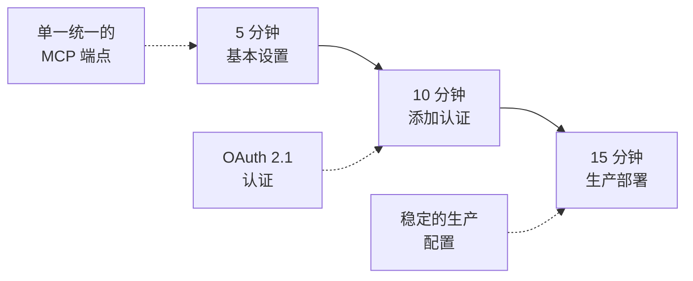

# 1MCP 入门指南

> **🎯 目标**：通过简单实用的步骤，将您从单独的 MCP 服务器连接转变为统一的代理。

## 🗺️ 您的旅程概览



**选择您的起点**：

- 👋 **初次接触 MCP？** → 从第 1 级开始
- 🔒 **需要认证？** → 跳转到第 2 级
- 🏢 **生产部署？** → 前往第 3 级

---

## 📋 先决条件

### **系统要求**

- **操作系统**：Linux、macOS 或 Windows
- **内存**：最低 512MB RAM，推荐 2GB
- **Node.js**：版本 18+ (用于 MCP 服务器)
- **网络**：HTTP/HTTPS 出站访问

### **您需要什么**

- [ ] 已有的 MCP 服务器或计划安装它们
- [ ] 用于配置文件的文本编辑器
- [ ] 终端/命令行访问权限
- [ ] 对 JSON 配置的基本了解

### **5 分钟环境检查**

```bash
# 检查 Node.js 版本
node --version  # 应为 18+

# 验证您可以在主目录中创建文件
touch ~/.test-file && rm ~/.test-file && echo "✅ 文件权限正常"

# 检查您是否有现有的 MCP 服务器
ls ~/.config/*/mcp.json 2>/dev/null || echo "ℹ️ 未找到现有 MCP 配置"
```

---

## 🌟 第 1 级：基本代理 (5 分钟)

**🎯 目标**：用单个代理替换单独的 MCP 连接
**👤 适用于**：初次使用的用户、简单设置、概念验证

### **您将实现**

- ✅ 单个配置文件取代多个连接
- ✅ 所有 MCP 服务器的统一健康监控
- ✅ 自动连接管理和重试逻辑
- ✅ 您的 AI 助手连接的单一端点

### **步骤 1：获取 1MCP** (1 分钟)

**选项 A：二进制下载 (最快 - 无需 Node.js)**

```bash
# Linux:
curl -L -o 1mcp https://github.com/1mcp-app/agent/releases/latest/download/1mcp-linux-x64
sudo mv 1mcp /usr/local/bin/ && sudo chmod +x /usr/local/bin/1mcp
1mcp --help

# macOS:
curl -L -o 1mcp https://github.com/1mcp-app/agent/releases/latest/download/1mcp-darwin-arm64
sudo mv 1mcp /usr/local/bin/ && sudo chmod +x /usr/local/bin/1mcp
1mcp --help

# Windows (PowerShell):
Invoke-WebRequest -Uri "https://github.com/1mcp-app/agent/releases/latest/download/1mcp-win32-x64.exe" -OutFile "1mcp.exe"
.\1mcp.exe --help
```

**选项 B：NPM (无需安装)**

```bash
# 1MCP 通过 npx 运行 - 无需全局安装
# 验证其是否有效：
npx -y @1mcp/agent --help
```

### **步骤 2：创建基本配置** (2 分钟)

```bash
# 创建配置目录
mkdir -p ~/.config/1mcp

# 创建基本配置文件
cat > ~/.config/1mcp/mcp.json << 'EOF'
{
  "mcpServers": {
    "filesystem": {
      "command": "npx",
      "args": ["-y", "@modelcontextprotocol/server-filesystem", "/tmp"],
      "tags": ["local", "files"]
    },
    "memory": {
      "command": "npx",
      "args": ["-y", "@modelcontextprotocol/server-memory"],
      "tags": ["memory", "notes"]
    }
  }
}
EOF
```

### **步骤 3：启动 1MCP** (1 分钟)

```bash
# 二进制选项：
1mcp --config ~/.config/1mcp/mcp.json --port 3050

# NPM 选项：
npx -y @1mcp/agent --config ~/.config/1mcp/mcp.json --port 3050

# 您应该会看到：
# ✅ 服务器正在端口 3050 上运行，使用 HTTP/SSE 传输
# ✅ 已连接到 filesystem、memory 服务器
# 📋 OAuth 管理仪表板：http://localhost:3050/oauth
```

### **步骤 4：测试您的设置** (< 1 分钟)

```bash
# 使用 MCP Inspector 进行测试和调试 (推荐)
npx @modelcontextprotocol/inspector

# 这将在 http://localhost:5173 打开一个强大的用户界面，让您：
# - 连接到您的 1MCP 代理 http://localhost:3050
# - 测试所有可用的工具和资源
# - 调试认证流程
# - 监控实时的 MCP 协议消息

# 备选方案：通过 curl 检查健康状况
curl http://localhost:3050/health
# 或在浏览器中访问 http://localhost:3050/health
```

### **✅ 第 1 级完成！**

**🎉 成功指标**：

- [ ] 1MCP 服务器在端口 3050 上运行
- [ ] MCP Inspector 在 http://localhost:5173 成功连接
- [ ] 健康端点在 http://localhost:3050/health 显示服务器已连接
- [ ] 可以通过 Inspector UI 测试 filesystem 和 memory 工具

**🔧 常见问题**：

- **端口 3050 被占用？** → 使用 `--port 3051`
- **MCP 服务器启动失败？** → 检查 Node.js 版本是否为 21+
- **权限错误？** → 确保 ~/.config/1mcp 目录可写
- **找不到配置？** → 使用绝对路径：`--config $(pwd)/.config/1mcp/mcp.json`

**➡️ 下一级**：[添加认证和访问控制](#-第-2-级安全访问-15-分钟)

---

## 🔒 第 2 级：安全访问 (15 分钟)

**🎯 目标**：添加认证和精细的访问控制
**👤 适用于**：团队、共享环境、注重安全的用户

### **您将实现**

- ✅ 使用安全令牌管理的 OAuth 2.1 认证
- ✅ 基于范围的权限控制 MCP 服务器访问
- ✅ 具有自动令牌刷新功能的用户会话管理
- ✅ 所有访问尝试的审计日志

### **步骤 1：启用认证** (1 分钟)

```bash
# 停止您现有的 1MCP 实例 (Ctrl+C)

# 启用认证并启动
# 二进制选项：
1mcp --config ~/.config/1mcp/mcp.json --port 3050 --enable-auth

# NPM 选项：
npx -y @1mcp/agent --config ~/.config/1mcp/mcp.json --port 3050 --enable-auth

# 新输出显示：
# 🔐 认证已启用 - OAuth 2.1 端点可通过 SDK 使用
# 📋 OAuth 管理仪表板：http://localhost:3050/oauth
```

### **步骤 2：使用 OAuth 管理仪表板** (2 分钟)

1MCP Agent 提供了一个 OAuth 管理仪表板，而不是手动注册端点，用于管理与后端服务的授权流程。当后端服务需要 OAuth 时，您可以使用此仪表板启动和批准授权请求。

在浏览器中访问仪表板，查看您的服务状态并授权任何等待 OAuth 的服务。

### **步骤 3：配置基于范围的访问** (2 分钟)

```bash
# 使用更详细的标签更新您的配置
cat > ~/.config/1mcp/mcp.json << 'EOF'
{
  "mcpServers": {
    "filesystem": {
      "command": "npx",
      "args": ["-y", "@modelcontextprotocol/server-filesystem", "/tmp"],
      "tags": ["filesystem", "local", "sensitive"]
    },
    "memory": {
      "command": "npx",
      "args": ["-y", "@modelcontextprotocol/server-memory"],
      "tags": ["memory", "notes", "safe"]
    }
  }
}
EOF

# 配置将自动热重载 - 无需重启！
```

### **步骤 4：测试认证** (2 分钟)

```bash
# 使用 MCP Inspector 测试 OAuth 流程 (推荐)
npx @modelcontextprotocol/inspector

# 在 Inspector UI 中：
# 1. 连接到 http://localhost:3050
# 2. 您将看到 OAuth 认证提示
# 3. 使用内置的 OAuth 流程测试
# 4. 使用不同的标签测试基于范围的访问

# 备选方案：通过 curl 手动进行 OAuth 测试
# 尝试在没有认证的情况下访问 SSE 端点
curl http://localhost:3050/sse
# 当启用认证时，应要求认证

# 手动令牌流程 (如果需要用于调试)
export CLIENT_ID="your-client-id-from-step-2"
export CLIENT_SECRET="your-client-secret-from-step-2"

curl -X POST http://localhost:3050/token \
  -H "Content-Type: application/x-www-form-urlencoded" \
  -d "grant_type=client_credentials&client_id=$CLIENT_ID&client_secret=$CLIENT_SECRET&scope=tag:safe"
```

### **✅ 第 2 级完成！**

**🎉 成功指标**：

- [ ] MCP Inspector 成功处理 OAuth 流程
- [ ] OAuth 客户端注册通过 Inspector UI 工作
- [ ] 范围限制被正确执行 (基于标签的访问)
- [ ] 可以使用 Inspector 界面测试不同的范围
- [ ] 管理仪表板显示认证状态

**🔧 常见问题**：

- **MCP Inspector 无法连接？** → 验证 1MCP 是否在端口 3050 上运行
- **Inspector 中的 OAuth 流程失败？** → 检查 1MCP 是否使用 --enable-auth 运行
- **范围错误？** → 确保服务器标签与请求的范围匹配
- **Inspector 显示“未授权”？** → 首先在 Inspector UI 中完成 OAuth 流程
- **仪表板未加载？** → 确保使用了 --enable-auth 标志

**➡️ 下一级**：[生产就绪部署](#-第-3-级生产就绪-45-分钟)

---

## 🏗️ 第 3 级：生产就绪 (15 分钟)

**🎯 目标**：具有基本安全性的稳定生产部署
**👤 适用于**：生产环境、团队、共享部署

### **您将实现**

- ✅ 用于自动启动的 Systemd 服务
- ✅ 基本安全配置
- ✅ 日志管理和轮换
- ✅ 配置备份
- ✅ 基本监控

### **步骤 1：生产配置** (5 分钟)

```bash
# 创建生产配置目录
sudo mkdir -p /etc/1mcp
sudo chown $USER:$USER /etc/1mcp

# 生产配置文件
cat > /etc/1mcp/mcp.json << 'EOF'
{
  "mcpServers": {
    "filesystem": {
      "command": "npx",
      "args": ["-y", "@modelcontextprotocol/server-filesystem", "/app/data"],
      "tags": ["filesystem", "data", "sensitive"]
    },
    "memory": {
      "command": "npx",
      "args": ["-y", "@modelcontextprotocol/server-memory"],
      "tags": ["memory", "cache", "safe"]
    }
  }
}
EOF
```

### **步骤 2：创建 Systemd 服务** (5 分钟)

```bash
# 创建 systemd 服务文件
sudo tee /etc/systemd/system/1mcp.service << 'EOF'
[Unit]
Description=1MCP - 通用 MCP 服务器代理
After=network.target

[Service]
Type=simple
User=$USER
WorkingDirectory=/home/$USER
ExecStart=/usr/bin/npx -y @1mcp/agent --config /etc/1mcp/mcp.json --port 3050 --enable-auth
Restart=always
RestartSec=5
StandardOutput=journal
StandardError=journal

[Install]
WantedBy=multi-user.target
EOF

# 启用并启动服务
sudo systemctl daemon-reload
sudo systemctl enable 1mcp
sudo systemctl start 1mcp

# 检查状态
sudo systemctl status 1mcp
```

### **步骤 3：基本监控** (5 分钟)

```bash
# 简单的健康检查脚本
cat > /usr/local/bin/1mcp-health-check << 'EOF'
#!/bin/bash
HEALTH_URL="http://localhost:3050/health"
RESPONSE=$(curl -s -o /dev/null -w "%{http_code}" "$HEALTH_URL")

if [ "$RESPONSE" = "200" ]; then
    echo "✅ 1MCP 健康 ($(date))"
    exit 0
else
    echo "❌ 1MCP 不健康 (HTTP $RESPONSE) ($(date))"
    exit 1
fi
EOF

sudo chmod +x /usr/local/bin/1mcp-health-check

# 添加到 crontab 以进行定期健康检查
(crontab -l 2>/dev/null; echo "*/5 * * * * /usr/local/bin/1mcp-health-check >> /var/log/1mcp-health.log 2>&1") | crontab -

# 检查日志
tail -f /var/log/1mcp-health.log
```

### **步骤 4：配置环境** (可选)

```bash
# 为生产设置环境变量
sudo tee -a /etc/environment << 'EOF'
ONE_MCP_ENABLE_AUTH=true
ONE_MCP_ENABLE_ENHANCED_SECURITY=true
ONE_MCP_RATE_LIMIT_WINDOW=15
ONE_MCP_RATE_LIMIT_MAX=100
EOF

# 重启服务以应用环境更改
sudo systemctl restart 1mcp
```

### **步骤 5：备份配置** (可选)

```bash
# 简单的备份脚本
cat > ~/1mcp-backup.sh << 'EOF'
#!/bin/bash
TIMESTAMP=$(date +%Y%m%d-%H%M%S)
cp /etc/1mcp/mcp.json ~/"1mcp-config-backup-$TIMESTAMP.json"
echo "✅ 配置已备份到 ~/1mcp-config-backup-$TIMESTAMP.json"
EOF

chmod +x ~/1mcp-backup.sh

# 运行备份
~/1mcp-backup.sh
```

### **✅ 第 3 级完成！**

**🎉 成功指标**：

- [ ] 1MCP 作为 systemd 服务运行
- [ ] 服务在启动时自动启动
- [ ] 健康检查脚本正常工作
- [ ] 配置已备份
- [ ] 健康端点可在 http://localhost:3050/health 访问

**🔧 生产清单**：

- [ ] SSL/TLS 证书已配置 (使用像 nginx 这样的反向代理)
- [ ] 防火墙规则已配置 (仅允许端口 3050)
- [ ] 已为您的应用程序注册 OAuth 客户端
- [ ] 服务器标签已适当配置
- [ ] 定期备份配置

**➡️ 下一级**：[高级优化](#-第-4-级高级优化-2-小时)

---

## 🔧 超越基本设置

**可用的其他配置选项：**

### **传输配置**

- 使用 `--transport sse` 进行服务器发送事件
- 使用 `--transport stdio` 进行标准输入/输出
- 使用 `--transport http` 进行可流式传输的 HTTP (默认)

### **标签过滤**

- 按标签过滤服务器：`--tags "network,filesystem"`
- 配置基于标签的 OAuth 范围

### **反向代理设置**

- 为代理环境配置 `--trust-proxy`
- 为面向公众的部署使用 `--external-url`

### **简单的反向代理设置** (可选)

```bash
# 用于 SSL 终止的基本 nginx 配置
sudo tee /etc/nginx/sites-available/1mcp << 'EOF'
server {
    listen 80;
    server_name your-domain.com;
    return 301 https://$server_name$request_uri;
}

server {
    listen 443 ssl;
    server_name your-domain.com;

    ssl_certificate /path/to/your/cert.pem;
    ssl_certificate_key /path/to/your/key.pem;

    location / {
        proxy_pass http://localhost:3050;
        proxy_set_header Host $host;
        proxy_set_header X-Real-IP $remote_addr;
        proxy_set_header X-Forwarded-For $proxy_add_x_forwarded_for;
        proxy_set_header X-Forwarded-Proto $scheme;
    }
}
EOF
```

### **使用不同的配置**

```bash
# 创建特定于环境的配置
cp /etc/1mcp/mcp.json /etc/1mcp/mcp-dev.json
cp /etc/1mcp/mcp.json /etc/1mcp/mcp-staging.json

# 使用不同的配置启动
npx -y @1mcp/agent --config /etc/1mcp/mcp-dev.json --port 3051
npx -y @1mcp/agent --config /etc/1mcp/mcp-staging.json --port 3052
```

### **基本日志监控**

```bash
# 监控 1MCP 日志
sudo journalctl -u 1mcp -f

# 检查错误
sudo journalctl -u 1mcp --since "1 hour ago" | grep -i error

# 简单的日志分析脚本
cat > ~/1mcp-log-summary.sh << 'EOF'
#!/bin/bash
echo "=== 1MCP 服务状态 ==="
sudo systemctl status 1mcp --no-pager
echo
echo "=== 最近的错误 ==="
sudo journalctl -u 1mcp --since "1 hour ago" | grep -i error | tail -10
EOF

chmod +x ~/1mcp-log-summary.sh
```

### **环境变量参考**

```bash
# 认证设置
ONE_MCP_ENABLE_AUTH=true
ONE_MCP_ENABLE_SCOPE_VALIDATION=true

# 速率限制
ONE_MCP_RATE_LIMIT_WINDOW=15  # 15 分钟
ONE_MCP_RATE_LIMIT_MAX=100

# 安全
ONE_MCP_ENABLE_ENHANCED_SECURITY=true
ONE_MCP_TRUST_PROXY=loopback

# 会话管理
ONE_MCP_SESSION_TTL=1440  # 24 小时
ONE_MCP_SESSION_STORAGE_PATH=/var/lib/1mcp/sessions
```

### **✅ 设置完成！**

您现在已将 1MCP 作为具有基本认证和监控的稳定服务运行。

---

## 🆘 故障排除指南

### **常见问题与解决方案**

#### **🔌 连接问题**

```bash
# 问题：“连接被拒绝”
# 解决方案：检查 1MCP 是否正在运行
systemctl status 1mcp
# 检查应用程序日志以获取服务器状态

# 问题：“MCP 服务器无响应”
# 解决方案：检查单个服务器的健康状况
ONE_MCP_LOG_LEVEL=debug npx -y @1mcp/agent --config ~/.config/1mcp/mcp.json
```

#### **🔐 认证问题**

```bash
# 问题：“无效令牌”
# 解决方案：检查令牌过期时间和范围
# 通过 OAuth 端点检查令牌有效性 (当启用认证时)

# 问题：“范围不足”
# 解决方案：验证服务器标签是否与令牌范围匹配
cat ~/.config/1mcp/mcp.json | jq '.mcpServers[].tags'
```

#### **⚡ 性能问题**

```bash
# 问题：响应时间慢
# 解决方案：检查服务器状态和日志
# 检查应用程序日志以获取服务器状态
# 检查日志以查找连接问题
htop # 检查 CPU/内存使用情况

# 问题：错误率高
# 解决方案：检查服务器日志以查找模式
journalctl -u 1mcp -f --lines=100
```

### **获取帮助**

- 📖 **文档**：[文档主页](/)
- 🐛 **问题**：[GitHub Issues](https://github.com/1mcp-app/agent/issues)
- 💬 **社区**：[Discussions](https://github.com/1mcp-app/agent/discussions)

---

## 🎯 后续步骤

- [探索安全功能](/reference/security)
- [高级架构](/reference/architecture)

---

> **🎉 恭喜！** 您已成功将 1MCP 从基本代理设置到企业级基础设施。您的 AI 助手现在可以通过单一、统一的界面可靠、安全、可扩展地访问其所有 MCP 功能。
