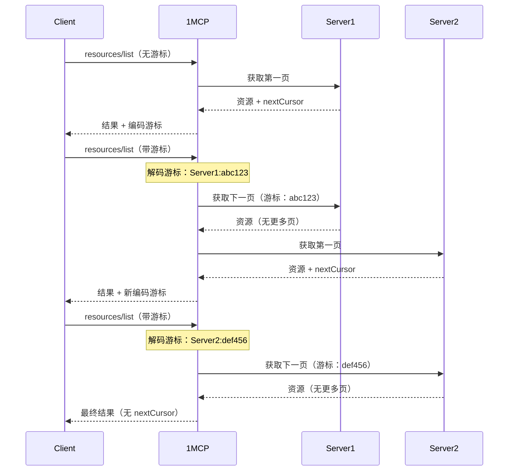

# 分页支持

1MCP 代理支持 MCP 协议响应的分页功能，以在处理来自多个服务器的大型结果集时提升性能。该功能有助于在从多个 MCP 服务器聚合数据时高效管理资源。

## 概述

**功能说明**：为 MCP 协议方法（资源、工具、提示、资源模板）启用分页响应

**为何默认禁用**：并非所有 MCP 客户端都支持分页，因此采用选择性启用以确保兼容性

**工作原理**：使用基于游标的分页从多个服务器分块获取结果

## ⚠️ 重要提示：默认行为

**分页默认禁用**，因为并非所有 MCP 客户端都支持分页。当禁用时：

- 一次性获取并返回所有连接 MCP 服务器的所有结果
- 这确保与现有客户端的最大兼容性
- 但在服务器较多时可能消耗更多内存和时间

## 启用分页

### 1. 命令行标志

使用 `--pagination` 或 `-p` 标志启用分页：

```bash
# 为 HTTP 传输启用分页
npx -y @1mcp/agent --config mcp.json --pagination

# 使用简短标志
npx -y @1mcp/agent --config mcp.json -p
```

### 2. 环境变量

设置 `ONE_MCP_PAGINATION` 环境变量：

```bash
export ONE_MCP_PAGINATION=true
npx -y @1mcp/agent --config mcp.json
```

### 3. HTTP 查询参数

对于 HTTP 传输，按请求启用分页：

```bash
# 使用 MCP 检查器测试分页
pnpm inspector

# 然后在检查器界面中：
# 1. 导航到工具选项卡
# 2. 在设置中启用分页
# 3. 点击"列出工具"查看分页结果
# 4. 使用"列出更多工具"按钮浏览结果
```

## 分页工作原理

### 游标格式

1MCP 使用 **base64 编码的游标**，包含：

- 客户端名称（从哪个 MCP 服务器继续）
- 服务器特定游标（用于在该服务器内继续）

```
游标格式：base64(clientName:serverCursor)
```

### 分页流程



### 支持的 MCP 方法

分页适用于以下 MCP 协议方法：

- `resources/list` - 列出可用资源
- `resources/templates/list` - 列出资源模板
- `tools/list` - 列出可用工具
- `prompts/list` - 列出可用提示

## 性能优势

### 启用分页时

**内存使用**：更低 - 仅当前页在内存中
**响应时间**：更快的初始响应 - 立即返回第一页
**网络**：减少 - 更小的响应载荷
**扩展性**：更好 - 高效处理多个服务器

```bash
# 示例：10 个服务器，每个有 100 个资源
# 无分页：在单个响应中返回 1000 个资源（慢）
# 有分页：每个响应 50-100 个资源（快）
```

### 无分页时（默认）

**内存使用**：更高 - 一次加载所有结果
**响应时间**：更慢 - 等待所有服务器
**网络**：更大 - 完整结果集
**兼容性**：最大 - 适用于所有客户端

## 客户端实现

### 发起分页请求

```json
{
  "jsonrpc": "2.0",
  "id": 1,
  "method": "resources/list",
  "params": {
    "_meta": {
      "progressToken": "optional-progress-token"
    }
  }
}
```

### 处理分页响应

```json
{
  "jsonrpc": "2.0",
  "id": 1,
  "result": {
    "resources": [
      {
        "uri": "file:///example.txt",
        "name": "Example File",
        "mimeType": "text/plain"
      }
    ],
    "nextCursor": "aGVsbG86d29ybGQ="
  }
}
```

### 获取下一页

```json
{
  "jsonrpc": "2.0",
  "id": 2,
  "method": "resources/list",
  "params": {
    "cursor": "aGVsbG86d29ybGQ=",
    "_meta": {
      "progressToken": "optional-progress-token"
    }
  }
}
```

## 错误处理

### 无效游标

如果游标变得无效（服务器已移除、数据损坏）：

```json
{
  "jsonrpc": "2.0",
  "id": 1,
  "result": {
    "resources": [],
    "nextCursor": "bmV3LWN1cnNvcg=="
  }
}
```

1MCP 会自动：

- 回退到第一个可用服务器
- 记录关于无效游标的警告
- 从有效起始点继续分页

### 服务器不可用

当分页序列中的服务器变得不可用时：

- 1MCP 跳过不可用的服务器
- 继续处理下一个可用服务器
- 记录服务器状态以供监控

## 配置示例

### 开发设置

```bash
# 使用分页的快速开发
npx -y @1mcp/agent --config dev.json --pagination --log-level debug
```

### 生产设置

```bash
# 使用环境变量的生产环境
export ONE_MCP_PAGINATION=true
npx -y @1mcp/agent --config production.json
```

### Docker 环境

```yaml
# docker-compose.yml
services:
  1mcp:
    image: ghcr.io/1mcp-app/agent:latest
    environment:
      - ONE_MCP_PAGINATION=true
      - ONE_MCP_CONFIG_PATH=/config/mcp.json
    volumes:
      - ./config:/config
    ports:
      - '3050:3050'
```

## 何时启用分页

### ✅ 在以下情况启用

- 您有 **5+ 个 MCP 服务器**且结果集较大
- 客户端**支持分页**（能处理 `nextCursor`）
- **性能**比简洁性更重要
- 处理**资源密集型**操作

### ❌ 在以下情况保持禁用

- 您有**少数 MCP 服务器**（≤3）且结果集较小
- 客户端**不支持分页**（忽略 `nextCursor`）
- **兼容性**比性能更重要
- 偏好**简单设置**

## 故障排除

### 检查分页是否工作

```bash
# 使用 MCP 检查器测试
pnpm inspector

# 在检查器中：
# 1. 在设置中启用分页
# 2. 导航到任意列表视图（资源、工具、提示）
# 3. 查找"列出更多"按钮和页面指示器
# 4. 检查响应 JSON 中的 "nextCursor" 字段
```

### 调试分页问题

```bash
# 启用调试日志查看分页流程
npx -y @1mcp/agent --config mcp.json --pagination --log-level debug
```

查找以下日志消息：

- `Fetching all items for client X`（分页禁用时）
- `Fetching next page for client X with cursor Y`（分页启用时）

### 常见问题

**分页结果为空**：

- 检查服务器是否支持分页
- 验证游标格式是否为有效 base64

**性能未改善**：

- 确保客户端发起分页请求
- 检查服务器是否返回适当的页面大小

**游标错误**：

- 启用调试日志查看游标解析
- 验证配置中的服务器名称未更改

## 相关文档

- [配置指南](/zh/guide/configuration) - 完整配置选项
- [功能概述](/zh/guide/features) - 所有 1MCP 功能
- [服务器管理](/zh/guide/server-management) - 管理 MCP 服务器
- [健康检查 API](/zh/reference/health-check) - 监控服务器状态
