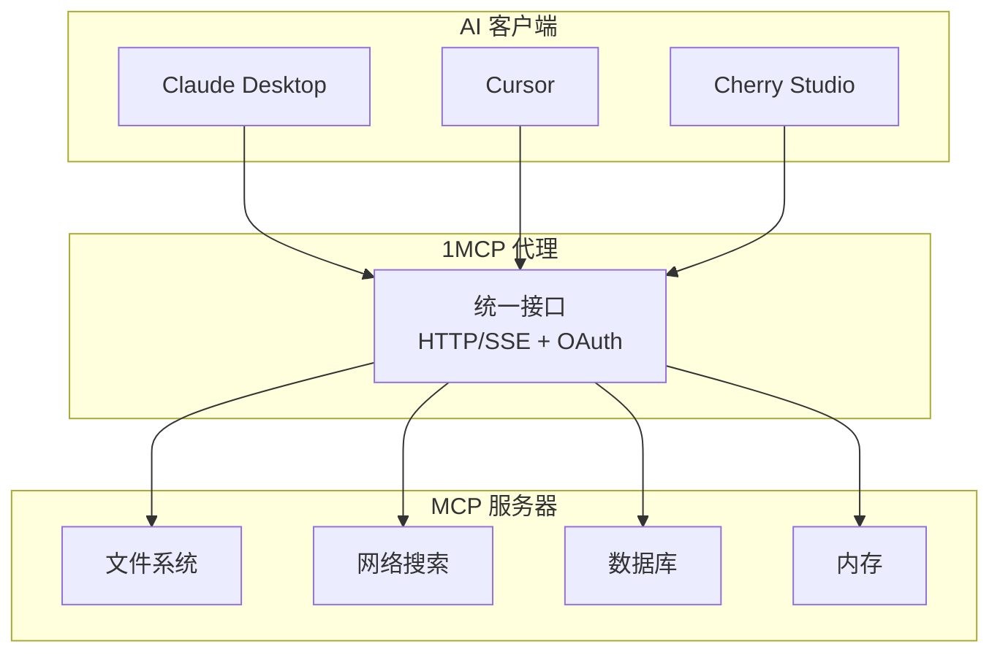

## 为什么选择 1MCP？

**问题**：AI 助手需要连接到多个 MCP 服务器，但管理数十个独立连接是复杂、不可靠且安全性密集的。

**解决方案**：1MCP 作为统一的代理/多路复用器，将多个 MCP 服务器聚合在单一、可靠的接口后面。



## 快速示例

从简单配置开始：

```json
{
  "mcpServers": {
    "filesystem": {
      "command": "npx",
      "args": ["-y", "@modelcontextprotocol/server-filesystem", "/tmp"],
      "description": "文件系统访问"
    },
    "search": {
      "command": "npx",
      "args": ["-y", "@modelcontextprotocol/server-web-search"],
      "description": "网络搜索功能"
    }
  }
}
```

```bash
# 启动代理
npx -y @1mcp/agent --config mcp.json --port 3000
```

现在您的代理正在运行。将您的 MCP 客户端连接到 `http://localhost:3000` 开始使用您聚合的工具。

## 主要优势

- **🎯 简化集成**：一个连接代替多个连接
- **🔐 生产安全性**：OAuth 2.1 与基于范围的权限
- **📈 更好的可靠性**：集中化错误处理和监控
- **⚙️ 易于管理**：单一配置，热重载支持
- **🚀 性能**：高效多路复用，最小开销

## 下一步？

<div class="vp-feature-grid">
  <a href="/zh/guide/getting-started" class="vp-feature-box">
    <h3>📚 学习基础知识</h3>
    <p>了解 1MCP 架构和核心概念</p>
  </a>

  <a href="/zh/guide/quick-start" class="vp-feature-box">
    <h3>⚡ 快速入门</h3>
    <p>5 分钟内通过基本配置快速运行</p>
  </a>

  <a href="/zh/reference/architecture" class="vp-feature-box">
    <h3>🏗️ 深入了解</h3>
    <p>全面的系统架构和设计决策</p>
  </a>
</div>

<style>
.vp-feature-grid {
  display: grid;
  grid-template-columns: repeat(auto-fit, minmax(250px, 1fr));
  gap: 1rem;
  margin-top: 2rem;
}

.vp-feature-box {
  padding: 1.5rem;
  border: 1px solid var(--vp-c-border);
  border-radius: 8px;
  text-decoration: none;
  transition: border-color 0.25s;
}

.vp-feature-box:hover {
  border-color: var(--vp-c-brand);
}

.vp-feature-box h3 {
  margin: 0 0 0.5rem 0;
  font-size: 1.1rem;
}

.vp-feature-box p {
  margin: 0;
  color: var(--vp-c-text-2);
  line-height: 1.4;
}
</style>
