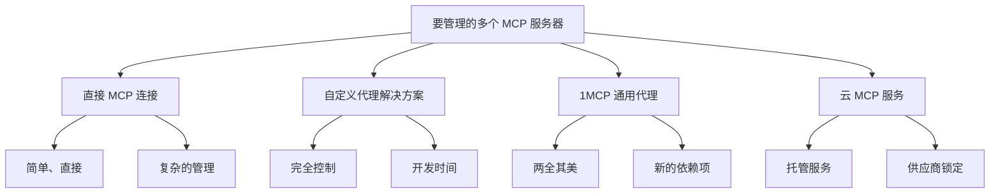
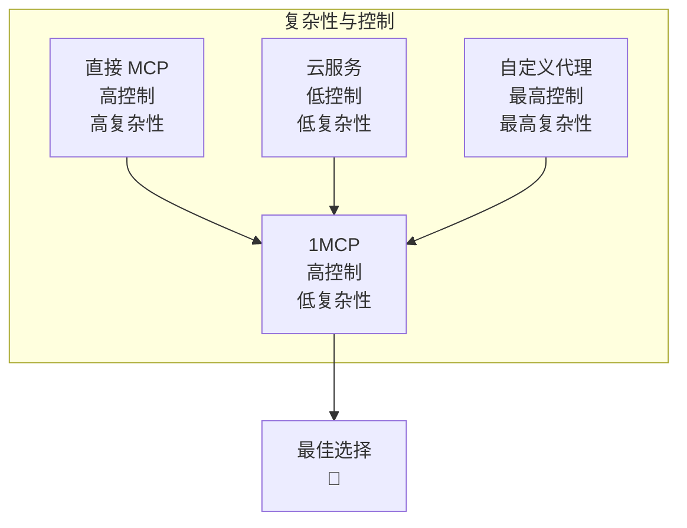

# 1MCP 与替代方案：为什么选择 1MCP？

> **🎯 客观比较**：我们相信做出明智的决定。以下是 1MCP 与管理多个 MCP 服务器的其他方法的比较，并诚实地列出了每种方案的优缺点。

## 🗺️ 您的选择范围



---

## 🔗 选项 1：直接 MCP 连接

### **它是什么**

将您的 AI 助手直接连接到每个 MCP 服务器，单独管理每个连接。

### **它在什么情况下有意义**

- **仅 1-2 个 MCP 服务器** - 设置简单，开销最小
- **概念验证** - 在扩展之前测试 MCP 功能
- **单个开发人员** - 具有完全控制权的个人使用
- **学习 MCP 协议** - 了解基础知识

### **详细比较**

| 方面           | 直接 MCP             | 1MCP 代理        | 获胜者      |
| -------------- | -------------------- | ---------------- | ----------- |
| **初始设置**   | 简单（1-2 台服务器） | 中等             | 直接 MCP 📊 |
| **扩展复杂性** | 指数级增长           | 线性增长         | 1MCP 🚀     |
| **连接管理**   | 每台服务器手动       | 集中处理         | 1MCP ⚡     |
| **健康监控**   | 每台服务器检查       | 统一仪表板       | 1MCP 📊     |
| **身份验证**   | 每台服务器凭据       | 集中式 OAuth     | 1MCP 🔒     |
| **配置更改**   | 重新启动每台服务器   | 热重载           | 1MCP 🔄     |
| **故障恢复**   | 手动干预             | 自动重试         | 1MCP 🛡️     |
| **资源使用**   | 高（多个进程）       | 中等（单个代理） | 1MCP ⚡     |

### **真实场景：10 台 MCP 服务器**

**直接 MCP 设置**：

```bash
# Claude Desktop 配置
{
  "mcpServers": {
    "filesystem": {
      "command": ["mcp-filesystem"],
      "args": ["/data"]
    },
    "database": {
      "command": ["python", "/path/to/db-server.py"]
    },
    "web-scraper": {
      "command": ["node", "/path/to/web.js"]
    }
    // ... 对另外 7 台服务器重复此操作
  }
}

# 日常维护：
# 1. 检查所有 10 台服务器是否正在运行
ps aux | grep mcp | wc -l  # 应该是 10，通常是 7-9

# 2. 单独重新启动失败的服务器
pkill -f "mcp-filesystem" && mcp-filesystem /data &
pkill -f "db-server.py" && python /path/to/db-server.py &

# 3. 更新 Claude Desktop 配置以进行任何更改
# 4. 重新启动 Claude Desktop 以应用更改
```

**时间投入**：

- **每日监控**：10 台服务器 × 2 分钟 = 20 分钟
- **每周故障排除**：10 台服务器 × 15 分钟 = 2.5 小时
- **每月更新**：10 台服务器 × 30 分钟 = 5 小时
- **总计**：每月 15 小时以上的维护

**1MCP 等效方案**：

```bash
# 单个配置文件
{
  "mcpServers": {
    "filesystem": { "command": ["mcp-filesystem", "/data"] },
    "database": { "command": ["python", "/path/to/db-server.py"] },
    "web-scraper": { "command": ["node", "/path/to/web.js"] }
    // ... 另外 7 台服务器
  }
}

# 日常维护：
# 通过应用程序监控检查日志和服务器状态

# 总维护时间：每月 5 分钟
```

### **直接 MCP 的优点**

✅ **简单性**：无需管理其他组件
✅ **直接控制**：完全控制每台服务器
✅ **无依赖项**：没有可能出现故障的代理层
✅ **学习**：更好地了解 MCP 协议
✅ **调试**：直接访问服务器日志和诊断信息

### **直接 MCP 的缺点**

❌ **指数级复杂性**：每台新服务器都会增加大量开销
❌ **无健康监控**：必须单独检查每台服务器
❌ **连接开销**：每个请求都有新的连接
❌ **无身份验证**：每台服务器单独管理安全性，或者根本不管理
❌ **手动恢复**：服务器故障需要手动干预
❌ **配置碎片化**：更新需要多个文件更改

### **底线**

**如果**：您最多有 1-2 台服务器，正在学习 MCP，或者需要以最少的依赖项获得最大的控制权，请选择直接 MCP。

**当**：您有 3 台以上服务器，希望获得可靠性或需要团队访问时，请切换到 1MCP。

---

## 🔧 选项 2：自定义代理解决方案

### **它是什么**

使用 Express.js、FastAPI 或 Go 等框架构建您自己的代理/聚合层，以管理多个 MCP 服务器。

### **它在什么情况下有意义**

- **独特要求**：非常具体的业务逻辑或协议需求
- **现有基础架构**：已经拥有代理框架和专业知识
- **完全控制**：需要完全控制代理的各个方面
- **学习练习**：构建 MCP 专业知识和自定义解决方案

### **开发实际情况检查**

**最小可行的自定义代理**（3-6 个月）：

```typescript
// 基本代理服务器（简化）
class CustomMCPProxy {
  private servers: Map<string, MCPConnection> = new Map();

  async initialize() {
    // 1. 连接管理（2-3 周）
    // 2. 请求路由（1-2 周）
    // 3. 错误处理（2-3 周）
    // 4. 基本健康检查（1 周）
    // 5. 配置管理（1-2 周）
  }

  async handleRequest(request: MCPRequest) {
    // 路由到适当的服务器
    // 处理故障和重试
    // 如果需要，聚合响应
    // 返回格式化的响应
  }
}

// 缺少的企业功能：
// - 身份验证（OAuth 2.1）：+4-6 周
// - 请求处理优化：+2-3 周
// - 热重载：+1-2 周
// - 监控/指标：+3-4 周
// - 多实例部署：+4-6 周
// - 全面测试：+4-8 周
```

### **详细比较**

| 方面           | 自定义代理           | 1MCP                     | 获胜者        |
| -------------- | -------------------- | ------------------------ | ------------- |
| **开发时间**   | 3-12 个月            | 5 分钟                   | 1MCP ⚡       |
| **初始成本**   | 5 万至 20 万美元以上 | 0 美元                   | 1MCP 💰       |
| **持续维护**   | 高（您的团队）       | 无（社区）               | 1MCP 🔧       |
| **功能完整性** | 取决于时间/预算      | 生产就绪                 | 1MCP ✅       |
| **MCP 合规性** | 协议违规风险         | 保证合规性               | 1MCP 📋       |
| **安全功能**   | DIY 实现             | 经过实战考验的 OAuth 2.1 | 1MCP 🔒       |
| **性能**       | 取决于专业知识       | 标准                     | 平局 ⚖️       |
| **自定义**     | 无限                 | 可配置                   | 自定义代理 🎨 |
| **控制**       | 完全                 | 高                       | 自定义代理 🎛️ |
| **支持**       | 仅限内部团队         | 社区 + 文档              | 1MCP 🆘       |

### **实际开发时间表**

**第一阶段：基本代理（第 1-2 个月）**

```
第 1-2 周：项目设置、基本路由
第 3-4 周：MCP 协议实现
第 5-6 周：错误处理、基本重试逻辑
第 7-8 周：配置管理、测试
```

**第二阶段：生产功能（第 3-6 个月）**

```
第 9-12 周：身份验证系统（OAuth）
第 13-16 周：请求处理和错误恢复
第 17-20 周：健康监控和指标
第 21-24 周：高可用性和部署
```

**第三阶段：企业功能（第 7-12 个月）**

```
第 25-32 周：高级安全性、审计日志记录
第 33-40 周：多实例部署
第 41-48 周：全面监控、警报
第 49-52 周：文档、团队培训
```

**总投资**：15 万至 30 万美元（取决于团队规模和功能范围）

### **自定义开发的隐藏成本**

```
开发成本：
├── 高级开发人员（12 个月）：15 万美元
├── DevOps 工程师（6 个月）：7.5 万美元
├── 安全审查：2.5 万美元
├── 测试和质量保证：3 万美元
├── 文档：1.5 万美元
└── 总计：第一年 29.5 万美元

持续成本：
├── 维护（20% 的开发时间）：每年 3 万美元
├── 安全更新：每年 1.5 万美元
├── 功能增加：每年 4 万美元
├── 支持和文档：每年 1 万美元
└── 总计：每年 9.5 万美元
```

### **您获得的与 1MCP 的对比**

**自定义代理的优势**：

```typescript
// 您可以构建您真正需要的东西：
class MyCustomProxy {
  // 无限的自定义
  async handleSpecialBusinessLogic() {
    // 您独特的业务逻辑在这里
  }

  // 自定义协议
  async handleLegacyProtocol() {
    // 支持非标准系统
  }

  // 专有集成
  async integrateWithInternalSystems() {
    // 公司特定的集成
  }
}
```

**1MCP 等效方案**（5 分钟设置）：

```json
{
  "mcpServers": {
    "your-servers": "标准 MCP 配置"
  }
}
```

### **自定义代理的优点**

✅ **无限的自定义**：构建您真正需要的东西
✅ **完全控制**：完全拥有代码库和决策权
✅ **内部专业知识**：团队深入学习 MCP 协议
✅ **集成灵活性**：可以与任何内部系统集成
✅ **无外部依赖项**：完全自力更生

### **自定义代理的缺点**

❌ **高昂的开发成本**：15 万至 30 万美元的初始投资
❌ **上市时间长**：3-12 个月才能投入生产
❌ **持续维护**：永久的团队责任
❌ **安全风险**：DIY 安全性与经过实战考验的解决方案
❌ **功能差距**：数月/数年缺少企业功能
❌ **机会成本**：资源未用于核心业务功能

### **底线**

**如果**：您有现有解决方案无法满足的独特要求，有 6 个月以上的开发时间，并且项目预算超过 20 万美元，请选择自定义代理。

**如果**：您想快速解决 MCP 聚合问题并将资源集中在核心业务功能上，请选择 1MCP。

---

## ☁️ 选项 3：云 MCP 服务

### **它是什么**

由云提供商或专业供应商提供的托管 MCP 代理服务（假设，因为这个市场正在兴起）。

### **它在什么情况下有意义**

- **零维护**：希望完全托管的基础架构
- **企业 SLA**：需要供应商支持的正常运行时间保证
- **无限扩展**：处理大规模的企业部署
- **合规性要求**：需要供应商认证（SOC 2、GDPR 等）

### **理论比较**

| 方面           | 云 MCP 服务        | 1MCP         | 获胜者    |
| -------------- | ------------------ | ------------ | --------- |
| **设置时间**   | 5-15 分钟          | 5 分钟       | 平局 ⚖️   |
| **维护**       | 零                 | 最少         | 云服务 🔧 |
| **成本**       | 每月 500-5000 美元 | 0 美元       | 1MCP 💰   |
| **自定义**     | 限于服务功能       | 高度可配置   | 1MCP 🎨   |
| **数据控制**   | 第三方服务器       | 您的基础架构 | 1MCP 🔒   |
| **供应商锁定** | 高风险             | 无           | 1MCP 🔓   |
| **SLA 保证**   | 99.9% 以上，带积分 | 自我管理     | 云服务 📋 |
| **合规性**     | 供应商认证         | 自我认证     | 云服务 ✅ |
| **全球扩展**   | 自动               | 手动设置     | 云服务 🌍 |
| **功能更新**   | 自动               | 手动升级     | 云服务 🔄 |

### **成本分析示例**

**云 MCP 服务**（估计定价）：

```
定价层级：
├── 入门版：每月 99 美元（10 台服务器，100 万个请求）
├── 专业版：每月 499 美元（50 台服务器，1000 万个请求）
├── 企业版：每月 2499 美元（无限服务器，1 亿个请求）
└── 自定义：每月 5000 美元以上（专用基础架构）

年费：1200 美元 - 60000 美元以上
```

**1MCP 自托管**：

```
基础架构成本：
├── 小型部署：每月 50-100 美元（云虚拟机）
├── 中型部署：每月 200-500 美元（高可用性设置）
├── 大型部署：每月 1000-2000 美元（多区域）
└── 维护：您的团队或顾问

总年费：600 美元 - 24000 美元（仅基础架构）
```

**成本比较**（5 年）：

```
                第 1 年    第 3 年    第 5 年    总计
云服务   3 万美元      3.2 万美元      3.5 万美元      16.1 万美元
1MCP 托管     6 千美元       8 千美元       1 万美元       3.9 万美元
节省         2.4 万美元      2.4 万美元      2.5 万美元      12.2 万美元
```

### **云 MCP 服务的优点**

✅ **零维护**：完全托管的基础架构
✅ **企业 SLA**：供应商支持的正常运行时间保证
✅ **自动扩展**：自动处理流量高峰
✅ **合规性**：供应商认证和审计支持
✅ **全球基础架构**：包括多区域部署
✅ **24/7 支持**：专业支持团队

### **云 MCP 服务的缺点**

❌ **高成本**：每年 1200-60000 美元以上，而 1MCP 为 0 美元
❌ **供应商锁定**：难以从服务中迁移出来
❌ **数据隐私**：您的 MCP 流量流经第三方服务器
❌ **有限的自定义**：受限于供应商的功能集
❌ **服务风险**：供应商可能会停止服务或更改条款
❌ **网络延迟**：通过供应商基础架构的额外跃点

### **底线**

**如果**：成本不是问题，您需要零维护，并且合规性需要供应商 SLA，请选择云 MCP。

**如果**：您希望控制您的基础架构，需要自定义，或者希望将成本降至最低，请选择 1MCP。

---

## 🏆 1MCP：两全其美

### **为什么存在 1MCP**

我们构建 1MCP 是因为每种替代方案都有明显的缺点：

- **直接 MCP**：无法扩展到 2-3 台服务器以上
- **自定义代理**：需要 6 个月以上的时间和 20 万美元以上的资金才能正确构建
- **云服务**：昂贵、供应商锁定、控制有限

1MCP 立即以零成本、完全控制的方式提供企业级功能。

### **1MCP 的独特地位**



### **功能完整性比较**

| 功能             | 直接 MCP        | 自定义代理    | 云服务            | 1MCP         |
| ---------------- | --------------- | ------------- | ----------------- | ------------ |
| **MCP 聚合**     | ❌ 手动         | ✅ 自定义     | ✅ 托管           | ✅ 内置      |
| **健康监控**     | ❌ 无           | 🔧 DIY        | ✅ 包含           | ✅ 内置      |
| **身份验证**     | ❌ 每台服务器   | 🔧 DIY        | ✅ 包含           | ✅ OAuth 2.1 |
| **热重载**       | ❌ 需要重新启动 | 🔧 DIY        | ✅ 包含           | ✅ 内置      |
| **连接池**       | ❌ 无           | 🔧 DIY        | ✅ 包含           | ✅ 内置      |
| **速率限制**     | ❌ 无           | 🔧 DIY        | ✅ 包含           | ✅ 内置      |
| **多实例**       | ❌ 无           | 🔧 DIY        | ✅ 包含           | ✅ 内置      |
| **审计日志记录** | ❌ 无           | 🔧 DIY        | ✅ 包含           | ✅ 内置      |
| **基本监控**     | ❌ 无           | 🔧 DIY        | ✅ 包含           | ✅ 内置      |
| **自定义配置**   | ✅ 完全         | ✅ 无限       | ❌ 有限           | ✅ 广泛      |
| **数据控制**     | ✅ 完全         | ✅ 完全       | ❌ 供应商         | ✅ 完全      |
| **成本**         | 0 美元          | 20 万美元以上 | 每年 3 万美元以上 | 0 美元       |
| **投入生产时间** | 立即            | 6 个月以上    | 1 周              | 5 分钟       |

**图例**：✅ 包含 | 🔧 自己构建 | ❌ 不可用

---

## 🎯 决策框架

### **如果**：

- [ ] 您最多有 1-2 台 MCP 服务器
- [ ] 您正在学习 MCP 协议
- [ ] 您正在进行概念验证工作
- [ ] 您需要以最少的依赖项获得最大的控制权
- [ ] 设置简单性比扩展更重要

### **如果**：

- [ ] 您有现有解决方案无法满足的非常独特的业务要求
- [ ] 您有 20 万美元以上的预算和 6 个月以上的时间表
- [ ] 您有经验丰富的开发团队进行持续维护
- [ ] 您需要无限的自定义功能
- [ ] 控制比时间/成本更重要

### **如果**：

- [ ] 预算不是限制（每年 3 万美元以上是可以接受的）
- [ ] 您需要零维护和供应商 SLA
- [ ] 合规性需要供应商认证
- [ ] 您正在处理大规模的企业扩展（1000 多名开发人员）
- [ ] 数据隐私问题很小

### **如果**：

- [ ] 您有 3 台以上 MCP 服务器要管理
- [ ] 您希望立即获得生产就绪的功能
- [ ] 您希望以零成本获得企业功能
- [ ] 您希望控制您的基础架构
- [ ] 您希望快速提高工作效率（5 分钟设置）
- [ ] 您希望避免供应商锁定
- [ ] 您的重点应该是您的核心业务，而不是 MCP 基础架构

---

## 🚀 迁移路径

### **从直接 MCP 到 1MCP**

```bash
# 1. 导出您现有的 MCP 服务器配置
# 2. 转换为 1MCP 格式（5 分钟）
# 3. 与 1MCP 并行测试
# 4. 将您的 AI 客户端切换到 1MCP 端点
# 5. 停用单个服务器

# 迁移时间：30 分钟
# 风险：低（并行测试）
# 回滚：立即（切换回直接）
```

### **从自定义代理到 1MCP**

```bash
# 1. 记录您的自定义功能和要求
# 2. 使用等效设置配置 1MCP
# 3. 与自定义代理并行运行 1MCP
# 4. 逐步将客户端迁移到 1MCP
# 5. 验证后停用自定义代理

# 迁移时间：1-2 周（验证和测试）
# 风险：中等（功能对等验证）
# 好处：消除维护负担，获得新功能
```

### **从云服务到 1MCP**

```bash
# 1. 从云服务导出配置
# 2. 在您的基础架构上设置 1MCP
# 3. 测试功能对等和功能
# 4. 在维护窗口期间迁移
# 5. 取消云服务订阅

# 迁移时间：1 周（基础架构设置）
# 风险：低（类似的功能集）
# 好处：消除持续成本，获得控制权
```

---

## 🎯 底线

### **对于大多数用户来说，1MCP 是明确的选择，因为**：

1. **⚡ 立即价值**：5 分钟内即可投入生产，而不是数月的开发
2. **💰 零成本**：无许可、订阅或开发成本
3. **🛡️ 企业功能**：包括 OAuth、审计日志记录、多实例部署
4. **🔧 完全控制**：在您的基础架构上部署，根据需要进行自定义
5. **🚫 无锁定**：开源，随时可以迁移
6. **📈 经过验证的扩展**：从单个开发人员到财富 500 强企业
7. **🔒 安全第一**：经过实战考验的身份验证和安全功能
8. **📊 生产就绪**：健康检查、日志记录和可靠的操作

### **您可能会选择替代方案的情况**：

- **直接 MCP**：您有 1-2 台服务器和极高的简单性需求
- **自定义代理**：您有独特的要求和 20 万美元以上的预算
- **云服务**：您有无限的预算和零维护要求

### **最常见的决策路径**：

```
开始 → 直接 MCP（1-2 台服务器） → 1MCP（3 台以上服务器） → 继续使用 1MCP（可扩展到企业）
```

---

> **🎯 准备好进行切换了吗？**
>
> **无风险试用 1MCP**：[5 分钟设置指南](/guide/getting-started)
>
> 仍然不确定？[加入我们的社区](https://github.com/1mcp-app/agent/discussions)与其他已进行切换的用户讨论您的具体要求。
